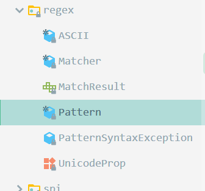

# 正则表达式

文档来源：[https://zh.javascript.info/regexp-introduction](https://zh.javascript.info/regexp-introduction)

## 字符类：后者称为反向类

​	`.`  => 除换行符外的任意字符

​	`\d` => 数字， `\D` 非数字

​	`\s` => 空格， `\S` 非空格

​	`\w` => 一个字符， `\W` 一个非字符

## 修辞符

	i 不区分大小写
	g 全局匹配，而不是只匹配第一个


## 量词

{n} 出现的确切次数 如 ： \d{4} 匹配连续 4 个数字

{m,n} 范围

### 量词缩写

`+`  一个或多个， == `{1,}`

`?`  零个或一个， == `{0,1}`

`*`  零个或多个， == `{0,}`

量词匹配默认是贪婪模式，在量词后加 ? 开启懒惰模式

## 贪婪模式 & 懒惰模式

[https://zh.javascript.info/regexp-greedy-and-lazy](https://zh.javascript.info/regexp-greedy-and-lazy)

`'functions "Hello()" and "world()" need match'.match(/".+"/g)` => `['"Hello()" and "world()"']`  => 结果并不是想要的

使用 ? 开启懒惰模式，即 让 + 尽量少地匹配 `/".+?"/g` => `['"Hello()"', '"world()"']`

## 常用方法(js)

	search(reg) => indexOf 的正则版，返回出现的下标
	match(reg)  => 截取符合条件的部分，返回数组
	replace(reg,rep) => 替换符合的部分
	reg.test(text) 检测文本是否符合模式

## 集合&范围

`[]` 中的字符或字符类，表示搜索其中的任意一个。或者添加 |

`[a-z]` 范围,表示搜索 from a to z 中的任意字母

`[^a-c]` 排除范围，搜索除 a,b,c 之外的字母 ，`[^dki]`

在 [] 中绝大多数可以不转义，如 +,(),., …… 换句话说，除了在方括号中有特殊含义的字符外，其它所有特殊字符都是允许不添加反斜杠的。


## 锚点：字符串开始^ 和末尾 $

`^` 匹配文本开头

`$` 匹配文本结尾

如：

`/^Hello/` 测试是否以 Hello 开头

`/World!$/` 测试是否以 World! 结尾

`/^Hello World!$/` 测试一个字符串是否完全和模式匹配

## 词边界 \b

用于检测单词边界，如 `\bjava\b` 可以匹配 `'hello java!'` 而不能匹配 `'hello javascript!'`

`\b\d\d\b` 可以匹配一个两位数

词边界可以是空格，符号(包括下划线)，其他词

如要匹配文本中的 `if()` 函数，若不加此边界检测，则 `sumIf()`， `sum_if()` 也会被匹配。而` \bif\b` 则只会匹配 `if` 函数

## 捕获组

方法 `str.match` 仅当不带标志 `g` 时返回捕获组。

使用 `()` 添加组，并在不使用 `g` 修饰的情况下进行捕获组的匹配结果 (如需要 `g` 修饰，且需要捕获组，则需要使用新 API `matchAll`)

如： `/(\d{4})-(\d{2})-(\d{2})/.match("2020-10-11")` 匹配日期，则 match 的结果为 ["2020-10-10","2020","10","11"]

第 0 组为全部结果。此时若需要对时间格式进行改变，就很轻松了，如改为 day/month/year 的格式

命名组 ： `/(?<year>\d{4})-(?<month>\d{2})-(?<day>\d{2})/` => `{0:"2020-10-10",1:"2020",2:"10",3:"11",groups: {year: "2020", month: "10", day: "12"}}`

### 替换捕获组

如上转换日期格式 `"2020-10-11".replace(/(\d{4})-(\d{2})-(\d{2})/, '$3/$2/$1')` => 11/10/2020

对于命名组：` "2020-10-11".replace(/(?<year>\d{4})-(?<month>\d{2})-(?<day>\d{2})/, '$<day>/$<month>/$<year>')` => 11/10/2020

### 非捕获组 ?:

有时我们需要括号才能正确应用量词，但我们不希望它们的内容出现在结果中。

可以通过在开头添加 `?:` 来排除组。

例如，如果我们要查找 `(go)+`，但不希望括号内容（`go`）作为一个单独的数组项，则可以编写：`(?:go)+`。

在下面的示例中，我们仅将名称 `John` 作为匹配项的单独成员：

```js
let str = "Gogogo John!";

// ?: 从捕获组中排除 'go'
let regexp = /(?:go)+ (\w+)/i;

let result = str.match(regexp);

alert( result[0] ); // Gogogo John（完全匹配）
alert( result[1] ); // John
alert( result.length ); // 2（数组中没有更多项）
```


### 捕获组反向引用 `\N & \k<name>`

[https://zh.javascript.info/regexp-backreferences](https://zh.javascript.info/regexp-backreferences)

引用捕获组表示查找与被引用捕获组结果相同的文本，在匹配单双引号时应用效果明显，也可用于少写模式

#### 按编号反向引用 `\N`

使用 `\N` 在模式中引用一个组， N 是组号

如匹配 js 中的字符串 

```js
let str = `"jack's addr is beijing"`
str.match(/['"].+?['"]/g) => [`"javk'`]
str1.match(/(['"]).+?\1/g) => [`javk's addr is beijing"`]
```

`\1` 引用编号为 1 的匹配结果，表示查找与第一个捕获组相同的文本

#### 按命名反向引用 `\k<name>`

同上

```js
let str = `"jack's addr is beijing"`
str.match(/['"].+?['"]/g) => [`"javk'`]
str1.match(/(?<quote>['"]).+?\k<quote>/g) => [`javk's addr is beijing"`]
```


## 断言(环视断言)

[https://zh.javascript.info/regexp-lookahead-lookbehind](https://zh.javascript.info/regexp-lookahead-lookbehind)

### 前瞻断言（lookahead）

有时候需要匹配后面跟着特定模式的一段模式。比如，我们要从 `1 turkey costs 30€` 这段字符中匹配价格数值。

语法为：`x(?=y)`，它表示 “匹配 `x`, 仅在后面是 `y` 的情况”

```js
let str = "1 turkey costs 30€";
alert( str.match(/\d+(?=€)/) ); // 30 （正确地跳过了单个的数字 1）
```


前瞻否定断言

语法为：`x(?!y)`，意思是 “查找 `x`, 但是仅在不被 `y` 跟随的情况下匹配成功”。

```javascript
let str = "2 turkeys cost 60€";
alert( str.match(/\d+(?!€)/) ); // 2（正确地跳过了价格）
```

### 后瞻断言 (lookbehind)

前瞻断言允许添加一个“后面要跟着什么”的条件判断。

后瞻断言也是类似的，只不过它是在相反的方向上进行条件判断。也就是说，它只允许匹配前面有特定字符串的模式。

语法为:

- 后瞻肯定断言：`(?<=y)x`, 匹配 `x`, 仅在前面是 `y` 的情况。
- 后瞻否定断言：`(?<!y)x`, 匹配 `x`, 仅在前面不是 `y` 的情况。

举个例子，把价格换成美元。美元符号通常在数字之前，所以要查找 `$30` 我们将使用 `(?<=\$)\d+` —— 一个前面带 `$` 的数值：

```javascript
let str = "1 turkey costs $30";
alert( str.match(/(?<=\$)\d+/) ); // 30 （跳过了单个的数字 1）
```


### 捕获组

一般来说，环视断言括号中（前瞻和后瞻的通用名称）的内容不会成为匹配到的一部分结果。

例如：在模式 `\d+(?!€)` 中，`€` 符号就不会出现在匹配结果中。

但是如果我们想要捕捉整个环视表达式或其中的一部分，那也是有可能的。只需要将其包裹在另加的括号中。

例如，这里货币符号 `(€|kr)` 和金额一起被捕获了(后瞻断言也一样)：

```js
let str = "1 turkey costs 30€";
let reg = /\d+(?=(€|kr))/; // €|kr 两边有额外的括号
alert( str.match(reg) ); // 30, €
```


| 模式      | 类型         | 匹配                      |
| :-------- | :----------- | :------------------------ |
| `x(?=y)`  | 前瞻肯定断言 | `x` ，仅当后面跟着 `y`    |
| `x(?!y)`  | 前瞻否定断言 | `x` ，仅当后面不跟 `y`    |
| `(?<=y)x` | 后瞻肯定断言 | `x` ，仅当跟在 `y` 后面   |
| `(?<!y)x` | 后瞻否定断言 | `x` ，仅当不跟在 `y` 后面 |

## 灾难性回溯

[https://zh.javascript.info/regexp-catastrophic-backtracking](https://zh.javascript.info/regexp-catastrophic-backtracking)

**回溯陷阱** 巨量的排列组合导致一直在回溯，最终导致 CPU 打满

## 例子(JavaScript)

```js
// 从 SQL 文本中匹配函数及其参数
sql.match(/\w[\w\d]+\s*\(.+*\)\s*/g)

// 检测给定的函数是否存在(词边界)
const reg = new RegExp("\\b" + fn + '\\b\\s*\\(', "gi")

// 检测字段是否符合带 schema(T1,T2,……) 的格式（从头到尾匹配）
/^\s*T\d+\.`?\w+`?\s*$/.test(sql)

// 匹配字段别名
sql.match(/\sAS\s+`?[\w\d]+`?\s*$/gi)
// 或使用捕获组引用
sql.match(/\sAS\s+(`?)[\w\d]+\1\s*$/gi)
```


---

---


## 量词

`*` : 代表字符可以不出现，也可以出现一次或者多次（0次、或1次、或多次） 。<u>表字符，占位。包含空字符</u>  == `{0,}`

`+` : 代表**前面的**字符必须**至少**出现一次（1次或多次） ，如：`abc+b` 表示 `c` 至少出现一次，可以多次。可匹配 `abcb`,`abccb`……<u>表字符，占位。不包含空字符</u>  == `{1,}`

`?` : 代表**前面的**字符**最多**只可以出现一次（0次、或1次） 。<u>表有或无</u> == `{0,1}`

### 匹配非打印字符

| 字符 | 描述                                                         |
| :--: | ------------------------------------------------------------ |
| \cx  | 匹配由x指明的控制字符。例如， \cM 匹配一个 Control-M 或回车符。x 的值必须为 A-Z 或 a-z 之一。否则，将 c 视为一个原义的 'c' 字符。 |
|  \f  | 匹配一个换页符。等价于 \x0c 和 \cL。                         |
|  \n  | 匹配一个换行符。等价于 \x0a 和 \cJ。                         |
|  \r  | 匹配一个回车符。等价于 \x0d 和 \cM。                         |
|  \s  | 匹配任何空白字符，包括空格、制表符、换页符等等。等价于 [ \f\n\r\t\v]。注意 Unicode 正则表达式会匹配全角空格符。 |
|  \S  | 匹配任何非空白字符。等价于 [^ \f\n\r\t\v]。                  |
|  \t  | 匹配一个制表符。等价于 \x09 和 \cI。                         |
|  \v  | 匹配一个垂直制表符。等价于 \x0b 和 \cK。                     |

正则表达式中的特殊字符： 

`\` ： 转义。若要匹配组成正则表达式本身的部分，需使用转义符。

| 特别字符 | 描述                                                         |
| :------: | ------------------------------------------------------------ |
|    $     | 匹配输入字符串的结尾位置。如果设置了 RegExp 对象的 Multiline 属性，则 `$` 也匹配 `'\n` 或 `\r`。要匹配 $ 字符本身，请使用 `\$`。 |
|   ( )    | 标记一个**子表达式的开始和结束位置**。子表达式可以获取供以后使用。要匹配这些字符，请使用 `\( `和 `\)`。 |
|    *     | 匹配前面的**子表达式零次或多次**。要匹配 * 字符，请使用 `\*`。 |
|    +     | 匹配前面的**子表达式一次或多次**。要匹配 + 字符，请使用 `\+`。 |
|    .     | 匹配**除换行符 \n 之外的任何单字符**。要匹配 . ，请使用 `\.` 。 |
|    [     | 标记一个**中括号表达式的开始**。要匹配 [，请使用 `\[`。      |
|    ?     | 匹配前面的**子表达式零次或一次**，或指明一个非贪婪限定符。要匹配 ? 字符，请使用 `\?`。 |
|    \     | **将下一个字符标记为或特殊字符、或原义字符、或向后引用、或八进制转义符**。例如， 'n' 匹配字符 'n'。'\n' 匹配换行符。序列 ``\\``'匹配 "\"，而 ``\(`` 则匹配 "("。 |
|    ^     | 匹配**输入字符串的开始位置**，除非在方括号表达式中使用，**当该符号在方括号表达式中使用时，表示不接受该方括号表达式中的字符集合，即取非**。要匹配 ^ 字符本身，请使用 `\^`。 |
|    {     | 标记**限定符表达式的开始**。要匹配 {，请使用 `\{`。          |
|    \|    | 指明**两项之间的一个选择，或的关系**。要匹配 \|，请使用`\|` 。 |


### 限定符

限定目标出现的次数或范围。

| 字符  | 描述                                                         |
| :---: | ------------------------------------------------------------ |
|   *   | 匹配前面的子表达式零次或多次。例如，zo* 能匹配 "z" 以及 "zoo"。* 等价于{0,}。 |
|   +   | 匹配前面的子表达式一次或多次。例如，'zo+' 能匹配 "zo" 以及 "zoo"，但不能匹配 "z"。+ 等价于 {1,}。 |
|   ?   | 匹配前面的子表达式零次或一次。例如，"do(es)?" 可以匹配 "do" 、 "does" 中的 "does" 、 "doxy" 中的 "do" 。? 等价于 {0,1}。 |
|  {n}  | n 是一个非负整数。匹配确定的 n 次。例如，'o{2}' 不能匹配 "Bob" 中的 'o'，但是能匹配 "food" 中的两个 o。 |
| {n,}  | n 是一个非负整数。至少匹配n 次。例如，'o{2,}' 不能匹配 "Bob" 中的 'o'，但能匹配 "foooood" 中的所有 o。'o{1,}' 等价于 'o+'。'o{0,}' 则等价于 'o*'。 |
| {n,m} | m 和 n 均为非负整数，其中n <= m。最少匹配 n 次且最多匹配 m 次。例如，"o{1,3}" 将匹配 "fooooood" 中的前三个 o。'o{0,1}' 等价于 'o?'。请注意在逗号和两个数之间不能有空格。 |


# Java 正则 API



Pattern对应正则表达式，一个Pattern与一个String对象关联，生成一个Matcher，它对应Pattern在String中的一次匹配；调用Matcher对象的find()方法，Matcher对象就会更新为下一次匹配的匹配信息。

要使用正则表达式，必须首先从字符串“编译”出Pattern对象，这需要用到`Pattern.compile(String regex)`方法(`Pattern pattern = Pattern.compile(text)`)。

