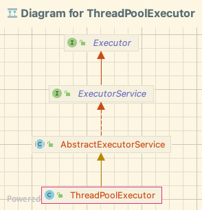

# 线程池常用配置 & 源码理解

参考文章：

- https://www.cnblogs.com/thisiswhy/p/12690630.html
- https://tech.meituan.com/2020/04/02/java-pooling-pratice-in-meituan.html

关键信息：

- 线程池可以动态调整其核心数参数。`setCorePoolSize` 方法
- spring `ThreadPoolTaskExecutor` 类包装了 juc 的 `ThreadPoolExecutor` 类，提供了更安全的调整线程池参数的方式

setCorePoolSize 源码及文档

```java
/**
* Sets the core number of threads.  This overrides any value set
* in the constructor.  If the new value is smaller than the
* current value, excess existing threads will be terminated when
* they next become idle.  If larger, new threads will, if needed,
* be started to execute any queued tasks.
*
* @param corePoolSize the new core size
* @throws IllegalArgumentException if {@code corePoolSize < 0}
* @see #getCorePoolSize
*/
public void setCorePoolSize(int corePoolSize) {
    if (corePoolSize < 0)
        throw new IllegalArgumentException();
    int delta = corePoolSize - this.corePoolSize;
    this.corePoolSize = corePoolSize;
    // 如果设置的 poolSize 小于当前工作的线程数，则将当前等待的任务取消（调用线程的 interrupt 方法）
    // 否则给当前队列中等待的任务创建新的线程（Worker），知道等待队列中没有任务在等待
    if (workerCountOf(ctl.get()) > corePoolSize)
        interruptIdleWorkers();
    else if (delta > 0) {
        // We don't really know how many new threads are "needed".
        // As a heuristic, prestart enough new workers (up to new
        // core size) to handle the current number of tasks in
        // queue, but stop if queue becomes empty while doing so.
        int k = Math.min(delta, workQueue.size());
        while (k-- > 0 && addWorker(null, true)) {
            if (workQueue.isEmpty())
                break;
        }
    }
}
```

## 线程池的几个参数

使用 ThreadPoolExecutor 创建线程池。ThreadPoolExecutor 类是创建线程池的基本类，其他类似 Executors 的各种创建方法，实际都是都过 new ThreadPoolExecutor 对象来创建线程池的。

继承关系：



参数说明：

```java
new ThreadPoolExecutor(
                10,                             // *corePoolSize: 保证存活的最少的线程数，最小是 0
                20,                             // *maximumPoolSize: 线程池最大的线程数（最大值实际上取决于 CAPCITY： 2^29 - 1。具体解释如下 ）
                0L,                             // keepAliveTime: 空闲线程的保留时间（毫秒）。当当前线程数量大于 corePoolSize 时，多出来的空余线程保留多久再 kill。在开启 allowCoreThreadTimeOut 时生效。否则一直保留空闲的线程
                TimeUnit.SECONDS,               // unit: 表示 keepAliveTime 的时间单位
                new ArrayBlockingQueue<>(10)    // workQuque: 存放等待的任务的队列
        );
```

其中和线程池性能相关的参数有：

- corePoolSize
- maximumPoolSize
- workQuque(长度)

## 源码理解

### 线程池状态

线程池状态如下：

|    状态    | 描述                                                         |
| :--------: | :----------------------------------------------------------- |
|  RUNNGING  | 能接受新提交的任务，并且也能处理阻塞队列中的任务             |
|  SHUTDONW  | 关闭状态，不再接受新提交的任务，继续处理阻塞队列中的任务     |
|    STOP    | 不接受新的任务，也不处理队列中的任务，并中断正在处理任务的进程 |
|  TIDYING   | 所有任务都终止了，workerCount 为 0                           |
| TERMINATED | 在 terminated 方法执行完后进入该状态                         |

线程池的状态维护，是内部通过两个值来维护的：`workerCount`, `runState`。具体实现，是将这两个值维护在一个变量里

```java
private final AtomicInteger ctl = new AtomicInteger(ctlOf(RUNNING, 0));
```

ctl 使用 32 位整型的高三位保存 runState, 低 29 位保存 workerCount(最大就是 2^29 - 1 个)

```java
private static final int COUNT_BITS = Integer.SIZE - 3;   // 32 - 3 = 29
private static final int CAPACITY   = (1 << COUNT_BITS) - 1;

// 运行状态保存在高位（一个符号位，两个数值位）
// runState is stored in the high-order bits
private static final int RUNNING    = -1 << COUNT_BITS;
private static final int SHUTDOWN   =  0 << COUNT_BITS;
private static final int STOP       =  1 << COUNT_BITS;
private static final int TIDYING    =  2 << COUNT_BITS;
private static final int TERMINATED =  3 << COUNT_BITS;
```