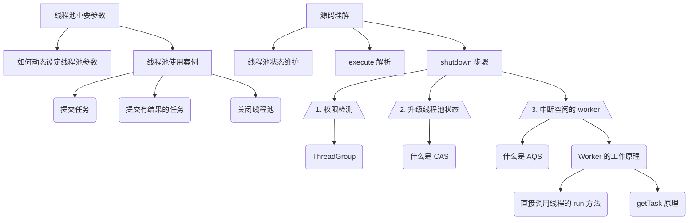

[TOC]


本文知识结构图：




# 线程池常用配置 & 源码理解

>   摘要：线程池常用配置以及相关使用方式。并基于源码理解其工作原理。在源码的基础上，延伸出来的相关知识点。

## 动态设定线程池关键参数

参考文章：

- https://www.cnblogs.com/thisiswhy/p/12690630.html
- https://tech.meituan.com/2020/04/02/java-pooling-pratice-in-meituan.html

关键信息：

- 线程池可以动态调整其核心数参数。`setCorePoolSize` 方法
- spring `ThreadPoolTaskExecutor` 类包装了 juc 的 `ThreadPoolExecutor` 类，提供了更安全的调整线程池参数的方式

setCorePoolSize 源码及文档

```java
/**
* Sets the core number of threads.  This overrides any value set
* in the constructor.  If the new value is smaller than the
* current value, excess existing threads will be terminated when
* they next become idle.  If larger, new threads will, if needed,
* be started to execute any queued tasks.
*
* @param corePoolSize the new core size
* @throws IllegalArgumentException if {@code corePoolSize < 0}
* @see #getCorePoolSize
*/
public void setCorePoolSize(int corePoolSize) {
    if (corePoolSize < 0)
        throw new IllegalArgumentException();
    int delta = corePoolSize - this.corePoolSize;
    this.corePoolSize = corePoolSize;
    // 如果设置的 poolSize 小于当前工作的线程数，则将当前等待的任务取消（调用线程的 interrupt 方法）
    // 否则给当前队列中等待的任务创建新的线程（Worker），知道等待队列中没有任务在等待
    if (workerCountOf(ctl.get()) > corePoolSize)
        interruptIdleWorkers();
    else if (delta > 0) {
        // We don't really know how many new threads are "needed".
        // As a heuristic, prestart enough new workers (up to new
        // core size) to handle the current number of tasks in
        // queue, but stop if queue becomes empty while doing so.
        int k = Math.min(delta, workQueue.size());
        while (k-- > 0 && addWorker(null, true)) {
            if (workQueue.isEmpty())
                break;
        }
    }
}
```

## 线程池的几个参数

使用 ThreadPoolExecutor 创建线程池。ThreadPoolExecutor 类是创建线程池的基本类，其他类似 Executors 的各种创建方法，实际都是都过 new ThreadPoolExecutor 对象来创建线程池的。

继承关系：


参数说明：

```java
ThreadPoolExecutor threadPoolExecutor = new ThreadPoolExecutor(
        10,                             // *corePoolSize: 保证存活的最少的线程数，最小是 0
        20,                             // *maximumPoolSize: 线程池最大的线程数（最大值实际上取决于 CAPCITY： 2^29 - 1。具体解释如下 ）
        0L,                             // keepAliveTime: 空闲线程的保留时间（毫秒）。当当前线程数量大于 corePoolSize 时，多出来的空余线程保留多久再 kill。在开启 allowCoreThreadTimeOut 时生效。否则一直保留空闲的线程
        TimeUnit.SECONDS,               // unit: 表示 keepAliveTime 的时间单位
        new ArrayBlockingQueue<>(10)    // workQuque: 存放等待的任务的队列
);
```

其中和线程池性能相关的参数有：

- corePoolSize
- maximumPoolSize
- workQuque(长度)

## 常用案例

定义一个简单的 Runnable 任务

```java
Runnable PrintTask = () -> System.out.println(Thread.currentThread().getName());
```

### 向线程池提交一个任务（Runnable，Thread）

```java
threadPoolExecutor.execute(PrintTask);
```

### 向线程池提交一个有结果的任务（Callable）

```java
Future<String> submit = threadPoolExecutor.submit(() -> {
    System.out.println("after");
    try {
        TimeUnit.SECONDS.sleep(3);
    } catch (InterruptedException e) {
        e.printStackTrace();
    }
    return "Haha";
});
System.out.println("before");
Object ret = submit.get();
System.out.println(ret);
```

### 关闭线程池

```java
// 不再接收新的任务提交，等现有任务（在运行的以及在队列中的）运行结束，关闭线程池
threadPoolExecutor.shutdown();
```

## 源码理解

### 线程池状态

线程池状态如下：

|    状态    | 描述                                                         |
| :--------: | :----------------------------------------------------------- |
|  RUNNGING  | 能接受新提交的任务，并且也能处理阻塞队列中的任务             |
|  SHUTDONW  | 关闭状态，不再接受新提交的任务，继续处理阻塞队列中的任务     |
|    STOP    | 不接受新的任务，也不处理队列中的任务，并中断正在处理任务的进程 |
|  TIDYING   | 所有任务都终止了，workerCount 为 0                           |
| TERMINATED | 在 terminated 方法执行完后进入该状态                         |

线程池的状态维护，是内部通过两个值来维护的：`workerCount`, `runState`。具体实现，是将这两个值维护在一个变量里

```java
private final AtomicInteger ctl = new AtomicInteger(ctlOf(RUNNING, 0));
```

ctl 使用 32 位整型的高三位保存 runState, 低 29 位保存 workerCount(最大就是 2^29 - 1 个)

```java
private static final int COUNT_BITS = Integer.SIZE - 3;   // 32 - 3 = 29
private static final int CAPACITY   = (1 << COUNT_BITS) - 1;

// 运行状态保存在高位（一个符号位，两个数值位）
// runState is stored in the high-order bits
private static final int RUNNING    = -1 << COUNT_BITS;
private static final int SHUTDOWN   =  0 << COUNT_BITS;
private static final int STOP       =  1 << COUNT_BITS;
private static final int TIDYING    =  2 << COUNT_BITS;
private static final int TERMINATED =  3 << COUNT_BITS;
```

### execute 解析

addWorker

### shutdown 步骤

```java
/**
* Initiates an orderly shutdown in which previously submitted
* tasks are executed, but no new tasks will be accepted.
* Invocation has no additional effect if already shut down.
*
* <p>This method does not wait for previously submitted tasks to
* complete execution.  Use {@link #awaitTermination awaitTermination}
* to do that.
*
* @throws SecurityException {@inheritDoc}
*/
public void shutdown() {
    // 1. 获取全局可重入锁
    final ReentrantLock mainLock = this.mainLock;
    mainLock.lock();
    try {
        // 2. 权限检测，使用 SecurityManager 检测每个 worker 是否有 shutdown 权限。
        checkShutdownAccess();
        // 3. 调整线程池状态为 shutdown
        advanceRunState(SHUTDOWN);
        // 4. 将空闲的 worker 终止
        interruptIdleWorkers();
        // 5. 如果是调度的线程池，则可注册 shutdown 事件
        onShutdown(); // hook for ScheduledThreadPoolExecutor
    } finally {
        mainLock.unlock();
    }
    tryTerminate();
}
```

#### 1. 权限检测

```java
/**
* If there is a security manager, makes sure caller has
* permission to shut down threads in general (see shutdownPerm).
* If this passes, additionally makes sure the caller is allowed
* to interrupt each worker thread. This might not be true even if
* first check passed, if the SecurityManager treats some threads
* specially.
*/
private void checkShutdownAccess() {
    SecurityManager security = System.getSecurityManager();
    if (security != null) {
        security.checkPermission(shutdownPerm);
        final ReentrantLock mainLock = this.mainLock;
        mainLock.lock();
        try {
            // 依次检查当前调用者是否拥有每个 worker 所属线程的 shutdown 权限 
            for (Worker w : workers)
                security.checkAccess(w.thread);
        } finally {
            mainLock.unlock();
        }
    }
}
```

##### checkAccess 方法中的知识点。

通过查看 checkAccess 方法源码，可以知道，只有当传入的线程属于 rootGroup 时才进行 check。

```java
public void checkAccess(Thread t) {
    if (t == null) {
        throw new NullPointerException("thread can't be null");
    }
    if (t.getThreadGroup() == rootGroup) {
        checkPermission(SecurityConstants.MODIFY_THREAD_PERMISSION);
    } else {
        // just return
    }
}
```

##### 那么什么是 rootGroup 呢？

在该方法的注释中有这么一句： **if the tread argument is a system thread then this method calls checkPermission. If the thread argument is not a system thread, this method just returns sliently**。这句注释配合源码可以知道，rootGroup 就是系统线程。通过再次查看 rootGroup 的创建方式可以知道，所有线程组最终的 parent 是 system 这个线程组。

如果从 main 方法打断点，获取当前线程的 threadGroup，可以看到这样的一个线程组层级关系：


```java
private static ThreadGroup rootGroup = getRootGroup();

private static ThreadGroup getRootGroup() {
    ThreadGroup root =  Thread.currentThread().getThreadGroup();
    while (root.getParent() != null) {
        root = root.getParent();
    }
    return root;
}
```

#### 2. 升级线程池的状态

使用  CAS 无锁方式升级。

```java
/**
* Transitions runState to given target, or leaves it alone if
* already at least the given target.
*
* @param targetState the desired state, either SHUTDOWN or STOP
*        (but not TIDYING or TERMINATED -- use tryTerminate for that)
*/
private void advanceRunState(int targetState) {
    for (;;) {
        int c = ctl.get();
        if (runStateAtLeast(c, targetState) ||
            ctl.compareAndSet(c, ctlOf(targetState, workerCountOf(c))))
            break;
    }
}
```

##### 那么什么是 CAS?

这里用到的是 `AtomicInteger` 的 `compareAndSet` 方法，该方法底层则是使用 `Unsafe` 类提供的 CAS 方法。

```java
/**
* Atomically sets the value to the given updated value
* if the current value {@code ==} the expected value.
*
* @param expect the expected value
* @param update the new value
* @return {@code true} if successful. False return indicates that
* the actual value was not equal to the expected value.
*/
public final boolean compareAndSet(int expect, int update) {
    return unsafe.compareAndSwapInt(this, valueOffset, expect, update);
}
```

CAS 是 `Compare And Swap` 的简称，用来原子性得修改变量值。原理是：修改值之前，判断变量当前值是否和期望的值一致，一致则说明该值没有被其他线程修改过，则进行修改；否则说明该值被其他线程修改过，本次修改失败。

因为 Unsafe 类的方法是 native 方法，实际使用的是 cpu 的原子指令 `cmpxchg`。

CAS 参考文章：[美团：Java 魔法类——Unsafe 应用解析](https://tech.meituan.com/2019/02/14/talk-about-java-magic-class-unsafe.html)

CAS 的典型应用场景：

1.   Java 的 atomic 相关类。`AtomicInterge`……
2.   Java juc 包下的 AQS
3.   CurrentHashMap

#### 3. 中断空闲的 worker

实际执行的方法为：

```java
/**
* Interrupts threads that might be waiting for tasks (as indicated by not being locked) so they can check for termination or configuration changes. 
* Ignores SecurityExceptions (in which case some threads may remain uninterrupted).
*/
private void interruptIdleWorkers(boolean onlyOne) {
  final ReentrantLock mainLock = this.mainLock;
  mainLock.lock();
  try {
    for (Worker w : workers) {
      Thread t = w.thread;
      // 如果线程不是已终止状态，并且能够获取到 worker 的锁（表示该 worker 空闲，未被加锁）
      if (!t.isInterrupted() && w.tryLock()) {
        try {
          t.interrupt();
        } catch (SecurityException ignore) {
        } finally {
          w.unlock();
        }
      }
      if (onlyOne)
        break;
    }
  } finally {
    mainLock.unlock();
  }
}
```

实际上，最终调用的还是线程的 `interrupt` 方法。

这里用尝试获取 worker 的锁来表示 worker 是否空闲。

##### 那么，worker 的工作原理是什么呢

这里的 Worker 指的是 `ThreadPoolExecutor` 类中的 Worker 类。

-   功能：主要用来维护任务线程的中断控制状态。以及其他的记录工作
-   实现：继承了 AQS(`AbstractQueuedSynchronizer`) 来简化任务运行前后锁的获取与释放工作。

Worker 也实现了 Runnable 接口，也是一个可以运行的线程，其 `run` 方法中调用 `ThreadPoolExecutor.runWorker` 方法，该方法内部在获取到一个 task 之前，都会获取 Worker 的**不可重入**锁，表示当前 Worker 正在运行。（获取线程池状态时也会以此作为依据）

翻看 runWorker 的代码，可以发现以下几点值得注意的地方：

1.   Worker 被创建，如果一直可以获得任务，就会一直运行下去。使用 while 循环判断是否能获得任务，如果 `getTask` 返回 null, 则结束循环，销毁 worker。
2.   Worker 运行 task 的方式就是**直接调用 task 的 run 方法**。有点超出一般的认知。一般在用户代码中，不会直接调用 run 方法。普遍得认为，手动调用 run 方法会使这个线程失去被调度执行的机会，而 **run 方法也将变成一个在当前线程执行的普通方法**。但是在此处，Worker 本身就是被调度的，task 这个线程在此处的作用就是提供一个统一的 run 方法。

再来说说 `getTask` 方法。

###### getTask

-   功能：阻塞或者等待一段时间得获取 task
-   返回值情况：
    -   正常情况下返回需要执行的 task
    -   否则返回 null， 表示这个 worker  需要被结束。
        1.   当前 Worker 数超出 `maximumPoolSize` 
        2.   线程池已经关闭（stopped）
        3.   线程池 shutdown 并且等待队列为空
        4.   当前 Worker 空闲的时间足够长（情况较复杂）

```java
private Runnable getTask() {
  boolean timedOut = false; // Did the last poll() time out?

  for (;;) {
    int c = ctl.get();
    int rs = runStateOf(c);

    // Check if queue empty only if necessary.
    if (rs >= SHUTDOWN && (rs >= STOP || workQueue.isEmpty())) {
      decrementWorkerCount();
      return null;
    }

    int wc = workerCountOf(c);

    // 是否通过时间来判断 Worker 是否该被销毁
    boolean timed = allowCoreThreadTimeOut || wc > corePoolSize;

    if ((wc > maximumPoolSize || (timed && timedOut))
        && (wc > 1 || workQueue.isEmpty())) {
      if (compareAndDecrementWorkerCount(c))
        return null;
      continue;
    }

    try {
      Runnable r = timed ?
        workQueue.poll(keepAliveTime, TimeUnit.NANOSECONDS) :
        workQueue.take();
      if (r != null)
        return r;
      timedOut = true;
    } catch (InterruptedException retry) {
      timedOut = false;
    }
  }
}
```

##### 那么什么是 AQS

https://github.com/doocs/source-code-hunter/blob/main/docs/JDK/concurrentCoding/%E8%AF%A6%E8%A7%A3AbstractQueuedSynchronizer.md

