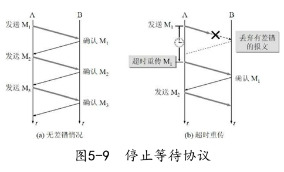

参考《计算机网络》第七版，谢希仁。有选择的读，重点读网际层、运输层和应用层。

# 概述

## 计算机网络的性能

**指标：**

1. 速率。基本单位是 bit/s ，即每秒传输的比特数量（二进制的 0 或 1），也有更大的单位：Kbit,Mbit,Gbit……一般提到的速率都是指额定速率，而非网络中的实际速率。
2. 带宽（bandwidth）。计算机网络中的带宽表示网络中通道的传输能力，单位是速率，亦即通道单位时间内支持传输的最大比特数（最高速率）。
3. 吞吐量（throughput）。单位时间内通过某网络的实际数据量，更常用于对网络的测量，额定速率是吞吐量的绝对上限值。
4. 时延（delay/latency）。由$发送时延+传播时延+处理时延+排队时延$组成。

## 计算机网络体系结构

分层是为了将一个巨大而复杂的问题转换为若干个小的问题。TCP/IP 协议并未遵循 OSI 标准，且先于 OSI 应用于互联网，TCP/IP 成了事实上的国际标准。TCP/IP 是四层结构，其中对于软件工程师最需要关注的是上面三层，即应用层、运输层和网际层。

1. 应用层。是最高层，定义了应用进程之间通信和交互的规则。常见应用层协议包括：HTTP，DNS，SMTP……应用层交互的数据单元称为报文。
2. 运输层（transport layer）。翻译为运输层更为准确。负责两个主机中的进程之间的数据运输，应用层使用此层传输应用层报文。主要有 TCP 和 UDP 两种常用协议。
   1. TCP，传输控制协议。用于提供面向连接的、可靠的数据传输服务，数据传输单位是报文段。
   2. UDP，用户数据报协议。提供无连接的、尽最大努力的数据传输服务，数据的传输单位是用户数据报。不保证数据传输的可靠性。
3. 网络层。TCP/IP 协议在网络层中使用 IP 协议把异构的物理网络连接起来。

TCP/IP 协议并未严格遵守 OSI 分层概念，即应用层的某些程序可以直接使用 IP层。

图片来源：http://www.colasoft.com.cn/download/protocols_map.php 

# 网际层

主要知识点：IP分类，子网分类，路由协议，IPV6

# 运输层

主要知识点：TCP连接三次握手、TCP断开四次挥手、滑动窗口。

## 进程间通信

运输层向应用层提供通信服务，属于面向通信部分的最高层，同时也是用户功能的最低层。另外，只有主机的协议栈采用运输层，路由器在转发分组时只用到下三层的功能。

既然 IP 协议能够把源主机发出的分组，按照首部中的目标地址送到目的主机，那为何还需要运输层？实际上，运输层提供了应用进程之间的**逻辑通信**，**通信的双方不是两个主机，而是两个主机中的应用进程在交换数据**，所以仅仅找到接收数据的主机还不够，还需要找到接收数据的对应进程。同时运输层协议还能提供网际层所不能提供的**差错检测**等功能，向高层用户屏蔽了下层网络的网络拓扑和路由选择等细节。其使得进程看见的似乎是在两个运输层实体之间有一条端到端的通信信道，故说是逻辑通信。

## 运输层的两个主要协议

运输层主要是两个协议：TCP和UDP。

常见基于 UDP 的应用层协议：DNS, DHCP, NFS。

常见基于 TCP 的应用层协议：SMTP, TELNET, HTTP, FTP。

## 运输层的端口

端口是为了解决运输层的复用和分用问题而出现了。复用是指应用层所有的进程都可以**通过运输层再传送到 IP 层（上到下）**；分用是指**运输层从 IP 层收到（下到上）**发送给各个应用的数据，需要分别交付给指明的进程。端口就是一个在网络环境下指明进程的唯一标识。由此可知，IP 地址确认主机的位置，端口号确认进程。**在主机建立一系列端口，发送端和接收端商议好在哪个端口进行数据交接，运输层即可根据端口进行分用。**需要注意的是，这种在协议栈间抽象的端口是**软件端口**，和路由器或交换机上的硬件端口不同。

端口号分类：

1. 服务端使用的端口号。又分为两类：
   1. 熟知端口号（或系统端口号），数值范围是0~1023。
   2. 登记端口号。数值范围是1024~49151。
2. 客户端使用的端口号。数值范围是49152~65535，只在客户端运行时才动态选择，用来供服务器进程发回数据到客户端进程，用完即废，所以又叫短暂端口。

常见端口及监听的程序： 22 -> ssh，23->telnet，80->http，443->https；3306->mysql……

## UDP

UDP 主要特点：

1. 无连接。即发送前不需要建立连接，当然发送完成也无需释放。
2. 尽最大努力交付。不保证可靠性，因此主机无需维护复杂的连接状态。
3. 面向报文。一次性交付一个完整的报文，不会像 TCP 一样进行拆分传输。
4. 没有拥塞机制。不会像 TCP 一样，网络的拥塞会降低主机的发送频率。这对于实时视频等要求源主机以恒定的速率发送数据的应用比较合适。
5. 支持一对一、一对多、多对一、多对多的交互通信。TCP 只支持一对一的点对点通信。
6. 首部开销小。只有 8 个字节，短于 TCP 的 20 个字节。

## TCP

TCP 主要特点：

1. 面向连接。一次通信的前后需要建立和释放连接。
2. 只能是点对点传输。
3. 提供可靠交付。能保证数据无差错、不丢失、不重复并且按序到达。
4. 全双工通信。即允许通信方法在任何时候都能发送数据，因为 TCP 连接的两端都设有发送和接收缓存，用于临时存放双向通信的数据。
5. 面向字节流。尽管应用程序和 TCP 交互是一次一个数据块，但 TCP 把应用程序交付下来的数据仅当成无结构的字节序列，并不知道序列代表的含义。

不同于 UDP 是由程序指定报文长度，**TCP 一次发送的报文段应包含多少字节，是由接收方的窗口大小和当前网络拥塞程度决定的，而不会管应用程序一次把多长的报文发送到 TCP 的缓存中**。（TCP 的流量控制和拥塞控制）

### TCP 连接

TCP 是点对点的连接，那连接的端点是什么呢？主机IP？端口？应用进程？都不是！而是**套接字（Socket）**。套接字由 IP 和端口号**共同确定**，如：``Socket = IP:Port`。则每条 TCP 连接唯一的被通信两端的 Socket 确定，即：`TCP={Socket1,Socket2}={IP1:port1,IP2,port2}` 

### 可靠传输的工作原理 & 实现

理想的传输条件的特点：

1. 传输信道不产生差错
2. 不管发送方以多快的速度发数据，接收方总是来得及处理。

拥有以上两个条件，则无需任何额外控制即可实现可靠传输。但现实的网络环境并非如此，故需要使用一些可靠传输协议来实现。如**出现差错时让对方重传**，在**接收方来不及处理时及时告诉发送方降低传输速率**。

#### 停止等待协议

指的是发送方在发送完一个分组的信息之后，停止发送，等待接受方的确认信息回复，收到确认之后再进行下一个分组的传输。

有以下四种情况：

1. <u>无差错</u>。最简单的情况。
2. <u>出现差错</u>。接收方不会向发送方反馈接到错误信息，而是直接丢弃，并不回应。发送方在一段时间后没有收到确认回应，则认为分组丢失，则会重传。**表现形式是超时重传**。
3. <u>确认丢失</u>。**接收方回应的确认信息**丢失。当这种情况发生，发送方并不知道是发送的分组丢失、出错还是接收方的确认信息丢失。所以发送方在定时器到期后就得重传分组。至于接收方，收到了重复的分组，此时有两个动作：**1. 丢弃重复分组 2. 向发送者回应确认信息**（依然要再次回应，因为既然会重发，必然是因为发送者未接到确认信息）。
4. <u>确认迟到</u>。**接收方回应的确认信息**超过发送发设定的时间。此种情况属于 3.确认丢失中的一种情况，发送方和接收方都进行了相应的后续动作，这一回合已经过去了，发送者才收到姗姗来迟的确认（重复了），此时发送者只需要忽略即可。

等待的时间是有限的，发送方发送一个分组之后会设置定时器，若在定时器结束之前收到回复，则撤销定时器；若定时结束还未收到确认回复，则发送方认为分组丢失，则会重传丢失的分组，这叫**超时重传**。

通常发送者总是会收到对所有发送分组的确认信息，如果不断的重传且得不到确认，则说明通信线路太差，不能进行通信。**使用上述确认和重传机制，就可以在不可靠的网络上实现可靠的通信。**通常称为**自动重传请求**（**ARQ**,Automatic Repeat reQuest）。

显然，停止等待协议信道利用率低，可使用**流水线传输**提高信道利用率。即发送方连续发送多个分组，而不是每发完一个就等待对方的确认，这样可以保证信道上一直有数据不间断的在传送。此时就要用到 **连续 ARQ 协议**和**滑动窗口协议**。

#### 连续 ARQ 协议

此部分还涉及**滑动窗口**的概念。窗口是缓存的一部分，缓存区内的数据可以连续发送，而无需一个个的等对方确认。而滑动则是指接收到对方的确认消息之后，发送方更新缓存的过程，而滑动的步进则是由接收方的确认回应来决定的。接收方采用的是**累积确认**的方式，即**对于按序收到的多个分组，只需要对最后一个分组发送确认即可**，表示到这个分组为止，之前的都收到了。实际上，**滑动窗口逻辑上将待发送数据按发送时间的先后排成一列**(序号空间，是有限的，最好是做成环状便于重复利用)，假设窗口大小为 5，有 D0 ~ D10 的数据需要发送，初始时，窗口内的数据是 D0 ~ D4，这些数据连续发送，发送完等待。若此时接收方回应确认 D3 ,则表示 D0、D1、D2、D3 都正确收到，发送方将窗口向前（时间序列的后）滑动 4 个分组。至于 D4 ，需要重新发送。

从此可以看出 **ARQ 的缺点**，就是**累积确认不能向发送方反映出接收方已经正确接收到的所有分组信息**。例如上文的例子，若 D2 丢失，则接收方只能对 D1 回应确认，发送方需要将 D2~D4 都重传一次，这叫 **Go-back-N(回退 N)**。

**TCP 首部格式：TCP 的全部功能都体现在其首部个字段的作用，详细参考 5.5 节**

#### 可靠传输的实现

##### 以字节为单位的滑动窗口

**窗口**：可以看做是一个缓冲区。发送窗口缓冲待发送和待确认的数据，接收窗口缓冲待处理的数据。

窗口由两个指针指明范围，分为上沿和下沿，通常认为上沿的增加标识着未发送的数据的增加，下沿的增加标识着已发送并得到确认的数据的增加；或者说是**上沿之上是未发送的数据，下沿之下是已发送且得到确认的数据**。就算在窗口内的数据可以依次发送而不需对方确认，但发送方依然要缓存未收到确认的数据，以便于出现异常后重新发送，故，**窗口实际上是由三个指针确定的**，在上下沿中间，还有一个指针用于作为窗口内数据是否得到确认的分界线。图 5-16 中 P1 P3 分别为窗口的下沿和上沿。这是发送窗口的情况，再看接收窗口。

接收窗口只要两个指针确定即可。**接收方只能对按序到达的数据中的最高序号进行确认**，而对于没有按序到达的数据（一般是因为前面的数据丢失或迟到而导致的提前到达）会先缓存，不会进行确认，更不会交付上层。

**窗口和缓存的关系**：窗口是缓存的一部分。

1. 发送方：发送缓存用于存储**准备发送的数据**和**已发出但未被确认的数据**。已确认的数据需要从发送缓存中删除。发送方应用程序需要控制向发送缓存写数据的速率，过快则会导致发送缓存没有多余空间存储。
2. 接收方：接收缓存用于存储**按序到达但未被读取的数据**和**未按序到达的数据**。已读取的数据需要从接收缓存中删除。接收程序也要及时读取正确数据，否则会造成积压，和接收窗口的减小。

##### 超时重传时间的选择

超时重传的时间选择是最复杂的问题，因为 TCP 下层是复杂的网络环境，网络速率不一，路由长短不同。若超时时间太短，则会引起很多报文的不必要重传，增大网络负荷；若太长，则增大网络空闲时间，降低传输效率。为此，TCP 采用了一种自适应的算法。

记录一个报文段发出的时间和接收到确认的时间，这个时间差就是报文段往返的时间 **RTT** 。TCP 保留 RTT 的加权平均值  $RTT_S$，第一次测量到的 RTT 就作为 $RTT_S$ 的值，往后每测量到一个新的 RTT 样本，就按这个公式计算得到 $RTT_S$：

\times RTTs+\alpha\times RTT , 0\le\alpha < 1)

由此公式可看出，若 $\alpha$ 接近 0 ，则表示新的 RTT 样本对 RTTs 值影响不大；若 $\alpha$ 接近 1，则表示新的 RTT 样本对 $RTT_S$值影响很大。RFC 6298 推荐 $\alpha = 0.125$ 。显然，超时重传时间 RTO 应略大于  $RTT_S$:

其中 $RTT_D$ 是 RTT 的偏差的加权平均，与  $RTT_S$ 和新的 RTT 样本之差有关。

\times RTT_D+\beta\times abs(RTT_S-RTT))

$\beta \lt 1$ , 推荐 $\beta = 0.25$ 。

### 流量控制

使用滑动窗口实现流量控制。流量控制的目的是为了让发送速度和接收速度相匹配，即**控制发送速度，让接收方来得及接收**（接收窗口大小的限制），发送速度是由接收窗口的大小控制的。

在连接建立时，接收方就会告诉发送方其接收窗口的大小，在接下来的传输过程中，若接收方来不及处理数据，就会减小窗口大小并告知发送方；若接收方及时处理完数据，即可再次增大窗口大小；当告诉发送方其接收窗口为 0 时，表示不允许再发送数据，此时发送方会设置一个持续计时器，若计时器到期，则发送一个零窗口探测报文段（仅包含一个字节），接收方会在对探测报文段的确认中给出现在的窗口值。若依然为 0 ，则重置计时器；如果不是 0 ，则恢复传输。**设置持续计时器的目的**：为了防止接收方恢复接收数据能力时告知发送方的数据丢失而造成**死锁**。

#### TCP 的传输效率

为了提高 TCP 的传输效率，不使 TCP 的性能变坏，发送方和接收方需要：

1. **发送方确认数据发送的时机**。最好是积攒一些数据组成长度合理的报文段一次发送，而不是一两个字节就发送，这样传输一次的冗余内容多于实际数据。
2. **接收方确认确认回传的时机**。假设这样的场景，接收方缓存已满，且应用程序读取缓慢，此时若读取一个字节，接收方就腾出一个窗口，就给发送方提示有一个空位，这样来来往往，网络传输效率很低。**接收方要矜持一点**，等接收窗口有一定的空间再向发送方要数据。

总之，传输过程中，尽量避免传输数据比其他 TCP 字段长度还小的情况。

### 拥塞控制

### 运输连接管理

# 应用层

# TCP/IP review

## Chapter 8 common commands

### PING(Packet InterNet Grouper)

检测分析网络连接情况
`ping/?`查看所有参数及用法
`ping host` 命令，Windows默认ping 4 个包，Linux会一直ping，所以需要加参数
`ping`命令会携带源地址和目标地址以及简单的计数器和计时器，每经过一个路由器计数器就 +1 ，直到到达目标节点，目标节点再将两个地址交换，再重复上述步骤，若运行`ping`命令的主机收到回复，则说明两个主机之间的存在往返通路，往返路程未必相同。若ping不通则说明两个主机之间的往返路径至少有一个是不通的。所以`ping`命令是用来检测两个IP节点之间的连通性的工具。
若本机地址无法ping通，则说明TCP/IP协议未正常工作。

### Traceroute

