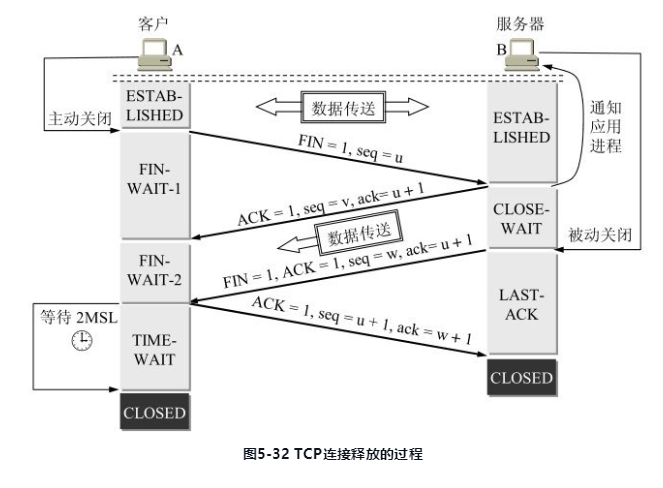

参考《计算机网络》第七版，谢希仁。有选择的读，重点读网际层、运输层和应用层。

# 概述

## 计算机网络的性能

**指标：**

1. 速率。基本单位是 bit/s ，即每秒传输的比特数量（二进制的 0 或 1），也有更大的单位：Kbit,Mbit,Gbit……一般提到的速率都是指额定速率，而非网络中的实际速率。
2. 带宽（bandwidth）。计算机网络中的带宽表示网络中通道的传输能力，单位是速率，亦即通道单位时间内支持传输的最大比特数（最高速率）。
3. 吞吐量（throughput）。单位时间内通过某网络的实际数据量，更常用于对网络的测量，额定速率是吞吐量的绝对上限值。
4. 时延（delay/latency）。由$发送时延+传播时延+处理时延+排队时延$组成。

## 计算机网络体系结构

分层是为了将一个巨大而复杂的问题转换为若干个小的问题。TCP/IP 协议并未遵循 OSI 标准，且先于 OSI 应用于互联网，TCP/IP 成了事实上的国际标准。TCP/IP 是四层结构，其中对于软件工程师最需要关注的是上面三层，即应用层、运输层和网际层。

1. 应用层。是最高层，定义了应用进程之间通信和交互的规则。常见应用层协议包括：HTTP，DNS，SMTP……应用层交互的数据单元称为报文。
2. 运输层（transport layer）。翻译为运输层更为准确。负责两个主机中的进程之间的数据运输，应用层使用此层传输应用层报文。主要有 TCP 和 UDP 两种常用协议。
   1. TCP，传输控制协议。用于提供面向连接的、可靠的数据传输服务，数据传输单位是报文段。
   2. UDP，用户数据报协议。提供无连接的、尽最大努力的数据传输服务，数据的传输单位是用户数据报。不保证数据传输的可靠性。
3. 网络层。TCP/IP 协议在网络层中使用 IP 协议把异构的物理网络连接起来。

TCP/IP 协议并未严格遵守 OSI 分层概念，即应用层的某些程序可以直接使用 IP层。


图片来源：http://www.colasoft.com.cn/download/protocols_map.php 

# 网际层

主要知识点：IP分类，子网分类，路由协议，IPV6


# 运输层

主要知识点：TCP连接三次握手、TCP断开四次挥手、滑动窗口。

## 进程间通信

运输层向应用层提供通信服务，属于面向通信部分的最高层，同时也是用户功能的最低层。另外，只有主机的协议栈采用运输层，路由器在转发分组时只用到下三层的功能。

既然 IP 协议能够把源主机发出的分组，按照首部中的目标地址送到目的主机，那为何还需要运输层？实际上，运输层提供了应用进程之间的**逻辑通信**，**通信的双方不是两个主机，而是两个主机中的应用进程在交换数据**，所以仅仅找到接收数据的主机还不够，还需要找到接收数据的对应进程。同时运输层协议还能提供网际层所不能提供的**差错检测**等功能，向高层用户屏蔽了下层网络的网络拓扑和路由选择等细节。其使得进程看见的似乎是在两个运输层实体之间有一条端到端的通信信道，故说是逻辑通信。

## 运输层的两个主要协议

运输层主要是两个协议：TCP和UDP。

常见基于 UDP 的应用层协议：DNS, DHCP, NFS。

常见基于 TCP 的应用层协议：SMTP, TELNET, HTTP, FTP。

## 运输层的端口

端口是为了解决运输层的复用和分用问题而出现了。复用是指应用层所有的进程都可以**通过运输层再传送到 IP 层（上到下）**；分用是指**运输层从 IP 层收到（下到上）**发送给各个应用的数据，需要分别交付给指明的进程。端口就是一个在网络环境下指明进程的唯一标识。由此可知，IP 地址确认主机的位置，端口号确认进程。**在主机建立一系列端口，发送端和接收端商议好在哪个端口进行数据交接，运输层即可根据端口进行分用。**需要注意的是，这种在协议栈间抽象的端口是**软件端口**，和路由器或交换机上的硬件端口不同。

端口号分类：

1. 服务端使用的端口号。又分为两类：
   1. 熟知端口号（或系统端口号），数值范围是0~1023。
   2. 登记端口号。数值范围是1024~49151。
2. 客户端使用的端口号。数值范围是49152~65535，只在客户端运行时才动态选择，用来供服务器进程发回数据到客户端进程，用完即废，所以又叫短暂端口。

常见端口及监听的程序： 22 -> ssh，23->telnet，80->http，443->https；3306->mysql……

## UDP

UDP 主要特点：

1. 无连接。即发送前不需要建立连接，当然发送完成也无需释放。
2. 尽最大努力交付。不保证可靠性，因此主机无需维护复杂的连接状态。
3. 面向报文。一次性交付一个完整的报文，不会像 TCP 一样进行拆分传输。
4. 没有拥塞机制。不会像 TCP 一样，网络的拥塞会降低主机的发送频率。这对于实时视频等要求源主机以恒定的速率发送数据的应用比较合适。
5. 支持一对一、一对多、多对一、多对多的交互通信。TCP 只支持一对一的点对点通信。
6. 首部开销小。只有 8 个字节，短于 TCP 的 20 个字节。

## TCP

TCP 主要特点：

1. 面向连接。一次通信的前后需要建立和释放连接。
2. 只能是点对点传输。
3. 提供可靠交付。能保证数据无差错、不丢失、不重复并且按序到达。
4. 全双工通信。即允许通信方法在任何时候都能发送数据，因为 TCP 连接的两端都设有发送和接收缓存，用于临时存放双向通信的数据。
5. 面向字节流。尽管应用程序和 TCP 交互是一次一个数据块，但 TCP 把应用程序交付下来的数据仅当成无结构的字节序列，并不知道序列代表的含义。

不同于 UDP 是由程序指定报文长度，**TCP 一次发送的报文段应包含多少字节，是由接收方的窗口大小和当前网络拥塞程度决定的，而不会管应用程序一次把多长的报文发送到 TCP 的缓存中**。（TCP 的流量控制和拥塞控制）

### TCP 连接

TCP 是点对点的连接，那连接的端点是什么呢？主机IP？端口？应用进程？都不是！而是**套接字（Socket）**。套接字由 IP 和端口号**共同确定**，如：``Socket = IP:Port`。则每条 TCP 连接唯一的被通信两端的 Socket 确定，即：`TCP={Socket1,Socket2}={IP1:port1,IP2,port2}` 

### 可靠传输的工作原理 & 实现

理想的传输条件的特点：

1. 传输信道不产生差错
2. 不管发送方以多快的速度发数据，接收方总是来得及处理。

拥有以上两个条件，则无需任何额外控制即可实现可靠传输。但现实的网络环境并非如此，故需要使用一些可靠传输协议来实现。如**出现差错时让对方重传**，在**接收方来不及处理时及时告诉发送方降低传输速率**。

#### 停止等待协议

指的是发送方在发送完一个分组的信息之后，停止发送，等待接受方的确认信息回复，收到确认之后再进行下一个分组的传输。

有以下四种情况：

1. <u>无差错</u>。最简单的情况。
2. <u>出现差错</u>。接收方不会向发送方反馈接到错误信息，而是直接丢弃，并不回应。发送方在一段时间后没有收到确认回应，则认为分组丢失，则会重传。**表现形式是超时重传**。
3. <u>确认丢失</u>。**接收方回应的确认信息**丢失。当这种情况发生，发送方并不知道是发送的分组丢失、出错还是接收方的确认信息丢失。所以发送方在定时器到期后就得重传分组。至于接收方，收到了重复的分组，此时有两个动作：**1. 丢弃重复分组 2. 向发送者回应确认信息**（依然要再次回应，因为既然会重发，必然是因为发送者未接到确认信息）。
4. <u>确认迟到</u>。**接收方回应的确认信息**超过发送发设定的时间。此种情况属于 3.确认丢失中的一种情况，发送方和接收方都进行了相应的后续动作，这一回合已经过去了，发送者才收到姗姗来迟的确认（重复了），此时发送者只需要忽略即可。

等待的时间是有限的，发送方发送一个分组之后会设置定时器，若在定时器结束之前收到回复，则撤销定时器；若定时结束还未收到确认回复，则发送方认为分组丢失，则会重传丢失的分组，这叫**超时重传**。


通常发送者总是会收到对所有发送分组的确认信息，如果不断的重传且得不到确认，则说明通信线路太差，不能进行通信。**使用上述确认和重传机制，就可以在不可靠的网络上实现可靠的通信。**通常称为**自动重传请求**（**ARQ**,Automatic Repeat reQuest）。

显然，停止等待协议信道利用率低，可使用**流水线传输**提高信道利用率。即发送方连续发送多个分组，而不是每发完一个就等待对方的确认，这样可以保证信道上一直有数据不间断的在传送。此时就要用到 **连续 ARQ 协议**和**滑动窗口协议**。

#### 连续 ARQ 协议

此部分还涉及**滑动窗口**的概念。窗口是缓存的一部分，缓存区内的数据可以连续发送，而无需一个个的等对方确认。而滑动则是指接收到对方的确认消息之后，发送方更新缓存的过程，而滑动的步进则是由接收方的确认回应来决定的。接收方采用的是**累积确认**的方式，即**对于按序收到的多个分组，只需要对最后一个分组发送确认即可**，表示到这个分组为止，之前的都收到了。实际上，**滑动窗口逻辑上将待发送数据按发送时间的先后排成一列**(序号空间，是有限的，最好是做成环状便于重复利用)，假设窗口大小为 5，有 D0 ~ D10 的数据需要发送，初始时，窗口内的数据是 D0 ~ D4，这些数据连续发送，发送完等待。若此时接收方回应确认 D3 ,则表示 D0、D1、D2、D3 都正确收到，发送方将窗口向前（时间序列的后）滑动 4 个分组。至于 D4 ，需要重新发送。

从此可以看出 **ARQ 的缺点**，就是**累积确认不能向发送方反映出接收方已经正确接收到的所有分组信息**。例如上文的例子，若 D2 丢失，则接收方只能对 D1 回应确认，发送方需要将 D2~D4 都重传一次，这叫 **Go-back-N(回退 N)**。

**TCP 首部格式：TCP 的全部功能都体现在其首部个字段的作用，详细参考 5.5 节**


#### 可靠传输的实现

##### 以字节为单位的滑动窗口

**窗口**：可以看做是一个缓冲区。发送窗口缓冲待发送和待确认的数据，接收窗口缓冲待处理的数据。

窗口由两个指针指明范围，分为上沿和下沿，通常认为上沿的增加标识着未发送的数据的增加，下沿的增加标识着已发送并得到确认的数据的增加；或者说是**上沿之上是未发送的数据，下沿之下是已发送且得到确认的数据**。就算在窗口内的数据可以依次发送而不需对方确认，但发送方依然要缓存未收到确认的数据，以便于出现异常后重新发送，故，**窗口实际上是由三个指针确定的**，在上下沿中间，还有一个指针用于作为窗口内数据是否得到确认的分界线。图 5-16 中 P1 P3 分别为窗口的下沿和上沿。这是发送窗口的情况，再看接收窗口。

接收窗口只要两个指针确定即可。**接收方只能对按序到达的数据中的最高序号进行确认**，而对于没有按序到达的数据（一般是因为前面的数据丢失或迟到而导致的提前到达）会先缓存，不会进行确认，更不会交付上层。

**窗口和缓存的关系**：窗口是缓存的一部分。

1. 发送方：发送缓存用于存储**准备发送的数据**和**已发出但未被确认的数据**。已确认的数据需要从发送缓存中删除。发送方应用程序需要控制向发送缓存写数据的速率，过快则会导致发送缓存没有多余空间存储。
2. 接收方：接收缓存用于存储**按序到达但未被读取的数据**和**未按序到达的数据**。已读取的数据需要从接收缓存中删除。接收程序也要及时读取正确数据，否则会造成积压，和接收窗口的减小。


##### 超时重传时间的选择

超时重传的时间选择是最复杂的问题，因为 TCP 下层是复杂的网络环境，网络速率不一，路由长短不同。若超时时间太短，则会引起很多报文的不必要重传，增大网络负荷；若太长，则增大网络空闲时间，降低传输效率。为此，TCP 采用了一种自适应的算法。

记录一个报文段发出的时间和接收到确认的时间，这个时间差就是报文段往返的时间 **RTT** 。TCP 保留 RTT 的加权平均值  RTT<sub>S</sub>，第一次测量到的 RTT 就作为 RTT<sub>S</sub> 的值，往后每测量到一个新的 RTT 样本，就按这个公式计算得到 RTT<sub>S</sub>：

\times RTTs+\alpha\times RTT , 0\le\alpha < 1)

由此公式可看出，若 α 接近 0 ，则表示新的 RTT 样本对 RTTs 值影响不大；若 α 接近 1，则表示新的 RTT 样本对 值影RTT<sub>S</sub>响很大。RFC 6298 推荐 α = 0.125 。显然，超时重传时间 RTO 应略大于 RTT<sub>S</sub>：


其中 RTT<sub>D</sub> 是 RTT 的偏差的加权平均，与   RTT<sub>S</sub>和新的 RTT 样本之差有关。

\times RTT_D+\beta\times abs(RTT_S-RTT))

β < 1 , 推荐 β = 0.25 。

### 流量控制

使用滑动窗口实现流量控制。流量控制的目的是为了让发送速度和接收速度相匹配，即**控制发送速度，让接收方来得及接收**（接收窗口大小的限制），发送速度是由接收窗口的大小控制的。

在连接建立时，接收方就会告诉发送方其接收窗口的大小，在接下来的传输过程中，若接收方来不及处理数据，就会减小窗口大小并告知发送方；若接收方及时处理完数据，即可再次增大窗口大小；当告诉发送方其接收窗口为 0 时，表示不允许再发送数据，此时发送方会设置一个持续计时器，若计时器到期，则发送一个零窗口探测报文段（仅包含一个字节），接收方会在对探测报文段的确认中给出现在的窗口值。若依然为 0 ，则重置计时器；如果不是 0 ，则恢复传输。**设置持续计时器的目的**：为了防止接收方恢复接收数据能力时告知发送方的数据丢失而造成**死锁**。

#### TCP 的传输效率

为了提高 TCP 的传输效率，不使 TCP 的性能变坏，发送方和接收方需要：

1. **发送方确认数据发送的时机**。最好是积攒一些数据组成长度合理的报文段一次发送，而不是一两个字节就发送，这样传输一次的冗余内容多于实际数据。
2. **接收方确认确认回传的时机**。假设这样的场景，接收方缓存已满，且应用程序读取缓慢，此时若读取一个字节，接收方就腾出一个窗口，就给发送方提示有一个空位，这样来来往往，网络传输效率很低。**接收方要矜持一点**，等接收窗口有一定的空间再向发送方要数据。

总之，传输过程中，尽量避免传输数据比其他 TCP 字段长度还小的情况。

### 拥塞控制

**拥塞（congestion）**：某段时间内，对网络中的某种资源的需求超过了该资源所能提供的部分，网络的性能就会变坏，就产生网络拥塞。其中，资源主要指带宽、交换节点中的缓存和处理机等。

网络拥塞是个复杂的问题，不是简单的通过增加处理机的速度或是节点的缓存空间就可以的，这是一个整体性的问题。

**网络拥塞的成因**有很多：

1. 节点缓存：**当节点缓存过小时**，到达节点的分组因没有缓存空间而被丢弃，就会导致重发，往往传输一个单位的数据会导致好几个单位的数据在网络上传输；**当节点缓存过大时**，凡是到达该节点的分组都被缓存起来，而输出链路的容量和处理机的速度并未提高，导致队列中的分组等待时间大大增加，最终导致超时重传，**导致更多的分组流向网络**。由此可见，简单的增大或缩小节点缓存并不能解决网络拥塞，相反，可能是网络性能更糟。
2. 处理机的速度：若简单的提高处理机的速度，可能会稍微缓解上述问题，但往往又会将瓶颈转移到其他地方。问题是系统的各个部分不匹配，只有各个部分平衡了，问题才会得到解决。

#### 拥塞控制与流量控制

二者关系密切，也存在一些差别。

所谓**拥塞控制**就是防止过多的分组涌入网络中，不至于使路由器或链路过载。**拥塞控制是一个全局性的过程，涉及到所有的主机、所有的路由器**。

**流量控制**是点对点通信量的控制，端到端的问题，控制的是发送端发送数据的速率，使接收端来得及接收。

**拥塞控制和流量控制之所以常常被弄混**，是因为某些拥塞控制算法是向发送端发送控制报文，并告诉发送端，网络已出现麻烦，必须放慢发送速率。这点又和流量控制是很相似的。

#### 几种拥塞控制方法

**慢开始**(slow-start)、**拥塞避免**(congestion avoidance)、**快重传**(fast retransmit)和**快恢复**(fast recovery)。

发送方维持一个叫**拥塞窗口** cwnd (congestion window)的状态变量，其大小取决于网络的拥塞程度，且动态变化。**发送方让自己的发送窗口等于拥塞窗口**（若考虑对方的接收能力，还可能小），若当前网络拥塞，则减小窗口，以便更少的分组涌入网络；若没有拥塞，则增大窗口，以便把更多的分组发送出去。**判断网络拥塞与否的原则**：只要发送方没有接收到应当达到的确认报文，就认为当前网络发生了拥塞（网络拥塞时，路由器就会丢弃分组）。

##### 慢开始和拥塞避免

**慢开始算法**思路：主机开始向网络中注入数据时，并不了解当前网络的负荷情况，若一下子注入过多的数据，则可能引起网络拥塞。较好的方法是先试探一下，即**由小到大地增大拥塞窗口**。一般把 cwnd 设置为一个**最大报文段** MSS，每接收到一个对新的报文段的确认，就将 cwnd 增加一个 MSS 的值，即增大一倍（1,2,4,8,……）。（MSS = 当前 cwnd。）

同时为了防止 cwnd 的过度增大导致网络拥塞，还设有一个 **慢开始门限** ssthresh 状态变量，当 cwnd 超过 ssthresh 时，则使用**拥塞避免算法**。

**拥塞避免算法**：**慢开始算法使 cwnd 指数式的增长，而拥塞避免算法则是使 cwnd 线性增长。**每接收到一个对新的报文段的确认，就将 cwnd 加 1。

**ssthresh 的设置**：无论是在以上哪个阶段，只要发送方判断当前网络出现拥塞，即把 ssthresh 设置为发生拥塞时的发送窗口的一半，但不小于 2 ，然后把 ssthresh 设置为 1，开始执行慢开始算法（ssthresh 的计算公式在 RFC 2581 中有新算法）。这样可以迅速减少主机发送到网络中的分组数，让发生拥塞的路由器有时间处理队列中的积压数据。


“**乘法减小**”(Multiplicative Decrease)和“**加法增大**”(Additive Increase)：

1. “乘法减小”是指不论在慢开始阶段还是拥塞避免阶段，只要出现超时（即很可能出现了网络拥塞），就把慢开始门限值ssthresh减半，即设置为当前的拥塞窗口的一半（与此同时，执行慢开始算法）。**当网络频繁出现拥塞时，ssthresh值就下降得很快**，以大大减少注入到网络中的分组数。
2. “加法增大”是指执行拥塞避免算法后，**使拥塞窗口缓慢增大**，以防止网络过早出现拥塞。

上面两种算法合起来就是使用最广泛的 AIMD 算法（加法增大乘法减小）。

实际上，“拥塞避免”并非指完全能够避免了拥塞。利用以上的措施要完全避免网络拥塞还是不可能的。**“拥塞避免”是说在拥塞避免阶段将拥塞窗口控制为按线性规律增长**，使网络比较不容易出现拥塞。

##### 快重传和快恢复

**快重传算法**<u>要求接收方收到一个失序报文段之后，为了使发送方尽早知道有报文段没有到达，立即发送重复确认，而不是等到自己发送数据时捎带</u>。假设有 M 1-7 个报文段需要发送，接收方只接收到了 M1 和 M2，并发回确认报文，M3丢失，当接收方接收到 M4 时，接收方不能进行确认，因为 M4 是失序报文，按快重传算法要求，需要再次对 M2 进行重复确认，发送方只要一连收到三个重复确认，就要立即重传对方未接收到的报文段 M3，而不需要等计时器到时再重传。


**快恢复算法**是与快重传配合的算法。要点是：

1. **ssthresh 减半**：当发送方连续收到三个重复确认时，就执行“乘法减小”算法，把慢开始门限 ssthresh 减半。**但接下去不执行慢开始算法**。
2. **执行拥塞避免算法**：由于发送方现在认为网络**很可能没有发生拥塞**（因为有三个重复确认报文到达），因此**不执行慢开始算法**，而是把 cwnd 值设置为慢开始门限 ssthresh 减半后的数值，**然后开始执行拥塞避免算法**（“加法增大”），使拥塞窗口缓慢地线性增大。


实际上，发送窗口并不仅仅由网络拥塞程度来决定，还收接收方的接收能力决定，故发送窗口的上限值 swndUpLimit:

)

即，接收窗口 rwnd 和 拥塞窗口 cwnd 中较小的一个。

#### 随机早期检测 (RED)

之前讨论的拥塞控制并没有和网络层采取的策略进行联系，实际上是有密切联系的。

RED （Random Early Detection）又称为**随机早期丢弃**（Random Early Drop 、Random Early Discard），这是更容易反映其本质的翻译。网络层的路由器采用该策略是因为避免**全局同步**的现象产生。

**全局同步**：网络层的策略对 TCP 拥塞控制影响最大的是路由器因队列长度限制而产生的**尾部分组丢弃策略**，分组被丢弃或因排队导致分组处理时间超过重传时间，则会导致发送端认为网络产生了拥塞，TCP 进入拥塞控制的慢开始状态，使得 TCP 连接的发送方突然将发送速率降得很低。更为严重的是，网络中的很多共用同一个 IP 数据报的 TCP 同时进入慢开始的状态，这叫**全局同步**，使得全网通信量突然下降很多，而网络恢复之后，又突然增多。

RED 策略的要点：路由器队列维护两个参数，队列长度最小门限 TH<sub>min</sub> 和最大门限 TH<sub>max</sub>，每当一个分组到来，就计算平均队列长度 L<sub>av</sub>，算法过程是：

```c
if (lav < THmin) {                           // lav < THmin
    enqueue(segment)                         // 新到达分组入队，丢弃概率为 0
} else if (lav > THmax) {                    // THmax < lav
    drop(segment)                            // 丢弃分组，丢弃概率为 1
} else if (THmin < lav && lav < THmax) {     // THmin < lav < Thmax
    dropWithProbability(segment,probability) // 按一定概率丢弃分组
}
```


RED 不是等到网络已经发生拥塞再进行尾部分组丢弃，而是**在检测到网络拥塞的早期征兆时（即路由器的平均队列长度超过一定门限值），就以概率 p 随机丢弃分组**，让拥塞控制只在个别 TCP 连接上进行，避免全局同步的发生。

RED 正常工作的关键就是选好三个参数。其中，经过试验证明：TH<sub>max</sub> = 2 * TH<sub>min</sub> 是合适的，同时 TH<sub>min</sub> 必须足够大。

平均队列长度 L<sub>av</sub> 计算方法：

 \times L_{av} + \delta \times queueLen , 0 < \delta < 1)

同 RTT 类似，以加权平均法计算 L<sub>av</sub> ，加权因子对结果的影响也和 RTT 相同。

分组丢弃概率 p 计算方法：

})

count 表示新到达的分组中没有被丢弃的数量，p<sub>temp</sub> 是过渡分组概率：

}{TH_{max} - TH_{min}})

### 运输连接管理

TCP 连接的建立和释放。

#### 连接的建立(三次握手，three-way handshake)

在 TCP 连接建立过程中要解决以下三个问题：

1.  要使每一方能够确知**对方的存在**。
2. 要允许**双方协商一些参数**（如最大窗口值、是否使用窗口扩大选项和时间戳选项以及服务质量等）。
3. 能够对运输实体资源（如缓存大小、连接表中的项目等）进行分配。


**为什么需要第三次握手**：现假定出现一种异常情况，A 发出的第一个连接请求报文段并没有丢失，而是在某些网络结点长时间滞留了，以致延误到连接释放以后的某个时间才到达 B。本来这是一个早已失效的报文段。但 B 收到此失效的连接请求报文段后，就误认为是 A 又发出一次新的连接请求。于是就向 A 发出确认报文段，同意建立连接。**假定不采用三次握手，那么只要 B 发出确认，新的连接就建立了**。或者，A 只选择其中一个连接发送数据，而 B 也会一直在另一个连接处等待接受数据，B 的资源就这样被浪费。

#### 连接的释放（四次挥手）



B 在 收到 A 在发出`ACK = 1,seq = u + 1,ack = w + 1` 的之后，就撤销了 TCB，就结束了这一次 TCP 连接，而 A 则需要再等 2MSL 的时间再进入 CLOSED 状态，即**服务端要比客户端更早的结束连接**。

除此之外，TCP 还设有**保活计时器**（keepalive timer），用于已经建立的 TCP 连接中，客户端出现故障，而不让服务端一直等下去。

#### TCP 连接的有限状态机

为了更清晰地看出 TCP 连接的各种状态之间的关系，图5-33给出了 TCP 的有限状态机。图中每一个方框即 TCP 可能具有的状态。每个方框中的大写英文字符串是 TCP 标准所使用的 TCP 连接状态名。状态之间的箭头表示可能发生的状态变迁。箭头旁边的字，表明引起这种变迁的原因，或表明发生状态变迁后又出现什么动作。请注意图中有三种不同的箭头。**粗实线箭头表示对客户进程的正常变迁**。**粗虚线箭头表示对服务器进程的正常变迁**。**另一种细线箭头表示异常变迁**。


## 运输层重点

- 运输层提供应用进程间的逻辑通信，也就是说，运输层之间的通信并不是真正在两个运输层之间直接传送数据。运输层向应用层屏蔽了下面网络的细节（如网络拓扑、所采用的路由选择协议等），它使应用进程看见的就是好像在两个运输层实体之间有一条端到端的逻辑通信信道。
- 网络层为主机之间提供逻辑通信，而运输层为应用进程之间提供端到端的逻辑通信。
- 运输层有两个主要的协议：TCP 和 UDP。它们都有复用和分用，以及检错的功能。当运输层采用面向连接的 TCP 协议时，尽管下面的网络是不可靠的（只提供尽最大努力服务），但这种逻辑通信信道就相当于一条全双工通信的可靠信道。当运输层采用无连接的 UDP 协议时，这种逻辑通信信道仍然是一条不可靠信道。
- 运输层用一个 16 位端口号来标志一个端口。端口号只具有本地意义，它只是为了标志本计算机应用层中的各个进程在和运输层交互时的层间接口。在因特网的不同计算机中，相同的端口号是没有关联的。
- 两台计算机中的进程要互相通信，不仅要知道对方的 IP 地址（为了找到对方的计算机），而且还要知道对方的端口号（为了找到对方计算机中的应用进程）。
-  运输层的端口号分为服务器端使用的端口号（0～1023 指派给熟知端口，1024～49151 是登记端口号）和客户端暂时使用的端口号（49152～65535）。
- **UDP 的主要特点**是：(1) 无连接；(2) 尽最大努力交付；(3) 面向报文；(4) 无拥塞控制；(5) 支持一对一、一对多、多对一和多对多的交互通信；(6) 首部开销小（只有四个字段：源端口、目的端口、长度、检验和）。
- **TCP 的主要特点**是：(1) 面向连接；(2) 每一条TCP连接只能是点对点的（一对一）；(3) 提供可靠交付的服务；(4) 提供全双工通信；(5) 面向字节流。
-  TCP 用主机的 IP 地址加上主机上的端口号作为 TCP 连接的端点。这样的端点就叫做套接字（socket）或插口。套接字用（IP 地址：端口号）来表示。
- **停止等待协议**能够在不可靠的传输网络上实现可靠的通信。每发送完一个分组就停止发送，等待对方的确认。在收到确认后再发送下一个分组。分组需要进行编号。
- **超时重传**是指只要超过了一段时间仍然没有收到确认，就重传前面发送过的分组（认为刚才发送的分组丢失了）。因此每发送完一个分组需要设置一个超时计时器，其重传时间应比数据在分组传输的平均往返时间更长一些。这种自动重传方式常称为**自动重传请求 ARQ**。
- 在停止等待协议中，若接收方收到重复分组，就丢弃该分组，但同时还要发送确认。
- **连续 ARQ 协议**可提高信道利用率。发送方维持一个**发送窗口**，凡位于发送窗口内的分组都可连续发送出去，而不需要等待对方的确认。接收方一般采用**累积确认**，对按序到达的最后一 个分组发送确认，表明到这个分组为止的所有分组都已正确收到了。
- **TCP 报文段首部**的前 20 个字节是固定的，后面有 4N 字节是根据需要而增加的选项（N是整数）。在一个 TCP 连接中传送的字节流中的每一个字节都按顺序编号。
    - 首部中的**序号字段值**则指的是本报文段所发送的数据的第一个字节的序号。
    - TCP 首部中的**确认号**是期望收到对方下一个报文段的第一个数据字节的序号。若确认号为 N，则表明：到序号 N - 1 为止的所有数据都已正确收到。
    - TCP 首部中的**窗口字段**指出了现在允许对方发送的数据量。窗口值是经常在动态变化着的。
-  TCP 使用**滑动窗口机制**。发送窗口里面的序号表示允许发送的序号。发送窗口后沿的后面部分表示已发送且已收到了确认，而发送窗口前沿的前面部分表示不允许发送的。发送窗口后沿的变化情况有两种可能，即不动（没有收到新的确认）和前移（收到了新的确认）。发送窗口前沿通常是不断向前移动的。
- **流量控制**就是让发送方的发送速率不要太快，要让接收方来得及接收。
- **拥塞控制**：在某段时间，若对网络中某一资源的需求超过了该资源所能提供的可用部分，网络的性能就要变坏。这种情况就叫做拥塞。拥塞控制就是防止过多的数据注入到网络中，这样可以使网络中的路由器或链路不致过载。
    - 流量控制是一个端到端的问题，是接收端抑制发送端发送数据的速率，以便使接收端来得及接收。拥塞控制是一个全局性的过程，涉及到所有的主机、所有的路由器，以及与降低网络传输性能有关的所有因素。
    - 为了进行拥塞控制，TCP 的发送方要维持一个拥塞窗口 cwnd 的状态变量。拥塞窗口的大小取决于网络的拥塞程度，并且动态地在变化。发送方让自己的发送窗口取为拥塞窗口和接收方的接收窗口中较小的一个。
    - TCP 的拥塞控制采用了四种算法，即**慢开始**、**拥塞避免**、**快重传**和**快恢复**。在网络层，也可以使路由器采用适当的分组丢弃策略（如**随机早期检测** RED），以减少网络拥塞的发生。
- 运输连接有三个阶段，即：**连接建立**、**数据传送**和**连接释放**。
    - 主动发起 TCP 连接建立的应用进程叫做客户，而被动等待连接建立的应用进程叫做服务器。TCP 的连接建立采用三次握手机制。服务器要确认客户的连接请求，然后客户要对服务器的确认进行确认。
    - TCP 的连接释放采用四次握手机制。任何一方都可以在数据传送结束后发出连接释放的通知，待对方确认后就进入半关闭状态。当另一方也没有数据再发送时，则发送连接释放通知，对方确认后就完全关闭了 TCP 连接。

# 应用层

## DNS

Domain Name System，用于将域名转换成 IP 地址。DNS 是一个分布式系统，采用树状结构的命名方法。**大多数都在本地完成解析**，仅少量的解析需要在因特网上通信。**域名解析过程的要点**是：采用层级递进的查询方式进行解析，首先选择离客户端最近的域名服务器解析，若不成功，则向上层域名服务器请求解析服务，此时为了效率考虑，采用 UDP 协议。

### 域名结构

如：`map.baidu.com`  ，`.com` 是顶级域名，`baidu` 是二级域名，`map` 是三级域名……用 `.` 分割。


### 域名查询

DNS 可以看做是一个只读的服务，故采用分层结构之后，各级 DNS 都可以拥有一份查询结果的缓存，以便快速得到查询结果。查询方式有：递归查询和迭代查询。

当在浏览器输入框中输入URL，**域名解析查询路径**是：浏览器缓存，本机（OS\hosts文件）缓存，本地 DNS 服务器……根 DNS 服务器。

