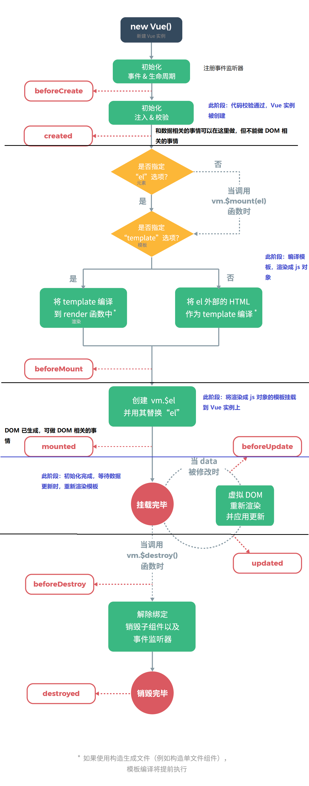

# 那组Vue

## lifecycle



## Vuex

### Mutation VS Action

Mutation 用于向 Store 提交对状态的修改，而且建议通过 Mutation 而不是直接修改 state。

[Action ](https://vuex.vuejs.org/zh/guide/actions.html) 的作用类似 Mutation ，只是，Mutation 提交的是 commit ，而 Action 提交的是 Mutation，可执行异步，而 Mutation 必须同步执行。

```javascript
const store = new Vuex.Store({
  state: {
    count: 0
  },
  mutations: {
    increment (state) {
        // 提交状态修改
      state.count++
    }
  },
  actions: {
    increment (context) {
        // 提交 Mutation
      context.commit('increment')
    },
    incrementAsync({ commit },amount){
        setTimeout(() => {
            commit('increment',amount)
        },1000)
    }
  }
})

// 触发 Mutation
store.commit('increment')

// 触发 Action
store.dispatch('incrementAsync',{
    amount:10
})
```

### Module

支持将 store 分割成多个 module，每个 module 都拥有自己的 mutation、action、state、getter，或者嵌套子 module。

访问 module：将 module 当做  `store.state` 中的一个属性来访问。如:

```js
const moduleA = {
  namespaced:true, // 使用模块名作为 namespace 访问 state、action……
  state: { ... },
  mutations: { ... },
  actions: { 
    // state 是模块内部状态，rootState 才是 store 的 state
    // call : dispath('moduleA/incrementIfOddOnRootSum')
  	incrementIfOddOnRootSum ({ state, commit, rootState }) {
      if ((state.count + rootState.count) % 2 === 1) {
        commit('increment')
      }
    }
  },
  getters: { ... }
}

const moduleB = {
  state: { ... },
  mutations: { ... },
  actions: { ... }
}

const store = new Vuex.Store({
  modules: {
    a: moduleA,
    b: moduleB
  }
})

store.state.a // -> moduleA 的状态
store.state.b // -> moduleB 的状态
```

## Vue 自定义右键菜单

https://github.com/vmaimone/vue-context-menu

```html
<div @contextmenu.prevent="$refs.ctxMenu.open">
  ...
</div>

<context-menu id="context-menu" ref="ctxMenu" @ctx-open="onCtxOpen">
  <li @click="doSomething(...)">option 1</li>
  <li class="disabled">option 2</li>
  <li>option 3</li>
</context-menu>
```

```js
// 程序触发 & 携带数据
that.$refs.ctxMenu.open('', data);
```

## 组件通信

### 父子组件通信

父组件传值到子组件：`props`；子组件传值到父组件：子组件通过`$emit`触发事件，父组件监听得到数据

### 兄弟组件或非父子组件通信

推荐通过 Vuex 通信。普通传值很简单，基于 Vuex 也可以实现类似组件内部的响应式功能。接收数据的组件监听 store 中的特定数据变化即可：

```js
this.$store.watch(
	(state,getters) => state.xxxState,
	(newValue,oldValue) => {
		// 
	}
)
```

eventBus 通信。没有组件关系的限制，新创建一个 Vue 实例作为第三方，提供事件的触发与派发。

```js
let vue = new Vue()

// component A
vue.$emit('eventA',{payload})

// component B
vue.$on('eventA',payload => {})
```

选用什么通信方式取决于组件的关系和传输数据的大小。

父子组件通信自不必说，其他关系的组件通信需要考虑传输数据的大小，因为通信实质上是数据的复制传输，若数据量很大，复制是一件很重量级的工作，倒不如共享同一份数据（Vuex）来的轻巧。

# CSS

css 选择器上的`/deep/` 修饰：https://stackoverflow.com/questions/25609678/what-do-deep-and-shadow-mean-in-a-css-selector

HTML5 Web Components offer full encapsulation of CSS styles.

This means that:

- styles defined within a component cannot leak out and effect the rest of the page
- styles defined at the page level do not modify the component's own styles

 

- 修改第三方组件的样式时，应该注意影响范围，最好在第三方组件外围包裹元素，再使用 CSS 子元素选择器选择第三方组件。


# Echarts

## 一个性能问题

Vue + Echarts 可能的一个性能问题是将 ECharts 对象挂载到 Vue 的 data 中。ECharts 实例是一个巨大的对象，若挂载到 Vue 的 data 中，会严重占用内存，影响图表的渲染速度。

```js
// somewhere beyond vue object
var echartInstance = null
// inside vue object
echartInstance = echart.init(document.getElementById('#id'));
echartInstance.setOption(options);
this.$once('hook:beforeDestroy', function() {
    echart.dispose(echartInstance);
});
```

ref:https://github.com/apache/incubator-echarts/issues/7234


# 回调

当需要在回调函数中使用当前作用域中的变量时，会出现访问不到的情况，如：

```js
this.unwatch = this.$store.watch(
    (state, getters) => state.showXAxis,
    (newV, oldV) => {
        // echartInstance 访问不到
        echartInstance.setOption({
            xAxis: {
                show: newV
            }
        });
    }
);
```

更改：

```js
const echartInstanceCopy = echartInstance;
this.unwatch = this.$store.watch(
    (state, getters) => state.showXAxis,
    (newV, oldV) => {
        ....
```

同样的还要` this ` 的问题，不光箭头函数中访问不到正确的 `this` ，在回调函数中也不能正确的访问 `this` 指向的 vue 实例，也需要提前做局部缓存。

```js
this.showChart(10);
const that = this;
echartInstance.on('click', function(e) {
    // 访问不到正确的 this 
    that.$emit('point-event', e);
});
```


# java8 stream api

`groupingby` 可以对集合按指定的键进行分组，如集合：

```js
[
    {name:'jack',age:12,addr:'shanghai',country:'China'},
    {name:'rose',age:24,addr:'shanghai',country:'UK'},
    {name:'robin',age:12,addr:'beijing',country:'China'},
    {name:'pony',age:12,addr:'guangzhou',country:'Ca'}
] = User
```

```java
// 单条件分组
Map<String,List<User>> collect = list.stream().collect(Collectors.groupingby(User::getAddr()));

// 双条件分组
Map<Pair<String,String>,List<User>> collect = list.stream().collect(Collectors.groupingby(u -> Pair.of(u.getAddr(),u.getCountry()));
                                                                    
// 多条件分组
Map<String,List<User>> collect = list.stream().collect(Collectors.groupingby(u -> getGroupbyKey(u)));
                                                                    
String getGroupbyKey(User u){
    return String.format("%s_%s_%s",u.getAddr(),u.getCountry(),u.getName());
}
```


# 文档生成工具

https://docsify.js.org/#/    https://github.com/docsifyjs/docsify

https://www.showdoc.cc/

https://github.com/phachon/mm-wiki