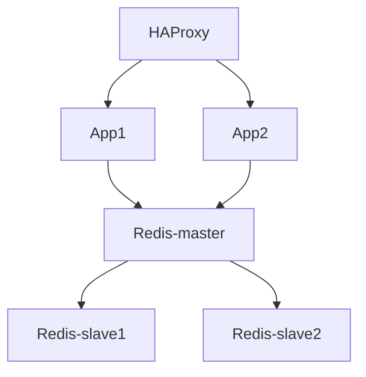

# Docker

概念：docker是一个给开发者、系统管理员提供开发、发布、运行应用的平台。在Linux中在容器中部署应用叫做容器化。容器并不是一个新兴事物，但是在容器中可以如此简单的部署应用是。

容器化技术越来越流行是因为：

- 灵活：就算最复杂的应用也可以被容器化
- 轻量级：多个容器分享和共用同一个宿主内核
- 可替换：支持热发布、更新和升级
- 可移植：本地构建之后，直接移动到云端或其他地方
- 可扩展
- 可堆叠

## Docker 是什么

《循序渐进学 Docker》这本书中使用 Java、Android 和 Github 来比喻 Docker，觉得比较形象贴切，故引用：

> 按照官方的说法，Docker 是一个开源的应用容器引擎。很多人觉得这个说法太抽象，不容易理解。
>
> 那我们就从最熟悉的事物说起吧，但凡从事过计算机相关行业的人，对 Java、Android 和 Github 都很熟悉。
>
> - Java
>
> 先说 Java，在 Java 之前的编程语言，像 C/C++，是严重依赖平台的，在不同平台下，需要重新编译才能运行。Java 的一个非常重要的特性就是与平台无关性，而使用 Java 虚拟机是实现这一特性的关键。**Java 虚拟机屏蔽了与具体平台相关的信息，使得 Java 语言编译程序只需生成可以在 Java 虚拟机上运行的目标代码**（字节码），就可以在多种平台上不加修改地运行。Java虚拟机在执行字节码时，把字节码解释成具体平台上的机器指令执行。
>
> 软件部署也依赖平台，Ubuntu 的软件包在 Centos 下可能就运行不起来。**和 Java 虚拟机类似，Docker 使用容器引擎解决平台依赖问题，它在每台宿主机上都启动一个 Docker 的守护进程，守护进程屏蔽了与具体平台相关的信息，对上层应用提供统一的接口**。这样，Docker 化的应用，就可以在多个平台下运行，Docker 会针对不同的平台，解析给不同平台下的执行驱动、存储驱动和网络驱动去执行。
>
> Java 曾提出“Write Once, Run Anywhere”，而 Docker 则提出了“Build once, Run anywhere, Configureonce, Run anything”。虽然，Java 和 Docker 是为了解决不同领域的问题，但在平台移植方面却面临相同的问题，使用的解决方式也相似。
>
> - Android
>
> Android 是一个开源的手机操作系统，也是一个生态圈，它的 **App 应用以 apk 形式打包、发布，可以运行在任何厂商的Android 手机上**。它还有一个**官方的安卓市场**，提供各种各样的 App，我们需要某个 App 时，就从安卓市场上搜索下载，手机开发者也可以编写一些 App，发布到安卓市场，提供给别人使用，Android 也允许在第三方的安卓市场上下载或上传应用。
>
> 如果**把软件部署的应用看作 Android 的 App** , Docker 简直和 Android 一模一样， Docker 是一个开源的容器引擎，也有自己的生态圈，**它的应用以镜像（image）的形式发布**，可以运行在任何装有 Docker 引擎的操作系统上。它有一个官方的镜像仓库，提供各种各样的应用，当需要某个应用时，就从官方的仓库搜索并下载，个人开发者也可以提交镜像到官方仓库，分享给别人使用。Docker 也允许使用第三方的镜像仓库。
>
> - Github
>
> 最后，再谈谈 Github。它主要用来做版本控制，不仅可以比较两个版本的差异，还可以基于某些历史版本创建新的分支。
>
> 使用 Docker 后，**软件部署的应用也可以具备类似 Github 的版本控制功能**，对应用做一些修改，提交新版本，运行环境可以在多个版本间快速切换，自由选择使用哪个版本对外提供服务。
>
> 通过和 Java、Android、Github 的对比，大家对 Docker 应该有了比较直观的认识， **Docker 用来管理软件部署的应用，Docker把应用打包成一个镜像，镜像带有版本控制功能，应用的每次修改迭代就对应镜像的一个版本，制作好的镜像可以发布到镜像仓库，分享给别人；也可以直接从镜像仓库下载别人制作好的应用，不做任何修改，即可运行起来**。

## Docker 的构成

Docker 是 Golang 编写的 C/S架构软件，包含 Docker Server 和 Docker Client。如果把 Docker 看做是生态，则包括 Docker 软件本身和 Docker 仓库，即相当于 Android 系统和 安卓应用市场的关系。


Docker 是一个 C/S 的架构，它的 Docker Daemon 作为 Server 端，在宿主机上以后台守护进程的形式运行。Docker Client 使用比较灵活，既可以在本机上以 bin 命令的形式（如Docker info、Docker start）发送指令，也可以在远端通过 RESTful API 的形式发送指令；Docker 的 Server 端接收指令并把指令分解为一系列任务去执行。

### 镜像和容器（Images and Containers）

**镜像**：是一个包含一切运行应用时所需要的资源的可运行的包，包括：代码、运行时环境、库、环境变量和配置文件。

**容器**：容器是镜像的运行时实例。容器通过运行镜像来启动。当镜像运行在内存里的时候，可以使用命令`docker ps `来查看当前运行了那些容器。

**镜像和容器的关系：**未运行时叫镜像，运行在内存中并由 docker 管理的叫容器，是程序运行的容器，仓库中存在的都是镜像。

### 容器和虚拟机

容器在Linux上以原生的方式运行，和其他容器共享宿主机的内核。容器运行在一个独立的进程中。

虚拟机则完全是一个寄生操作系统，通过虚拟层和宿主OS交互。虚拟机也需要更多的资源。


## 分层和版本控制

Docker 将应用进行分层分发，这样可以做到应用的重用（共享底层）和增量更新。

Docker 使用代码版本控制的思想对软件的变更进行版本控制，在分层的基础上，版本控制可以以层数来区分应用的版本（应用更改体现在新的层上），这样，就能做大增量更新。

## 安装 & 启动

Ubuntu 下安装：

```shell
# 推荐官方脚本安装最新版本
curl -sSL https://get.docker.com/ | sh

# apt 安装
sudo apt-get install docker.io

# 启动 daemon 进程
sudo service docker start

# 测试 docker 是否安装成功
sudo docker run hello-world

# 将当前用户加入 docker 组，不需要每次都加 sudo 
sudo usermod -aG docker <username>
```

## 命令

`docker search` 搜索可用镜像

`docker pull` 下载容器镜像。镜像都是按照`用户名/镜像名`的方式存储，所以需要写完整。

`docker run`命令由有两个参数，一个是镜像名，一个是要在镜像中运行的命令。如：

```sh
docker run learn/tutorial echo "hello world"
```

```sh
//在tutorial容器里安装ping程序,-y参数阻止 apt-get 进入交互模式，在docker环境下是无法响应这种交互的。
docker run learn/tutorial apt-get install -y ping
```

当对容器做了修改之后，可以将对容器的修改保存下来，下次直接以最新的状态来运行 docker。在 docker 中保存状态的过程称之为committing,它保存新旧状态之间的区别，从而产生一个新版本。

#### 目标：

首先使用 `docker ps -l` 命令获得安装完ping命令之后容器的id。然后把这个镜像保存为 learn/ping。

#### 提示：

1. 运行 docker commit，可以查看该命令的参数列表。
2. 你需要指定要提交保存容器的 ID。(译者按：通过`docker ps -l `命令获得)
3. 无需拷贝完整的 id，通常来讲最开始的三至四个字母即可区分。（译者按：非常类似 git 里面的版本号)

#### 正确的命令：

`docker commit 698 learn/ping`

执行完 `docker commit` 命令之后，会返回新版本镜像的 id 号。 

运行新命令

```sh
docker run learn/ping ping www.google.com
```

`docker ps`可以查看当前运行的容器

`docker inspect`可以更详细的查看某容器的信息

例如：

```sh
$ docker ps 
ID               IMAGE                    
efedcsf34sd      learn/ping:lastest
$ docker inspect efe
```


参考[《循序渐进学 Docker》]( https://book.douban.com/subject/26957408/ )


# Docker Hands Dirty

ref: 《Docker-容器与容器云》第二版


## 第一个 Hello World

使用常见的组件搭建一个 Web 应用（Docker 应用栈）。HAProxy 为两个 AP 服务做负载均衡， AP 服务连接 Redis 获取数据，Redis 由一个 master 和两个 slave 节点组成。



此处 APP 使用 golang 连接 Redis 进行简单示例

### 安装镜像

```bash
$ sudo docker pull ubuntu
$ sudo docker pull golang
$ sudo docker pull haproxy
$ sudo docker pull redis
$ sudo docker images
REPOSITORY    TAG       IMAGE ID       CREATED        SIZE
ubuntu        latest    26b77e58432b   29 hours ago   72.9MB
golang        latest    0debfc3e0c9e   2 days ago     862MB
redis         latest    7f33e76fcb56   3 days ago     105MB
haproxy       latest    56132d856f67   4 days ago     93.8MB
```

### 容器栈节点互联

使用 `docker run --link` 可以联结 docker 节点。`--link` 选项可以使得容器间建立安全的交互通信，格式为 `--link name:alias` 将容器 `name` 连接到本次启动的容器上，取别名为 `alias` ，如启动 App 服务，连接 Redis `docker run --name app1 --link redis-master:db` 则在 APP 内部可以通过 `db` 为主机名访问 `redis-master`

容器栈各个节点的连接信息：

- 启动 redis-master 容器节点
- 两个 Redis-slave 容器节点启动时要连接到 redis-master
- 两个 APP 容器节点启动时要连接到 redis-master
- HAProxy  容器节点启动时要连接到两个 APP 节点

故，容器的启动顺序为：

redis-master -> redis-slave -> app -> HAProxy

### 应用栈容器节点启动 & 配置

```bash
# 启动 Redis 容器
$ sudo docker run -it --name redis-master redis /bin/bash # 以交互模式启动 redis 镜像作为 master, 起名为 redis-master，启动后运行 /bin/bash 命令
$ redis-server # 启动 master

$ sudo docker run -it --name redis-salve1 --link redis-master:master redis /bin/bash
$ redis-server --slaveof master 6379 # 启动 slave1 并连接 master

$ sudo docker run -it --name redis-salve2 --link redis-master:master redis /bin/bash
$ redis-server --slaveof master 6379 # 启动 slave2 并连接 master

# 测试 Redis 容器节点互联
$ docker exec -it <redis-master container id> /bin/bash
$ redis-cli
$ 127.0.0.1:6379> set xxx yyy

$ docker exec -it <redis-salve container id> /bin/bash
$ redis-cli
$ 127.0.0.1:6379> get xxx
"yyy"

# 启动应用容器
$ sudo docker run -it --name app1 --link redis-master:db -v ~/project/app:/usr/src/data goredis ./goOnDocker
server listening on 8090...

$ sudo docker run -it --name app2 --link redis-master:db -v ~/project/app:/usr/src/data goredis ./goOnDocker
server listening on 8090...

# 启动 HAProxy ,将容器的 6301 端口绑定 host 的 6301 端口
$ docker run -it --name haproxy --link ap1:ap1 --link ap2:ap2 -p 6301:6301 -v ~/project/haproxy:/tmp haproxy /bin/bash
# 因为将 host 的 ~/project/haproxy 挂载到容器 /tmp 下，所以在 host 中修改 HAProxy 的配置在容器中亦可见
# 修改 ~/project/haproxy/haproxy.cfg 后，启动 HAProxy
$ haproxy -f /tmp/haproxy.cfg

# 应用栈访问测试
curl http://localhost:6301/get?key=<>

# Done
# 可以访问 http://localhost:6301/haproxy-stats 查看两个 ap 的情况
```

### AP 程序 & 配置

```go
// goRedis.go
package main

import (
	"fmt"
	"github.com/go-redis/redis"
	"net/http"
)

var client *redis.Client

func get(w http.ResponseWriter, req *http.Request)  {
	key := req.URL.Query().Get("key")
	fmt.Println(key + "....")
	res, err := client.Get(key).Result()
	if err != nil {
		fmt.Fprintf(w, "nil")
		fmt.Println(err)
	} else {
		fmt.Fprintf(w, "%s", res)
	}
}

func main() {
	client = redis.NewClient(&redis.Options{
		Addr:"db:6379",
		Password:"",
		DB: 0,
	})

	http.HandleFunc("/get", get)

	fmt.Println("server listening on 8090...")
	http.ListenAndServe(":8090", nil)
}
```


```dockerfile
FROM golang

ENV GOPROXY=https://goproxy.cn,https://goproxy.io,direct \
  GO111MODULE=on \
  CGO_ENABLED=1
WORKDIR /opt/app
RUN go env -w GOPROXY=https://goproxy.cn,https://goproxy.io,direct
COPY goRedis.go ./
COPY go.mod ./
COPY go.sum ./

RUN go env && go list && go build
```


```bash
$ mkdir goRedis
$ cd goRedis
$ vi goRedis.go # AP code
$ go mod init goOnDocker # use go module & init module alias goOnDocker
$ go mod tidy # generate go.mod & go.sum, declare dependenceies

$ docker build . -t goredis  # build Ap image
```


```text
# haproxy.cfg
global
  log 127.0.0.1 local0 # 日志输出位置，所有日志都记录在本机，通过 local0 输出
  maxconn 4096
  chroot /usr/local/sbin # 改变当前工作目录
  daemon # 以后台形式运行 HAProxy
  nbproc 4 # 启动 4 个 HAProxy 实例
  pidfile /usr/local/sbin/haproxy.pid

defaults
  log 127.0.0.1 local3
  mode http # {tcp|http|health} 设定启动实例的协议类型
  option dontlognull # 保证 HAProxy 不记录上级负载均衡发送过来的心跳包
  option redispatch # 当 serverId 对应服务器挂掉后，强制定向到其他健康的服务器
  retries 2 # 重试两次连接失败就认为服务器不可用，主要通过后面的 check 检查
  maxconn 2000
  balance roundrobin # 负载均衡选项 {roundrobin|source}, 1:轮训，2:固定转发
  timeout connect 5000ms
  timeout client 5000ms
  timeout server 5000ms
  listen redis_proxy
    bind 0.0.0.0:6301  # haproxy 向外暴露的地址端口
    stats enable
    stats refresh 5s
    stats uri /haproxy-stats # haproxy 状态页
      server ap1 ap1:8090 check inter 2000 rise 2 fall 5 # 负载的 AP， 可以是不同端口
      server ap2 ap2:8090 check inter 2000 rise 2 fall 5

```


