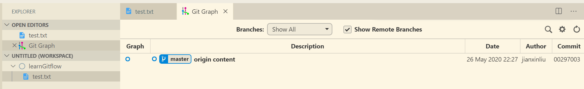
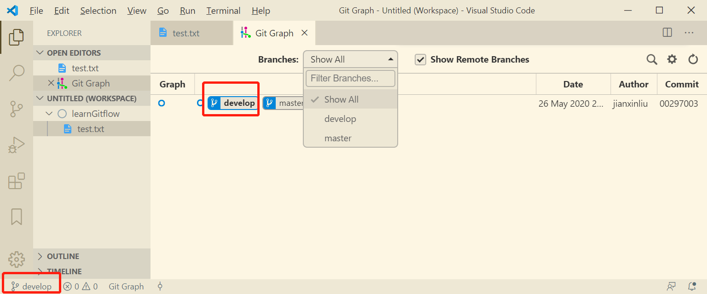
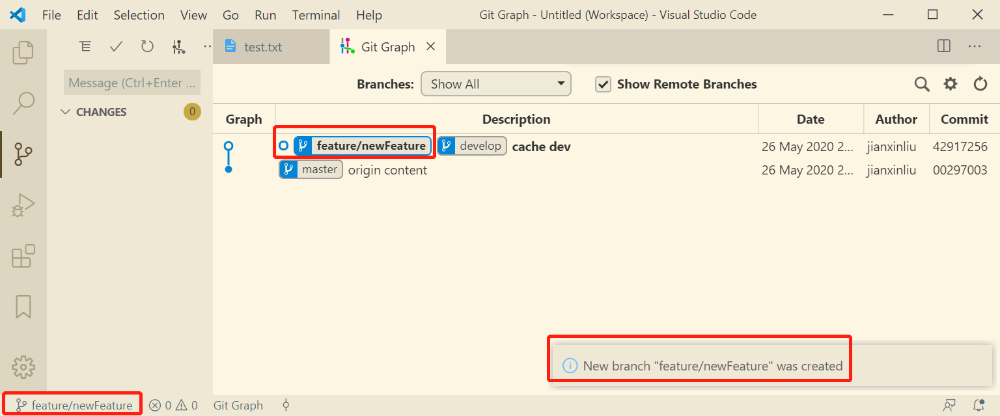
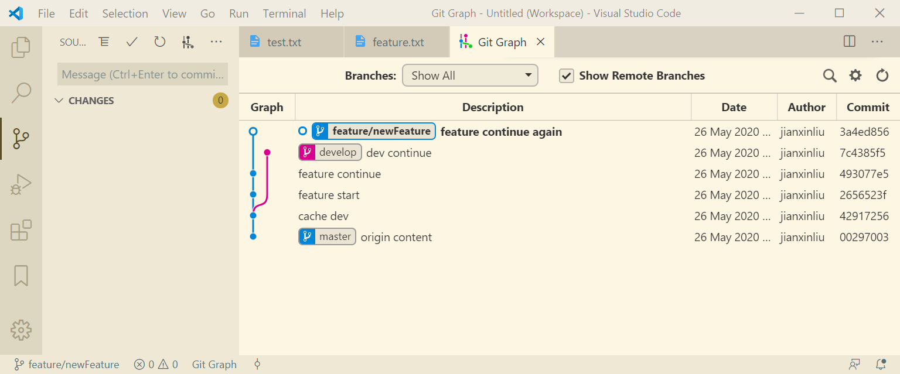
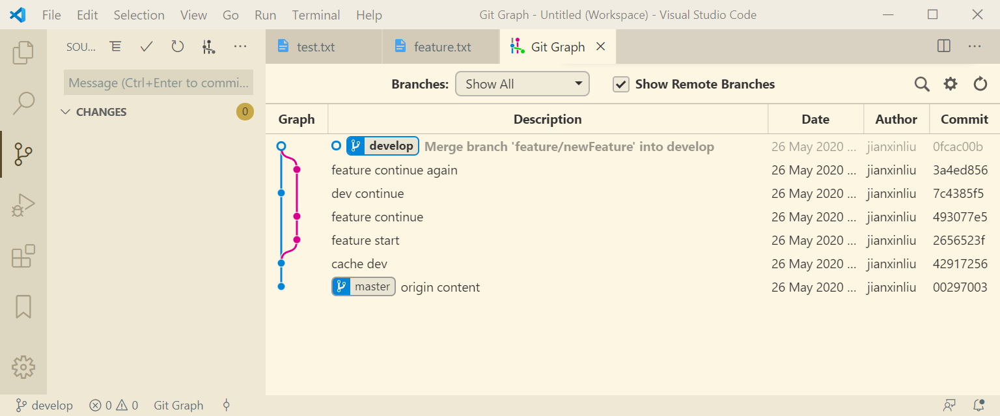
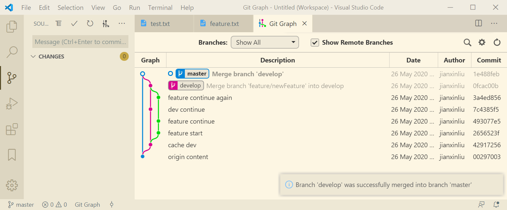

# GitFlow 实验

gitflow 并没有什么新鲜的东西，只是在 git 的分支功能的基础上，总结出或者说创造出的**一种可以支持多任务并行的工作模式**。

现实社会中有没有平行时空还不能确定，但是 git 的分支功能却可以让你体验平行时空穿梭。

## 开始实验

### 准备

一个 git 初始化后，有内容有提交的仓库，可以没有 remote。大概像这样：

现在准备在这个仓库上开展工作。

原先只在 `master` 分支上进行一切开发工作，但当实际情况变得复杂，合作人员增多时，使用分支是更明智的选择。gitflow 的经验是不稳定的代码放在 `develop` 上，再添加若干分支代表不同目的，如：`feature`,`release`……

所以使用 gitflow 之前需要先创建若干分支，这一步可以由插件代劳，执行插件的 gitflow 初始化即可。创建好之后，默认会切换到 develop 分支。就像这样：

### 正常开发

在 develop 分支上开发了一部分，突然有更要紧的功能需要实现，工作台只有一个，只能给更紧急的事物让步了。此时，若在 develop 上开发的足够完善，可以提交而不产生坏的影响，则提交；否则就将这部分代码贮藏（stash）。若不提交也不贮藏，则在 develop 中修改的代码会出现在新分支上，到时候更分不清了。

提交或贮藏之后，就可以开新分支开发新功能了，这一步可以让插件帮忙，类似`gitflow feature start` 之类的功能就可以实现。

这一步实际上做了这么几件事情：

1. 从 develop 分支上创建新的 feature 分支（会让你指定分支名）
2. 切换到新创建的分支

做完之后，就像这样：

### 新功能

在新功能上开发了一部分之后，又因为某些事情需要切回 develop 的代码，此时和之前一样，对所做修改提交或贮藏，然后切换分支做该做的事情。

这期间可以来回切换，只是切换之前要记住对所做修改进行提交或贮藏，否则就会引起混乱了。

多次切换之后，现在的分支情况是这样的：

feature 分支上持续开发新功能，develop 上也做了一些修改，这些修改最好是不要和 feature 上的代码有冲突，否则最后合并的时候需要解决冲突。

### 新功能结束

新功能开发结束之后，就可以将代码合并到 develop 上去，并删除 feature 分支，这一步可以用插件的类似 `gitflow feature finish`的功能帮忙，操作后是这样的：

### 最后

其他如 bug 修复，发布版本，都是一样的操作逻辑。

如果 develop 的代码没问题，就可以合并到 master 上去。先切换到 master ，再将 develop 合并进来。合并之后是这样的：

