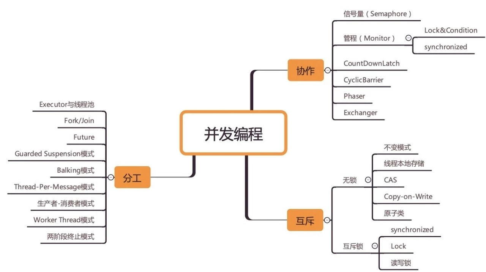

[TOC]

参考[并发编程网](http://ifeve.com/)

# 1.并发

并发，（concurrency），意指多个线程同时工作（多个事件同时发生）。实际上并没有同时发生，在单个处理器的情况下也不可能同时发生，只不过是CPU快速的切换 Context，造成多个线程同时执行的错觉。

当需要由CPU来切换不同的Context来执行不同的线程，那么就由CPU决定各个线程的执行顺序，对于程序员来说，程序就变得不可 控。某些需要线性执行的场景下，必须控制CPU对线程的调度顺序。

就像在没有任何规则约束的社会，对于稀缺资源的竞争，肯定是一窝蜂的涌上去，没有秩序可言。如果人为的添加一个秩序，并且大家都遵守，就会变得有序。这个秩序就是排队，先到先得，后到排队等候。

人是智能体，知道怎么排队，但程序不行，需要程序员安排，加锁，两种方式。

- 资源处安排，资源要求获取者排队
- 获取者主动排队。

锁的消耗就是挂起和等待（阻塞）的时间以及调度，Context 切换

> 使用synchronized同步锁进行线程阻塞和唤醒切换以及用户态内核态间的切换操作额外浪费消耗cpu资源

排队的结果无非两种：

- 挂起
- 原地等待



# 为什么需要多线程？本质

1. 利用多核
2. 当 I/O 阻塞系统，但 CPU 空闲时，可以利用多线程使用 CPU 资源。

若让 IO 不阻塞系统，不就可以避免使用多线程来利用 CPU 资源了

> IO感觉上和多线程并没有多大关系，但是**NIO改变了线程在应用层面使用的方式**，也解决了一些实际的困难。而AIO是异步IO和前面的系列也有点关系。在此，为了学习和记录，也写一篇文章来介绍NIO和AIO。

参考：[高并发Java（8）：NIO和AIO](http://www.importnew.com/21341.html)

## 1.1 并发编程，分为两种：

1. 一种是被动的防卫，为存在竞态条件的代码添加保障，让其成为线程安全的代码

2. 一种是主动的发起，为了执行效率，主动创建多线程，并协调好多个线程及其运行结果

### 1.1.1 被动防卫

这种并发编程，常见的场景是每一个客户端对应服务器上的一个线程（进程），同时访问同一个资源，对于此资源的操作便会存在同步（一致性）问题。常见的解决方案是加锁来保证同步，确保每个线程在操作资源时其他线程不能插手，以保证所操作资源的正确性。因为加锁，所以才有了接下来的一系列问题。

因为有锁，就会出现线程挂起和线程等待的操作，这些操作都会造成资源的浪费，尤其是线程挂起和唤醒。java 中的线程是映射到CPU的线程去执行，所以线程的挂起和唤醒都需要CPU的参与，CPU需要在内核态和用户态之间切换，这是一个巨大的消耗。

另一个消耗不是因为引入锁带来的，而是线程挂起和唤醒本身。CPU进行线程的挂起，需要切换上下文（Context）,需要将当前线程中的状态（程序指针）、数据（寄存器中、程序数据）都进行保存；线程的唤醒，CPU需要恢复线程被挂起之前的执行环境。

初始的并发控制很原始粗放，只要有竞态条件的出现便上锁，没获取到锁的线程就挂起。随着技术的进步和工程的经历，并发控制越来越精细，出现竞态条件并不一定要上锁，没获取到锁的线程并不一定就要挂起。

 ### 1.1.2 主动发起

这种并发编程，通常不是使用多个线程操作同一个资源，而是利用多线程的执行效率来处理**计算问题**。例如大数求和问题，可以使用多线程，每个线程计算几部分，然后将结果合并。在这方面，java并发包`java.util.concurrent`提供了 `fork\join`框架用于任务拆解和执行。


----

----


下文对[并发编程网-Java并发和多线程](http://ifeve.com/java-concurrency-thread-directory/)整个教程进行简化、划重点


# 2. java 并发和多线程介绍


# 3. 多线程的优点


# 4. 多线程的代价

1. 设计更复杂：主要体现在多线程访问共享数据的时候，线程之间的交互往往非常复杂。不正确的线程同步产生的错误往往难以发现，并且重现及修复
2. 上下文切换的开销：当CPU从执行一个线程切换到执行另外一个线程的时候，它需要先存储当前线程的本地的数据，程序指针等，然后载入另一个线程的本地数据，程序指针等，最后才开始执行。这种切换称为“上下文切换”(context switch)。CPU会在一个上下文中执行一个线程，然后切换到另外一个上下文中执行另外一个线程。上下文切换并不廉价。如果没有必要，应该减少上下文切换的发生。你可以通过维基百科阅读更多的关于上下文切换相关的内容：http://en.wikipedia.org/wiki/Context_switch
3. 增加资源的消耗：线程在运行的时候需要从计算机里面得到一些资源。除了CPU，线程还需要一些内存来维持它本地的堆栈。它也需要占用操作系统中一些资源来管理线程。我们可以尝试编写一个程序，让它创建100个线程，这些线程什么事情都不做，只是在等待，然后看看这个程序在运行的时候占用了多少内存。

# 5. 并发编程模型


# 6. 如何创建并运行java线程

编写线程运行时执行的代码有两种方式：一种是创建Thread子类的一个实例并重写run方法，第二种是创建类的时候实现Runnable接口。

## 6.1 继承 Thread

```java
public class MyThread extends Thread{
    @Override
    public void run(){
        System.out.println("MyThread running");
    }
}
```

调用：

```java
new MyThread().start();
```

一旦线程启动后start方法就会立即返回，而不会等待到run方法执行完毕才返回。就好像run方法是在另外一个cpu上执行一样。当run方法执行后，将会打印出字符串MyThread running。

## 6.2 实现 Runnable 接口

```java
Runnable runnable = new Runnable(){
    @Override
    public void run(){
        System.out.println("Runnable running");
    }
}
new Thread(runnable).start();
```

## 6.3创建 Runnable 子类还是实现 Runnable 接口？

对于这两种方式哪种好并没有一个确定的答案，它们都能满足要求。就我个人意见，我更倾向于实现Runnable接口这种方法。因为线程池可以有效的管理实现了Runnable接口的线程，如果线程池满了，新的线程就会排队等候执行，直到线程池空闲出来为止。而如果线程是通过实现Thread子类实现的，这将会复杂一些。

有时我们要同时融合实现Runnable接口和Thread子类两种方式。例如，实现了Thread子类的实例可以执行多个实现了Runnable接口的线程。一个典型的应用就是线程池。

## 6.4 常见错误：调用 run 方法而非 start 方法

起初你并不会感觉到有什么不妥，因为run()方法的确如你所愿的被调用了。但是，事实上,**run()方法并非是由刚创建的新线程所执行的，而是被创建新线程的当前线程所执行了**。也就是被执行上面两行代码的线程所执行的。想要让创建的新线程执行run()方法，必须调用新线程的start方法。

## 6.5 补充：Callable 与 Runnable

可以参考这篇博客：[Java并发编程：Callable、Future和FutureTask](https://www.cnblogs.com/dolphin0520/p/3949310.html)

主要区别：Callable用来创建可以返回处理结果的线程，Runnable 创建的线程不支持返回。

# 7. 竞态条件与临界区

在同一程序中运行多个线程本身不会导致问题，问题在于多个线程访问了相同的资源。如，同一内存区（变量，数组，或对象）、系统（数据库，web services等）或文件。实际上，这些问题只有在一或多个线程向这些资源做了写操作时才有可能发生，只要资源没有发生变化,多个线程读取相同的资源就是安全的。

## 7.1 竞态条件 & 临界区

当两个线程竞争同一资源时，如果**对资源的访问顺序敏感**，就称存在竞态条件。导致竞态条件发生的代码区称作临界区。在临界区中使用适当的同步就可以避免竞态条件。

# 8. 线程安全与共享资源

允许被多个线程同时执行的代码称作线程安全的代码。**线程安全的代码不包含竞态条件**。当多个线程同时更新共享资源时会引发竞态条件。因此，**了解Java线程执行时共享了什么资源很重要**。

## 8.1 局部变量

局部变量存储在线程自己的栈中。也就是说，局部变量永远也不会被多个线程共享。所以，基础类型的局部变量是线程安全的。

## 8.2 局部对象引用

对象的局部引用和基础类型的局部变量不太一样。尽管引用本身没有被共享，但引用所指的对象并没有存储在线程的栈内。所有的对象都存在共享堆中。如果在某个方法中创建的对象不会逃逸出（*译者注：即该对象不会被其它方法获得，也不会被非局部变量引用到*）该方法，那么它就是线程安全的。实际上，哪怕将这个对象作为参数传给其它方法，只要别的线程获取不到这个对象，那它仍是线程安全的。下面是一个线程安全的局部引用样例：

```java
public void someMethod(){
    LocalObject local = new LocalObject();
    local.callSomething();
    method2(local);
}
public void method2(LocalObject local){
    loca.setValue("value");
}
```

样例中LocalObject对象没有被方法返回，也没有被传递给someMethod()方法外的对象。**每个执行someMethod()的线程都会创建自己的LocalObject对象，并赋值给localObject引用**。因此，这里的LocalObject是线程安全的。事实上，整个someMethod()都是线程安全的。即使将LocalObject作为参数传给同一个类的其它方法或其它类的方法时，它仍然是线程安全的。当然，如果LocalObject通过某些方法被传给了别的线程，那它就不再是线程安全的了。

注：如果锁没有被多个线程共享，那也就失去了锁的作用。

## 8.3 对象成员

对象成员存储在堆上。如果两个线程同时更新同一个对象的同一个成员，那这个代码就不是线程安全的。下面是一个样例：

```java
public class NotThreadSafe{
    StringBuilder builder  = new StringBuilder();
    public void add(String text){
        this.builder .append(text);
    }
}
```

如果两个线程同时调用同一个`NotThreadSafe`实例上的add()方法，就会有竞态条件问题。例如：

```java
NotThreadSafe sharedInstance  = new NotThreadSafe();

new Thread(new MyRunnable(sharedInstance )).start();
new Thread(new MyRunnable(sharedInstance )).start();

public class MyRunnable implements Runnable{
    NotThreadSafe istance = null;
    public MyRunnable(NotThreadSafe instance){
        this.instance = instance;
    }
    @Override
    public void run(){
        this.instance.add("some");
    }
}
```

注意两个MyRunnable共享了同一个NotThreadSafe对象。因此，当它们调用add()方法时会造成竞态条件。

当然，如果这两个线程在不同的NotThreadSafe实例上调用call()方法，就不会导致竞态条件。这样，两个线程都有自己单独的NotThreadSafe对象，调用add()方法时就会互不干扰，再也不会有竞态条件问题了。所以非线程安全的对象仍可以通过某种方式来消除竞态条件。

## 8.4 线程控制逃逸规则

如果一个资源的创建，使用，销毁都在同一个线程内完成，且永远不会脱离该线程的控制，则该资源的使用就是线程安全的。

资源可以是对象，数组，文件，数据库连接，套接字等等。Java中你无需主动销毁对象，所以“销毁”指不再有引用指向对象。

即使对象本身线程安全，但如果该对象中包含其他资源（文件，数据库连接），整个应用也许就不再是线程安全的了。比如2个线程都创建了各自的数据库连接，每个连接自身是线程安全的，但它们所连接到的同一个数据库也许不是线程安全的。

区分某个线程控制的对象是资源本身，还是仅仅到某个资源的引用很重要。


# 9. 线程安全及不可变性

http://ifeve.com/thread-safety-and-immutability/

## 9.1 不可变性

- ReactJs 通过不可变性计算组件的变化。若组件变化了，不是直接修改组件，而是新建一个相同的，来替换旧的。
- CopyOnWrite。在写变量时，不是直接改变这个变量，而是改变这个变量的副本，然后用副本去替换原来的。

不可变性在ReactJS中，简化了组件树变化的计算，比较同一个对象变化前后的区别和比较两个不同的对象，明显后者更简单，只需要比较对象的地址即可。

不可变性在`CopyOnWriteList`中兼顾了对资源同时高效率的读和写需求，允许多个线程同时访问List的内部数据，毕竟读操作是没有线程安全问题的，不应该加锁而降低了效率。

# 10. java 内存模型

如果你想设计表现良好的并发程序，理解Java内存模型是非常重要的。**Java内存模型规定了如何和何时可以看到由其他线程修改过后的共享变量的值，以及在必须时如何同步的访问共享变量**。


每一个运行在Java虚拟机里的**线程都拥有自己的线程栈**。这个**线程栈包含了这个线程调用的方法当前执行点相关的信息**。**一个线程仅能访问自己的线程栈**。**一个线程创建的本地变量对其它线程不可见，仅自己可见**。即使两个线程执行同样的代码，这两个线程任然在在自己的线程栈中的代码来创建本地变量。因此，**每个线程拥有每个本地变量的独有版本**。

所有**原始类型的本地变量**都存放在线程栈中，对其他线程不可见，就算一个线程向另一个线程传递一个原始类型的变量，那共享的只是这个原始变量的拷贝，而不是原始变量本身。

堆上包含在java程序中创建的所有对象，包括原始类型的对象版本（包装类）。就算一个对象被创建，然后复制给一个局部变量或被作为另一个对象的成员变量，被复制的只是对象在堆里的地址，而不是对象本身，对象依然存放在堆里。

**注：**知道了变量和对象存在哪里，在编写多线程程序时，就能更清楚的知道给谁加锁和锁的范围。

- 原始类型的本地变量总是存放在线程栈上。

- 本地变量指向一个对象的引用，引用（本地变量）存放在线程栈，被引用的对象仍然存放在堆上。

- 对象中的方法包含本地变量，这些本地变量存放在线程栈上，即使这些方法所属的对象存放在堆上。

- 不管对象的成员变量是原始类型还是引用类型，都可能随着对象本身存放在堆上。

- 静态成员变量跟随着类定义一起也存放在堆上。

存放在堆上的对象可以被所有持有对这个对象引用的线程访问。当一个线程可以访问一个对象时，它也可以访问这个对象的成员变量。如果两个线程同时调用同一个对象上的同一个方法，它们将会都访问这个对象的成员变量，但是**每一个线程都拥有这个本地变量的私有拷贝**。


## 10.1 硬件内存架构

……

## 10.2 Java内存模型和硬件内存架构之间的桥接

……

[java 内存模型](http://ifeve.com/java-memory-model-6/)

# 11. Java 同步块

Java同步块用来避免竞争。

有四种不同的同步块：

1. 实例方法。Java实例方法同步是同步在拥有该方法的对象上。
2. 静态方法。静态方法的同步是指同步在该方法所在的类对象上。
3. 实例方法中的同步块。
4. 静态方法中的同步块。

不同的同步块，加锁的范围是不同的。当加锁的范围过小，就起不到锁的作用。

# 12. 线程通信

线程通信的目标是使线程间能够互相发送信号。另一方面，线程通信使线程能够等待其他线程的信号。

## 12.1 通过共享对象通信

```java
public class MySignal{
    private boolean isTrue = false;
    public synchronized boolean isTrue(){
        return this.isTrue;
    }
    public void set(boolean tr){
        this.isTrue = tr;
    }
}
```

线程A和B必须获得指向一个MySignal共享实例的引用，以便进行通信。如果它们持有的引用指向不同的MySingal实例，那么彼此将不能检测到对方的信号。需要处理的数据可以存放在一个共享缓存区里，它和MySignal实例是分开存放的。

## 12.2 忙等待

准备处理数据的线程B正在等待数据变为可用。它在等待线程A的一个信号，这个信号使hasDataToProcess()返回true。线程B运行在一个循环里，以等待这个信号：

```java
MySignal sharedSignal = new MySignal();
...
// 当等待时间变得很长，这样的忙等待就变得不合理了。CPU一直在执行这个循环而不能做其他事情
while(!sharedSignal.isTrue()){
	// do nothing,busy waiting
}
```

## 12.3 wait(),notify() 和 notifyAll()

忙等待没有对运行等待线程的CPU进行有效的利用，**除非平均等待时间非常短。**否则，让等待线程进入睡眠或者非运行状态更为明智，直到它接收到它等待的信号。

wait 和 notify 方法必须在同步块内被调用。线程调用某对象的wait 方法，意思是让当前线程在这个对象的监视器上挂起等待。调用某对象的 notify 方法的意思是，将等待在这个对象监视器上的线程之一唤醒。详细参考“./线程间通信.md”

## 12.4 丢失的信号

notify()和notifyAll()方法不会保存调用它们的方法，因为当这两个方法被调用时，有可能没有线程处于等待状态。通知信号过后便丢弃了。因此，**如果一个线程先于被通知线程调用wait()前调用了notify()，等待的线程将错过这个信号**。这可能是也可能不是个问题。不过，在某些情况下，这可能使等待线程永远在等待，不再醒来，因为线程错过了唤醒信号。

## 12.5 假唤醒

由于莫名其妙的原因，**线程有可能在没有调用过notify()和notifyAll()的情况下醒来**。这就是所谓的假唤醒（spurious wakeups）。无端端地醒过来了。

为了防止假唤醒，**保存信号的成员变量将在一个while循环里接受检查，而不是在if表达式里**。这样的一个while循环叫做**自旋锁**（校注：这种做法要慎重，目前的JVM实现自旋会消耗CPU，如果长时间不调用doNotify方法，doWait方法会一直自旋，CPU会消耗太大）。被唤醒的线程会自旋直到自旋锁(while循环)里的条件变为false。

留意wait()方法是在while循环里，而不在if表达式里。如果等待线程没有收到信号就唤醒，wasSignalled变量将变为false,while循环会再执行一次，促使醒来的线程回到等待状态。

## 12.6 多个线程等待相同的信号

如果你有多个线程在等待，被notifyAll()唤醒，但只有一个被允许继续执行，使用while循环也是个好方法。

## 12.7 不要在字符串常量或全局对象中调用wait()

字符串常量会有缓存。**在wait()/notify()机制中，不要使用全局对象，字符串常量等。应该使用对应唯一的对象**。

# 13. Java ThreadLocal

Java中的**ThreadLocal类可以让你创建的变量只被同一个线程进行读和写操作**。因此，尽管有两个线程同时执行一段相同的代码，而且这段代码又有一个指向同一个ThreadLocal变量的引用，但是这两个线程依然不能看到彼此的ThreadLocal变量域。**就是给每个线程创建本地变量。**

```java
public class ThreadLocalExample {
    public static class MyRunnable implements Runnable {
        private ThreadLocal<Integer> threadLocal = new ThreadLocal<Integer>();
        @Override
        public void run() {
            threadLocal.set( (int) (Math.random() * 100D) );
            try {
                Thread.sleep(2000);
            } catch (InterruptedException e) { }
            System.out.println(threadLocal.get());
        }
    }
    public static void main(String[] args) {
        MyRunnable sharedRunnableInstance = new MyRunnable();

        Thread thread1 = new Thread(sharedRunnableInstance);
        Thread thread2 = new Thread(sharedRunnableInstance);

        thread1.start();
        thread2.start();

        thread1.join(); //wait for thread 1 to terminate
        thread2.join(); //wait for thread 2 to terminate
    }
}
```

InheritableThreadLocal类是ThreadLocal的子类。为了解决ThreadLocal实例内部每个线程都只能看到自己的私有值，所以InheritableThreadLocal允许一个线程创建的所有子线程访问其父线程的值。

# 14. 死锁

死锁是两个或更多线程阻塞着等待其它处于死锁状态的线程所持有的锁。死锁通常发生在多个线程同时但以不同的顺序请求同一组锁的时候。

# 15. 避免死锁

[避免死锁](http://ifeve.com/deadlock-prevention/)

三种方法：

## 15.1 加锁顺序

当多个线程需要相同的一些锁，但是按照不同的顺序加锁，死锁就很容易发生。

如果能确保所有的线程都是按照相同的顺序获得锁，那么死锁就不会发生。

## 15.2 加锁时限

另外一个可以避免死锁的方法是在尝试获取锁的时候加一个超时时间，这也就意味着在尝试获取锁的过程中若超过了这个时限该线程则放弃对该锁请求。

若一个线程没有在给定的时限内成功获得所有需要的锁，则会进行回退并释放所有已经获得的锁，然后等待一段随机的时间再重试。这段随机的等待时间让其它线程有机会尝试获取相同的这些锁，并且让该应用在没有获得锁的时候可以继续运行

## 15.3 死锁检测

死锁检测是一个更好的死锁预防机制，它主要是针对那些不可能实现按序加锁并且锁超时也不可行的场景。

每当一个线程获得了锁，会在线程和锁相关的数据结构中（map、graph等等）将其记下。除此之外，每当有线程请求锁，也需要记录在这个数据结构中。

当一个线程请求锁失败时，这个线程可以遍历锁的关系图看看是否有死锁发生。例如，线程A请求锁7，但是锁7这个时候被线程B持有，这时线程A就可以检查一下线程B是否已经请求了线程A当前所持有的锁。如果线程B确实有这样的请求，那么就是发生了死锁。

# 16. 饥饿和公平


# 17. 嵌套管程锁死


# 18. java 中的锁


# 19. java 中的读、写锁


# 20. 重入锁死


# 21. 信号量


# 22. 阻塞队列


# 23. 线程池


# 24. CAS 


