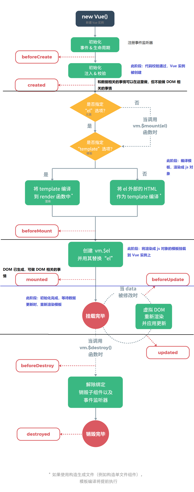

# Vue

## lifecycle



## Vuex

### Mutation VS Action

Mutation 用于向 Store 提交对状态的修改，而且建议通过 Mutation 而不是直接修改 state。

[Action ](https://vuex.vuejs.org/zh/guide/actions.html) 的作用类似 Mutation ，只是，Mutation 提交的是 commit ，而 Action 提交的是 Mutation，可执行异步，而 Mutation 必须同步执行。

```javascript
const store = new Vuex.Store({
  state: {
    count: 0
  },
  mutations: {
    increment (state) {
        // 提交状态修改
      state.count++
    }
  },
  actions: {
    increment (context) {
        // 提交 Mutation
      context.commit('increment')
    },
    incrementAsync({ commit },amount){
        setTimeout(() => {
            commit('increment',amount)
        },1000)
    }
  }
})

// 触发 Mutation
store.commit('increment')

// 触发 Action
store.dispatch('incrementAsync',{
    amount:10
})
```

### Module

支持将 store 分割成多个 module，每个 module 都拥有自己的 mutation、action、state、getter，或者嵌套子 module。

访问 module：**将 module 当做  `store.state` 中的一个属性来访问**。如:

```js
const moduleA = {
  namespaced:true, // 使用模块名作为 namespace 访问 state、action……
  state: { ... },
  mutations: { ... },
  actions: { 
    // state 是模块内部状态，rootState 才是 store 的 state
    // call : dispath('moduleA/incrementIfOddOnRootSum')
  	incrementIfOddOnRootSum ({ state, commit, rootState }) {
      if ((state.count + rootState.count) % 2 === 1) {
        commit('increment')
      }
    }
  },
  getters: { ... }
}

const moduleB = {
  state: { ... },
  mutations: { ... },
  actions: { ... }
}

const store = new Vuex.Store({
  modules: {
    a: moduleA,
    b: moduleB
  }
})

store.state.a // -> moduleA 的状态
store.state.b // -> moduleB 的状态
```

## Vue 自定义右键菜单

https://github.com/vmaimone/vue-context-menu

```html
<div @contextmenu.prevent="$refs.ctxMenu.open">
  ...
</div>

<context-menu id="context-menu" ref="ctxMenu" @ctx-open="onCtxOpen">
  <li @click="doSomething(...)">option 1</li>
  <li class="disabled">option 2</li>
  <li>option 3</li>
</context-menu>
```

```js
// 程序触发 & 携带数据
that.$refs.ctxMenu.open('', data);
```

## 组件通信

### 父子组件通信

父组件传值到子组件：`props`；子组件传值到父组件：子组件通过`$emit`触发事件，父组件监听得到数据

### 兄弟组件或非父子组件通信

推荐通过 Vuex 通信。普通传值很简单，基于 Vuex 也可以实现类似组件内部的响应式功能。接收数据的组件监听 store 中的特定数据变化即可：

```js
this.$store.watch(
	(state,getters) => state.xxxState,
	(newValue,oldValue) => {
		// 
	}
)
```

eventBus 通信。没有组件关系的限制，新创建一个 Vue 实例作为第三方，提供事件的触发与派发。

```js
let vue = new Vue()

// component A
vue.$emit('eventA',{payload})

// component B
vue.$on('eventA',payload => {})
```

选用什么通信方式取决于组件的关系和传输数据的大小。

父子组件通信自不必说，其他关系的组件通信需要考虑传输数据的大小，因为通信实质上是数据的复制传输，若数据量很大，复制是一件很重量级的工作，倒不如共享同一份数据（Vuex）来的轻巧。

## Vue 动态组件

Vue 通过给组件添加 `is` 属性来动态的渲染不同的组件，一般用法是：

```html
<keep-alive>
	<component :is='dynamicComponentName' ref='child'></component>
</keep-alive>
```

`<keep-alive>` 可以是组件在切换后还保留状态，而不会重新渲染。`is` 会让 `<component>` 元素随着 `dynamicComponentName` 的变化而动态渲染，该变量指明的是动态组件的 `name` 属性。`ref` 常常出现在动态组件上，一般用于父组件对不同子组件的统一操作；如不同子组件都需要处理同一份数据，但是处理方式不同，变可以使用该方法（if 判断不优雅）。

**is** 属性还可以用来避免 DOM 内模板的限制：如 

```html
<table>
  <blog-post-row></blog-post-row>
</table>
```

这个自定义组件 `<blog-post-row>` 会被作为无效的内容提升到外部，并导致最终渲染结果出错。幸好这个特殊的 `is` attribute 给了我们一个变通的办法：

```html
<table>
    <tr is="blog-post-row"></tr> 
</table>
```

需要注意的是**如果我们从以下来源使用模板的话，这条限制是\*不存在\*的**：

- 字符串 (例如：`template: '...'`)
- [单文件组件 (`.vue`)](https://cn.vuejs.org/v2/guide/single-file-components.html)
- [`<script type="text/x-template">`](https://cn.vuejs.org/v2/guide/components-edge-cases.html#X-Templates)

## 例子

以一个简单的日志记录为例，主界面有 tab 页，选择不同级别的日志进行记录，底部展示当前所有日志记录。

```text
<button @click='changeLog(logBtn.type)' v-for='logBtn in logList'>{{logBtn.text}}</button>
<keep-alive>
	<component :is='currentLogger' ref='log'></component>
</keep-alive>

logList:[{
	type: 0,
	text:'Error',
	componentName: 'ErrorLogger'
},……]

changeLog(type){
	this.currentLogger = this.logList[type].componentName
}

addLog(){
	this.logTable.push(this.$refs.log.add())
}
```

Error logger

```text
name: ErrorLogger

add(){
	return `<span style='color: red'>${logMsg}</span>`
}
```

Warning logger、Success logger……

# CSS

css 选择器上的`/deep/` 修饰：https://stackoverflow.com/questions/25609678/what-do-deep-and-shadow-mean-in-a-css-selector

HTML5 Web Components offer full encapsulation of CSS styles.

This means that:

- styles defined within a component cannot leak out and effect the rest of the page
- styles defined at the page level do not modify the component's own styles

 

- 修改第三方组件的样式时，应该注意影响范围，最好在第三方组件外围包裹元素，再使用 CSS 子元素选择器选择第三方组件。


# Echarts

## 一个性能问题

Vue + Echarts 可能的一个性能问题是将 ECharts 对象挂载到 Vue 的 data 中。ECharts 实例是一个巨大的对象，若挂载到 Vue 的 data 中，会严重占用内存，影响图表的渲染速度。

```js
// somewhere beyond vue object
var echartInstance = null
// inside vue object
echartInstance = echart.init(document.getElementById('#id'));
echartInstance.setOption(options);
this.$once('hook:beforeDestroy', function() {
    echart.dispose(echartInstance);
});
```

ref:https://github.com/apache/incubator-echarts/issues/7234


# 回调

当需要在回调函数中使用当前作用域中的变量时，会出现访问不到的情况，如：

```js
this.unwatch = this.$store.watch(
    (state, getters) => state.showXAxis,
    (newV, oldV) => {
        // echartInstance 访问不到
        echartInstance.setOption({
            xAxis: {
                show: newV
            }
        });
    }
);
```

更改：

```js
const echartInstanceCopy = echartInstance;
this.unwatch = this.$store.watch(
    (state, getters) => state.showXAxis,
    (newV, oldV) => {
        ....
```

同样的还有` this ` 的问题，不光箭头函数中访问不到正确的 `this` ，在回调函数中也不能正确的访问 `this` 指向的 vue 实例，也需要提前做局部缓存。（在基于 `webpack` 的应用中，在箭头函数中可以正确的访问到 `this`,那是因为 `webpack`在编译时自动将箭头函数作用域中的 `this` 替换为外围的 `this`）

```js
this.showChart(10);
const that = this;
echartInstance.on('click', function(e) {
    // 访问不到正确的 this 
    that.$emit('point-event', e);
});

// webpack 优化
echartInstance.on('click', function(e) {
    // 访问不到正确的 this 
    this.$emit('point-event', e);
});
// webpack 优化为
let _this = this
echartInstance.on('click', function(e) {
    _this.$emit('point-event', e);
});
```

箭头函数中的 `this` ：箭头函数没有自己的 `this`，但会引用父级的 `this`。所以在箭头函数中还是可以使用 `this` 的，只要是访问的调用者确是当前父级即可。

# java8 stream api

`groupingby` 可以对集合按指定的键进行分组，如集合：

```js
[
    {name:'jack',age:12,addr:'shanghai',country:'China'},
    {name:'rose',age:24,addr:'shanghai',country:'UK'},
    {name:'robin',age:12,addr:'beijing',country:'China'},
    {name:'pony',age:12,addr:'guangzhou',country:'Ca'}
] = User
```

```java
// 单条件分组
Map<String,List<User>> collect = list.stream().collect(Collectors.groupingby(User::getAddr()));

// 双条件分组
Map<Pair<String,String>,List<User>> collect = list.stream().collect(Collectors.groupingby(u -> Pair.of(u.getAddr(),u.getCountry()));
                                                                    
// 多条件分组
Map<String,List<User>> collect = list.stream().collect(Collectors.groupingby(u -> getGroupbyKey(u)));
             
// 任意键组合
String getGroupbyKey(User u){
    return String.format("%s_%s_%s",u.getAddr(),u.getCountry(),u.getName());
}
```


# 文档生成工具

https://docsify.js.org/#/    https://github.com/docsifyjs/docsify

https://www.showdoc.cc/

https://github.com/phachon/mm-wiki


# Js Promise

参考之前的一篇[博文](https://jianxinliu.github.io/post/learning_note/f2e/ES6_Promise.html)。

```javascript
async function getAll(){
    let promises = listColumn.map(col => {
        return (col => {
            return new Promise((resolve, reject) => {
                api.query(`SELECT DISTINCT ${field} FROM ${tableName} WHERE ${field} IS NOT NULL`)
                    .then(res => {
                        if (res.data) {
                            resolve({[field]: res.data})
                        } else {
                            reject('error')
                        }
                    })
            })
        })(col)
    })
    let results = await Promise.all(promises)
    ......
}
```

## 微任务队列

```javascript
let promise = Promise.resolve()
promise.then(res => console.log('promise done!'))
consoloe.log('code finished!')
```

上面这段代码的输出是这样的：

```
code finished!
promise done!
```

为什么立即 resolve 的代码执行依然会排在直接输出语句之后呢？因为 `Promise` 中，不论是 `then`,`catch`或 `finally` 语句块中的内容，都不会立即执行，而是会加入微任务队列中，直到 js 引擎没有其它任务在运行时，才会从队列中取出任务执行。在上面的例子中执行到第 2 句时， `console.log('promise done!')`被放入微任务队列中，js 引擎接着执行第 2 句，之后 js 引擎没有任务执行了，才从微任务队列中取出 `console.log('promise done!')` 执行。若要保证执行的顺序符合“直觉”，可将需要被顺序执行的代码依次使用 `then` 去调用，这样所有任务都会被加入队列，依次执行。

[ref](https://zh.javascript.info/microtask-queue)

## `async` & `await`

async/await 是以更舒适的方式使用 promise 的一种特殊语法，同时它也非常易于理解和使用。

async 用于修饰函数，保证该函数一定返回一个 `Promise`，即使最终函数没有返回 `Promise`，处理结果也会被封装进一个 resolved 的`Promise` 中返回。所以：

```js
async function foo(){
    return 1
}
async function bar(){
    return Promise().resolve(1)
}

foo().then(log) // 1
bar().then(log) // 1
```


# 函数错误处理

参考 go 语言函数的错误处理

```go
ret,error := someFn()
if(error){
    // 处理错误
} else {
    // 处理返回结果
}
```

```javascript
function foo(fields){
    if(fields.length < 1){
        return {
            ret:null,
            error:'fields empty!'
        }
    }
    // 正常处理流程
    
    // 最终返回
    let something = ''
    return {
        ret:something,
        error:null
    }
}

// 函数调用
let {ret,error} = foo(['a'])
if(error){
    alert(error)
} else {
    // handle result
}
// 或者对于输出返回值类型的函数，还可以更简便地处理
console.log(ret || error)
```

go 语言函数的返回值支持自定义变量名，即`let {ret,error} = foo(['a'])`中的 `ret` 可以自定义，即函数返回两个值，第一个是返回值，第二个是错误信息，但 js 不行，必须获取函数返回的那个变量，尤其是使用解构。

```js
// js 内置的错误对象
throw new Error('ErrMsg')

// 自定义错误对象
throw 'custom error'
```


# Web 端透视表生成的关键点

Excel 的透视表功能强大，支持多个维度对原始数据进行透视，从而获得更精确的信息。在 Web 实现该功能，看似及其困难，实际上关键技术还是常见的那些。有两种方案，一种是纯前端生成，一种是前端生成 SQL 后端得出透视表。纯前端生成的方案除了在数据量巨大时可能出现瓶颈外，其余都堪称完美。

## 透视表生成原理

对一个表格的数据生成透视表，实际上可以看成是 SQL 执行 `group by` 的操作，无论透视表是加行维度还是列维度，在 `group by` 中没有区别，都是增加 `group by` 的维度，不同的只是在展示上有区别。

## 纯前端

不使用 SQL，前端也可以进行 `group by`，知名 JavaScript 工具类库 `lodash`有针对数组的 `groupby` 函数，但该函数只支持一个维度的分组，不像 SQL 的 `group by` 后可接任意多字段。

```javascript
var _ = require('lodash')

Array.prototype.groupBy = function(fields) {
  return groupBy(this, fields, 0)
}

// 通过递归的方式实现多级 group by
function groupBy(dataSource, fields, i) {
  let ret = _.groupBy(dataSource, d => d[fields[i]])
  if (i < fields.length - 1) {
    i += 1
    for (let p in ret) {
      ret[p] = groupBy(ret[p], fields, i)
    }
  }
  return ret
}
```

如此 groupby 出来的数据，结构和透视表完全一样，之后其中的统计列需要再根据 groupby 出的组数据进行计算。这样的好处是生成透视表及其方便，还同时保留了原始数据，有利于后期对生成的统计数据快速钻取原始数据。

## 前端拼接 SQL

当数据量巨大，可以由前端根据操作生成 SQL ，再由后端执行 SQL 生成透视表的数据。实际上透视表也可以由 SQL 生成。如有学生数据，行维度选择国家和性别，列维度选择班级和城市，统计其 IQ 和 体重的均值，则生成其透视表数据的 SQL 是这样的。注：假设班级只有 `1` 和 `2`，城市只有 `beijing` 和 `shangha` 。

```sql
select country,
	sex,
	case when class = 1 and city = 'beijing' then avg(iq) end "1_beijing_IQ",
	case when class = 1 and city = 'shangha' then avg(iq) end "1_shangha_IQ",
	case when class = 2 and city = 'beijing' then avg(iq) end "2_beijing_IQ",
	case when class = 2 and city = 'shangha' then avg(iq) end "2_shangha_IQ",
	case when class = 2 and city = 'beijing' then avg(weight) end "2_beijing_weight",
	case when class = 1 and city = 'shangha' then avg(weight) end "1_shangha_weight",
	case when class = 1 and city = 'beijing' then avg(weight) end "1_beijing_weight",
	case when class = 2 and city = 'shangha' then avg(weight) end "2_shangha_weight"
from student
group by country, sex, class, city
```

从可以看到 `group by` 子句中可以看出，无论行维度还是列维度，都加入 group by 即可，只是展现不同而已。

由于这样的 SQL 生成的结果是会出现空值的，故再嵌套一层 `group by` 即可压缩结果集。

```sql
select country,
		sex,
		max("1_beijing_IQ") as "1_beijing_IQ" ,
		max("1_shangha_IQ") as "1_shangha_IQ" ,
		max("2_beijing_IQ") as "2_beijing_IQ" ,
		max("2_shangha_IQ") as "2_shangha_IQ" ,
		max("2_beijing_weight") as "2_beijing_weight",
		max("1_shangha_weight") as "1_shangha_weight",
		max("1_beijing_weight") as "1_beijing_weight",
		max("2_shangha_weight") as "2_shangha_weight"
from(
		select country,
				sex,
				case when class = 1 and city = 'beijing' then avg(iq) end "1_beijing_IQ",
				case when class = 1 and city = 'shangha' then avg(iq) end "1_shangha_IQ",
				case when class = 2 and city = 'beijing' then avg(iq) end "2_beijing_IQ",
				case when class = 2 and city = 'shangha' then avg(iq) end "2_shangha_IQ",
				case when class = 2 and city = 'beijing' then avg(weight) end "2_beijing_weight",
				case when class = 1 and city = 'shangha' then avg(weight) end "1_shangha_weight",
				case when class = 1 and city = 'beijing' then avg(weight) end "1_beijing_weight",
				case when class = 2 and city = 'shangha' then avg(weight) end "2_shangha_weight"
		from student
		group by country, sex, class, city
	) d
group by country,sex
order by country,sex
```

现在 SQL 是有了，但如何根据界面的操作来生成这个 SQL 呢？注意到内部 SQL 的 `case when` 的个数，是由列维度和统计维度的值的进行全排列的个数决定的。即班级有值：1,2；城市有值：beijing,shangha；统计 IQ  和 weight 。则全排列为

```
1 beijing iq
1 beijing weight
1 shangha iq
1 shangha weight
2 beijing iq
2 beijing weight
2 shangha iq
2 shangha weight
```

有了这个全排列的结果，则生成 SQL 就没什么问题了。全排列的函数参照[博客](https://blog.csdn.net/djcxym/article/details/79359057)，

```javascript
let indexes = []
function all_permutations(martix) {
  let res = []
  allPermutations(martix, res, 0)
  indexes = []
  return res
}
// 全排列
function allPermutations(martix, res, level) {
  let oneCase = []
  if (level < martix.length) {
    for (let i = 0; i < martix[level].length; i++) {
      indexes[level] = i
      allPermutations(martix, res, level + 1)
    }
  } else {
    for (let i = 0; i < martix.length; i++) {
      oneCase.push(martix[i][indexes[i]])
    }
    res.push(oneCase)
  }
}
```

全排列，也称笛卡尔积问题，简便方案：[两行代码](https://stackoverflow.com/questions/12303989/cartesian-product-of-multiple-arrays-in-javascript),[电商 SKU](https://juejin.im/post/5ee838cc6fb9a047ea45ef48)

```js
const f = (a, b) => [].concat(...a.map(d => b.map(e => [].concat(d, e))));
const cartesian = (a, b, ...c) => (b ? cartesian(f(a, b), ...c) : a);
let output = cartesian([1,2],[10,20],[100,200,300]);
output:
[ [ 1, 10, 100 ],
  [ 1, 10, 200 ],
  [ 1, 10, 300 ],
  [ 1, 20, 100 ],
  [ 1, 20, 200 ],
  [ 1, 20, 300 ],
  [ 2, 10, 100 ],
  [ 2, 10, 200 ],
  [ 2, 10, 300 ],
  [ 2, 20, 100 ],
  [ 2, 20, 200 ],
  [ 2, 20, 300 ] ]
```


## 多级表头 HTML 的生成

基于 elementUI 的多级表头，需要嵌套 `<el-table-column>` 元素，这对于动态生成的多级表头极不友好。最开始想到的是使用 jsx 来生成嵌套的元素，但在 vue 里动态添加元素的打开方式似乎不对，故没有成功，后参看此[博客](https://blog.csdn.net/liub37/article/details/82906141)，才明白不用写代码也可以实现嵌套组件的生成。

该博客的思路是新建一个组件，由这个组件自己负责嵌套生成 `<el-table-column>` 元素。

MyColumn.vue 组件

```vue
<template>
  <el-table-column :prop="col.prop" :label="col.label" align="left">
    <template v-if="col.children">
      <my-column v-for="(item, index) in col.children" :key="index" :col="item"></my-column>
    </template>
  </el-table-column>
</template>

<script>
import Vue from 'vue'
import { TableColumn } from 'element-ui'
Vue.use(TableColumn)
export default {
  name: 'MyColumn',
  props: {
    col: {
      type: Object
    }
  }
}
</script>
<style scoped></style>
```

使用该组件需要把列信息的结构更改为：

```json
[
    {
        prop: 'date',
        label: '日期'
    },
    {
        label: '配送信息',
        children: [
            {
                prop: 'name',
                label: '姓名'
            },
            {
                label: '地址',
                children: [
                    {
                        prop: 'province',
                        label: '省份'
                    },
                    {
                        prop: 'city',
                        label: '市区'
                    },
                    {
                        prop: 'address',
                        label: '地址'
                    }
                ]
            }
        ]
    }
]
```

使用时只需要把更改结构后的数据循环后传给myColumn 组件即可

```html
<my-column v-for="(item, index) in tableHeadSource" :key="index" :col="item"></my-column>
```

#  JavaScript 扩展函数

利用对象的 `prototype` 即可为对象扩展函数，如给 Array 扩展一个获取数组最后元素的函数

```js
Array.prototype.last = function(){
    return this[this.length - 1]
}
```

- 不能使用箭头函数定义。因为箭头函数中没有 `this` ，而扩展函数还需要 `this` 来指向调用者
- 使用 `this` 指向调用者，如 `[1,2,3].last()`,函数中的 `this` 便可以指向 `[1,2,3]` 这个数据
- 这样扩展之后，相当于数组多了一个函数，全局可用。

**重要：** 不要随意污染全局空间，危害参见<a href='#prototype'>JS Clean Code</a>

# JavaScript 数据操作

函数式编程和命令式编程的不同。

[函数式编程简介](https://mp.weixin.qq.com/s?__biz=MjM5ODQ2MDIyMA==&mid=402307374&idx=1&sn=2ff35dc5bcadab0bbeae626f48f4e18e#rd) [抽象的能力](https://zhuanlan.zhihu.com/p/20617201) 

遍历，过滤，查找，分组，排序，映射，归约…… 

```js
let classNo = [1,2,3,4]
let students = [{name:'jack',age:12,addr:'beijing'},
              {name:'rose',age:12,addr:'beijing'},
              {name:'mary',age:25,addr:'sahnghai'},
              {name:'pony',age:24,addr:'sahnghai'},
              {name:'robin',age:24,addr:'gaungzhou'}]

classNo.forEach(v => console.log(v)) // => 1 2 3 4
classNo.map(v => console.log(v))     // => 1 2 3 4
students.map(v => console.log(v.name))  // => ['jack','rose','mary','pony','robin']

// 实际上 map 的主要作用不是遍历，而是遍历的过程中，对所遍历值的操作
let student_age = students.map(v => v.age) // => [12,12,25,24,24]
let student_age_formatted = students.map(v => v.age + '岁') => ['12岁','12岁','25岁','24岁','24岁']

let student_from_beijing = students.filter(v => v.addr === 'beijing') // => find jack & rose

let rose = students.find(v => v.name === 'rose') // find rose
let roseIndex = students.findIndex(v => v.name === 'rose') // 1

let range_by_age_asc = students.sort((a,b) => a.age - b.age)
let range_by_age_desc = students.sort((a,b) => b.age - a.age)

let avg_age = students.reduce((a,b) => a + b.age,0) / students.length // => 19.4


// array deep copy
let studentCopy1 = Object.assign([],student)
let studentCopy2 = JSON.parse(JSON.stringify(student))
let studentCopy3 = student.map(stu => Object.assign({},stu))
let studentCopy4 = student.map(stu => ({...stu}))
```

# Java 8 Stream api 数据操作

```java
import lombok.AllArgsConstructor;
import lombok.Data;

import java.util.Arrays;
import java.util.DoubleSummaryStatistics;
import java.util.List;
import java.util.Optional;
import java.util.stream.Collectors;
import java.util.stream.Stream;

/**
 * @author jianxinliu
 * @date 2020/07/11 11:43
 * @description
 */
public class StreamTest {
    static Student defaultStu = new Student("default", 0, "xxx", 100000, "");
    static Student[] students = new Student[]{
            new Student("jack", 13, "shanghai", 123, ""),
            new Student("rose", 24, "shanghai", 124, ""),
            new Student("pony", 34, "guangzhou", 135, ""),
            new Student("robin", 35, "beijing", 143, "")
    };

    public static void main(String[] args) {
        List<Student> stuList = Arrays.asList(students);
        // just for each
        stuList.forEach(System.out::println);
        // change list properties
        List<String> stus = stuList.stream().map(stu -> stu.note = "hello").collect(Collectors.toList());
        stus.forEach(System.out::println);

        // get cities
        stuList.stream().map(Student::getAddr).distinct().collect(Collectors.toList()).forEach(System.out::println);

        double totalAge = stuList.stream().map(Student::getAge).reduce((a, b) -> a + b).orElse(0).doubleValue();
        System.out.println(totalAge);

        double avgIQ = stuList.stream().filter(v -> v.getAge() > 13).mapToDouble(Student::getIq).average().orElse(0);
        System.out.println(avgIQ);

        boolean allAdult = stuList.stream().allMatch(v -> v.getAge() > 18);
        System.out.println(allAdult);

        DoubleSummaryStatistics iqStatistics = stuList.stream().filter(v -> v.getAge() > 18).mapToDouble(Student::getIq).summaryStatistics();
        System.out.println(iqStatistics.getAverage());

        System.out.println(getStudentByName("edsion").orElse(defaultStu));
        System.out.println(getStudentByName("edsion").orElseThrow(IllegalArgumentException::new));
    }

    static Optional<Student> getStudentByName(String name) {
        List<Student> stuList = Arrays.asList(students);
        Stream<Student> limit = stuList.stream().filter(v -> v.getName() == name).limit(1);
        if (limit.findAny().isPresent()) {
            return Optional.of(limit.findAny().get());
        } else {
            return Optional.empty();
        }
    }
}

@Data
@AllArgsConstructor
class Student {
    String name;
    Integer age;
    String addr;
    Integer iq;
    String note;
}
```

# js 文件读入写出

HTML 5 的 File API 和 Blob 对象给 Web 页面提供了读写本地文件的能力。

读取本地文件内容

```js
export function readFile(callback) {
  let inputEle = document.createElement('input')
  inputEle.setAttribute('id', 'tempInput')
  inputEle.setAttribute('type', 'file')
  inputEle.setAttribute('accept', 'text/txt')
  inputEle.setAttribute("style", "display: none")
  const handleValue = () => {
    let file = inputEle.files[0]
    let blob = new Blob([file], {type: "text/plain;charset=utf-8"})
    blob.text().then(text => {
	  // text 即文件内容的文本格式
      callback(text)
      document.body.removeChild(inputEle)
    })
  }
  inputEle.addEventListener('change', handleValue, true)
  document.body.appendChild(inputEle)
  inputEle.click()
}
```

写入文件使用 File-saver 依赖，更方便全面的操作，实际上也是使用 File API  和 Blob 对象。

```js
export function buildAndSave(fileName) {
  let content = {}
  let settingJson = JSON.stringify(content)
  const blob = new Blob([NOTE, settingJson], {type: "text/plain;charset=utf-8"})
  FileSaver.saveAs(blob, fileName + '.txt')
}
```

# 计算

## 程序计算

数据可以被计算，程序也可以被计算。

 使用 `eval` 计算出表达式，代入程序执行。 

例如，图表上有五根线 `y = C`，C 的取值及其大小关系为：`USL > UCL > Target > LCL > lSL`，五根线中可能有不存在的线。设一系列点 P 中满足 `P > USL || P < LSL` 的点数称为 `OOS(out of specfication)`，满足 `P > UCL || P < LCL`的点数称为 `OOC(out of control)`。求一系列点 arrP 的 OOS，OOC。

本题麻烦的点在于五根线的存在性不确定，判断起来很繁琐。以求 OOS 为例

1. 若 USL 不存在，则过滤的表达式为 `P < LSL`
2. 若 LSL 不存在，则过滤的表达式为 `P > USL`
3. 若 USL、LSL 同时不存在，则不需计算 OOS
4. 若 USL、LSL 同时存在，则过滤的表达式为`P > USL || P < LSL`

若是基于 `if else` ，那肯定写出一大堆，还不好理解。若是转换下思路，将表达式看做是字符串，则基于以上逻辑，拼接字符串还是会稍微简单一些的。

```js
const conditionExpression = (up,low) => {
    let cond = [];
    // 设 d 为 filter 函数中的迭代变量名，直接写死会简便一些，也可通过参数传入
    up && cond.push(`d > ${up}`); 
    low && cond.push(`d < ${low}`);
    (!up && !low) && cond.push('false')
    return cond.join(' || ')
}

// call
let oos = arrP.filter(d => eval(conditionExpression(usl,lsl))).length
let ooc = arrP.filter(d => eval(conditionExpression(ucl,lcl))).length
```

## 属性计算

统一即简洁，统一即可计算。 

# js clean code

https://github.com/ryanmcdermott/clean-code-javascript

## 变量

### Use meaningful and pronounceable variable names

**Bad:**

```js
const yyyymmdstr = moment().format("YYYY/MM/DD");
```

**Good:**

```js
const currentDate = moment().format("YYYY/MM/DD");
```

### 使用可自解释的变量名

**Bad:**

```js
const address = "One Infinite Loop, Cupertino 95014";
const cityZipCodeRegex = /^[^,\\]+[,\\\s]+(.+?)\s*(\d{5})?$/;
saveCityZipCode(
  address.match(cityZipCodeRegex)[1],
  address.match(cityZipCodeRegex)[2]
);
```

**Good:**

```js
const address = "One Infinite Loop, Cupertino 95014";
const cityZipCodeRegex = /^[^,\\]+[,\\\s]+(.+?)\s*(\d{5})?$/;
const [_, city, zipCode] = address.match(cityZipCodeRegex) || [];
saveCityZipCode(city, zipCode);
```

### Explicit is better than implicit.

**Bad:**

```js
const locations = ["Austin", "New York", "San Francisco"];
locations.forEach(l => {
  doStuff();
  doSomeOtherStuff();
  // ...
  // ...
  // ...
  // Wait, what is `l` for again?
  dispatch(l);
});
```

**Good:**

```js
const locations = ["Austin", "New York", "San Francisco"];
locations.forEach(location => {
  doStuff();
  doSomeOtherStuff();
  // ...
  // ...
  // ...
  dispatch(location);
});
```

### Don't add unneeded context

If your class/object name tells you something, don't repeat that in your variable name.

**Bad:**

```js
const Car = {
  carMake: "Honda",
  carModel: "Accord",
  carColor: "Blue"
};

function paintCar(car) {
  car.carColor = "Red";
}
```

**Good:**

```js
const Car = {
  make: "Honda",
  model: "Accord",
  color: "Blue"
};

function paintCar(car) {
  car.color = "Red";
}
```

### Use default arguments instead of short circuiting or conditionals

Default arguments are often cleaner than short circuiting. Be aware that if you use them, your function will only provide default values for `undefined` arguments. Other "falsy" values such as `''`, `""`, `false`, `null`, `0`, and `NaN`, **will not be replaced by a default value**.

**Bad:**

```js
function createMicrobrewery(name) {
  const breweryName = name || "Hipster Brew Co.";
  // ...
}
```

**Good:**

```JS
function createMicrobrewery(name = "Hipster Brew Co.") {
  // ...
}
```

## 函数

### Function arguments (2 or fewer ideally)

**Bad:**

```js
function createMenu(title, body, buttonText, cancellable) {
  // ...
}

createMenu("Foo", "Bar", "Baz", true);
```

**Good:**

```js
function createMenu({ title, body, buttonText, cancellable }) {
  // ...
}
// 多了一个解释参数意义的机会
createMenu({
  title: "Foo",
  body: "Bar",
  buttonText: "Baz",
  cancellable: true
});
```

### Function names should say what they do

**Bad:**

```js
function addToDate(date, month) {
  // ...
}

const date = new Date();

// It's hard to tell from the function name what is added
addToDate(date, 1);
```

**Good:**

```js
function addMonthToDate(month, date) {
  // ...
}

const date = new Date();
addMonthToDate(1, date);
```

### Avoid Side Effects

避免函数带有副作用。因为 JavaScript 函数传参时，基本类型传值，对象类型传引用，故最好是只操作传入数据的副本，函数返回副本，对参数无影响，这样其他地方再次使用该参数时，不会出现意想不到的情况。

**Bad:**

```js
// Global variable referenced by following function.
// If we had another function that used this name, now it'd be an array and it could break it.
let name = "Ryan McDermott";

function splitIntoFirstAndLastName() {
  name = name.split(" ");
}

splitIntoFirstAndLastName();

console.log(name); // ['Ryan', 'McDermott'];
```

**Good:**

```js
function splitIntoFirstAndLastName(name) {
  return name.split(" ");
}

const name = "Ryan McDermott";
const newName = splitIntoFirstAndLastName(name);

console.log(name); // 'Ryan McDermott';
console.log(newName); // ['Ryan', 'McDermott'];
```

### Don't write to global functions

<span name='prototype'>不要给已有内置对象添加属性（方法），这样会影响到全局，造成污染。</span>

正是因为 JavaScript 的便利，才不可能预防他人（库）定义和你自定义函数同名的函数，一旦这种情况发生，前者的自定义函数将失效，整个系统将发生不可预估的问题。

Polluting globals is a bad practice in JavaScript because you could clash with another library and the user of your API would be none-the-wiser until they get an exception in production. Let's think about an example: what if you wanted to extend JavaScript's native Array method to have a `diff` method that could show the difference between two arrays? You could write your new function to the `Array.prototype`, but it could clash with another library that tried to do the same thing. What if that other library was just using `diff` to find the difference between the first and last elements of an array? This is why it would be much better to just use ES2015/ES6 classes and simply extend the `Array` global.

**Bad:**

```js
Array.prototype.diff = function diff(comparisonArray) {
  const hash = new Set(comparisonArray);
  return this.filter(elem => !hash.has(elem));
};
```

**Good:**

```js
class SuperArray extends Array {
  diff(comparisonArray) {
    const hash = new Set(comparisonArray);
    return this.filter(elem => !hash.has(elem));
  }
}
```

### 尽量使用函数式而不是命令式

**Bad:**

```js
const programmerOutput = [
  {
    name: "Uncle Bobby",
    linesOfCode: 500
  },
  {
    name: "Suzie Q",
    linesOfCode: 1500
  }
];

let totalOutput = 0;

for (let i = 0; i < programmerOutput.length; i++) {
  totalOutput += programmerOutput[i].linesOfCode;
}
```

**Good:**

```js
const programmerOutput = [
  {
    name: "Uncle Bobby",
    linesOfCode: 500
  },
  {
    name: "Suzie Q",
    linesOfCode: 1500
  }
];

const totalOutput = programmerOutput.reduce(
  (totalLines, output) => totalLines + output.linesOfCode,
  0
);
```

### 具名条件表达式

**Bad:**

```js
if (fsm.state === "fetching" && isEmpty(listNode)) {
  // ...
}
```

**Good:**

```js
const shouldShowSpinner = (fsm, listNode) => fsm.state === "fetching" && isEmpty(listNode)

if (shouldShowSpinner(fsmInstance, listNodeInstance)) {
  // ...
}
```

### 尽量避免‘非’条件

这只会让人陷入逻辑黑洞

**Bad:**

```js
function isDOMNodeNotPresent(node) {
  // ...
}

if (!isDOMNodeNotPresent(node)) {
  // ...
}
```

**Good:**

```js
function isDOMNodePresent(node) {
  // ...
}

if (isDOMNodePresent(node)) {
  // ...
}
```

## 格式

### Function callers and callees should be close

If a function calls another, keep those functions vertically close in the source file. Ideally, keep the caller right above the callee. We tend to read code from top-to-bottom, like a newspaper. Because of this, make your code read that way.

**Bad:**

```js
class PerformanceReview {
  constructor(employee) {
    this.employee = employee;
  }

  lookupPeers() {
    return db.lookup(this.employee, "peers");
  }

  lookupManager() {
    return db.lookup(this.employee, "manager");
  }

  getPeerReviews() {
    const peers = this.lookupPeers();
    // ...
  }

  perfReview() {
    this.getPeerReviews();
    this.getManagerReview();
    this.getSelfReview();
  }

  getManagerReview() {
    const manager = this.lookupManager();
  }

  getSelfReview() {
    // ...
  }
}

const review = new PerformanceReview(employee);
review.perfReview();
```

**Good:**

```js
class PerformanceReview {
  constructor(employee) {
    this.employee = employee;
  }

  // 总-分 结构
  perfReview() {
    this.getPeerReviews();
    this.getManagerReview();
    this.getSelfReview();
  }

  getPeerReviews() {
    const peers = this.lookupPeers();
    // ...
  }

  lookupPeers() {
    return db.lookup(this.employee, "peers");
  }

  getManagerReview() {
    const manager = this.lookupManager();
  }

  lookupManager() {
    return db.lookup(this.employee, "manager");
  }

  getSelfReview() {
    // ...
  }
}

const review = new PerformanceReview(employee);
review.perfReview();
```

## 注释

Comments are an apology, not a requirement. Good code *mostly* documents itself.

**Bad:**

```js
function hashIt(data) {
  // The hash
  let hash = 0;

  // Length of string
  const length = data.length;

  // Loop through every character in data
  for (let i = 0; i < length; i++) {
    // Get character code.
    const char = data.charCodeAt(i);
    // Make the hash
    hash = (hash << 5) - hash + char;
    // Convert to 32-bit integer
    hash &= hash;
  }
}
```

**Good:**

```js
function hashIt(data) {
  let hash = 0;
  const length = data.length;

  for (let i = 0; i < length; i++) {
    const char = data.charCodeAt(i);
    hash = (hash << 5) - hash + char;

    // Convert to 32-bit integer
    hash &= hash;
  }
}
```

# SQL

`row_number() over([partion by xx] order by xx) as rowNum` 该列是 SQL 执行后对结果集的每一行进行排序后生成的编号，可以用来做分页的依据。若加 `partion by xx` 则会依据指定字段分组，每组单独生成行号。

`case when a=1 and b=2 then avg(age) when a=2 and b=3 then ... end as avg_age`

# js 并发模型与事件循环

[ref](https://developer.mozilla.org/zh-CN/docs/Web/JavaScript/EventLoop)

JavaScript有一个基于**事件循环**的并发模型，事件循环负责执行代码、收集和处理事件以及执行队列中的子任务。这个模型与其它语言中的模型截然不同，比如 C 和 Java。

js 引擎是单线程模型，故一个函数在执行时，不会被抢占，只有在运行完之后才会运行其他任务（**执行至完成**）。该模型的缺点就是当一个任务运行时间过长，则会影响到其他程序的执行，如 Web 应用程序就无法响应用户的交互，会出现页面卡死的现象。

在浏览器中，每当有一个事件发生，且有一个事件监听器绑定在该事件上，该事件就会被加入消息队列。函数 `setTimeout` 可以将一个函数推迟一段时间执行，原理是当调用 `setTimeout` 时，传入的第一个参数（函数）将被加入消息队列等待执行，理想情况下，队列为空，则到了指定时间后，加入队列的消息会在指定的时间间隔后执行。非理想情况下，可能在消息入队之前，消息队列已经排有耗时远超指定的时间间隔，则该消息不会在指定的之间后执行，而是会在队列执行到该消息时执行。也就是：**`setTimeout` 的第二个参数仅仅表示消息延迟执行的最小时间间隔。** 同样的，`setTimeout(fn, 0)` 并不能立即执行`fn`。

也正是因为 js 引擎采用事件循环模型和消息队列，故可以实现“**永不阻塞**”。如一个 Web 应用在等待 XHR 的返回时，依然可以处理其他如用户输入的事情，因为这类 I/O 事务通常通过事件和回调来处理。