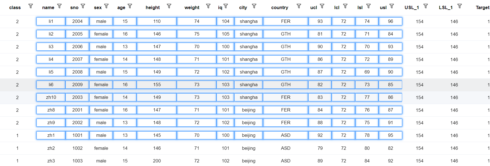
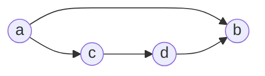

# Vue

## lifecycle


## Vuex

### Mutation VS Action

Mutation 用于向 Store 提交对状态的修改，而且建议通过 Mutation 而不是直接修改 state。

[Action ](https://vuex.vuejs.org/zh/guide/actions.html) 的作用类似 Mutation ，只是，Mutation 提交的是 commit ，而 Action 提交的是 Mutation，可执行异步，而 Mutation 必须同步执行。

```javascript
const store = new Vuex.Store({
  state: {
    count: 0
  },
  mutations: {
    increment (state) {
        // 提交状态修改
      state.count++
    }
  },
  actions: {
    increment (context) {
        // 提交 Mutation
      context.commit('increment')
    },
    incrementAsync({ commit },amount){
        setTimeout(() => {
            commit('increment',amount)
        },1000)
    }
  }
})

// 触发 Mutation
store.commit('increment')

// 触发 Action
store.dispatch('incrementAsync',{
    amount:10
})
```

### Module

支持将 store 分割成多个 module，每个 module 都拥有自己的 mutation、action、state、getter，或者嵌套子 module。

访问 module：**将 module 当做  `store.state` 中的一个属性来访问**。如:

```js
const moduleA = {
  namespaced:true, // 使用模块名作为 namespace 访问 state、action……
  state: { ... },
  mutations: { ... },
  actions: { 
    // state 是模块内部状态，rootState 才是 store 的 state
    // call : dispath('moduleA/incrementIfOddOnRootSum')
  	incrementIfOddOnRootSum ({ state, commit, rootState }) {
      if ((state.count + rootState.count) % 2 === 1) {
        commit('increment')
      }
    }
  },
  getters: { ... }
}

const moduleB = {
  state: { ... },
  mutations: { ... },
  actions: { ... }
}

const store = new Vuex.Store({
  modules: {
    a: moduleA,
    b: moduleB
  }
})

store.state.a // -> moduleA 的状态
store.state.b // -> moduleB 的状态
```

## Vue 自定义右键菜单

https://github.com/vmaimone/vue-context-menu

```html
<div @contextmenu.prevent="$refs.ctxMenu.open">
  ...
</div>

<context-menu id="context-menu" ref="ctxMenu" @ctx-open="onCtxOpen">
  <li @click="doSomething(...)">option 1</li>
  <li class="disabled">option 2</li>
  <li>option 3</li>
</context-menu>
```

```js
// 程序触发 & 携带数据
that.$refs.ctxMenu.open('', data);
```

## 组件通信

### 父子组件通信

父组件传值到子组件：`props`；子组件传值到父组件：子组件通过`$emit`触发事件，父组件监听得到数据

### 兄弟组件或非父子组件通信

推荐通过 Vuex 通信。普通传值很简单，基于 Vuex 也可以实现类似组件内部的响应式功能。接收数据的组件监听 store 中的特定数据变化即可：

```js
this.$store.watch(
	(state,getters) => state.xxxState,
	(newValue,oldValue) => {
		// 
	}
)
```

eventBus 通信。没有组件关系的限制，新创建一个 Vue 实例作为第三方，提供事件的触发与派发。

```js
let vue = new Vue()

// component A
vue.$emit('eventA',{payload})

// component B
vue.$on('eventA',payload => {})
```

选用什么通信方式取决于组件的关系和传输数据的大小。

父子组件通信自不必说，其他关系的组件通信需要考虑传输数据的大小，因为通信实质上是数据的复制传输，若数据量很大，复制是一件很重量级的工作，倒不如共享同一份数据（Vuex）来的轻巧。

## Vue 动态组件

Vue 通过给组件添加 `is` 属性来动态的渲染不同的组件，一般用法是：

```html
<keep-alive>
	<component :is='dynamicComponentName' ref='child'></component>
</keep-alive>
```

`<keep-alive>` 可以是组件在切换后还保留状态，而不会重新渲染。`is` 会让 `<component>` 元素随着 `dynamicComponentName` 的变化而动态渲染，该变量指明的是动态组件的 `name` 属性。`ref` 常常出现在动态组件上，一般用于父组件对不同子组件的统一操作；如不同子组件都需要处理同一份数据，但是处理方式不同，变可以使用该方法（if 判断不优雅）。

**is** 属性还可以用来避免 DOM 内模板的限制：如 

```html
<table>
  <blog-post-row></blog-post-row>
</table>
```

这个自定义组件 `<blog-post-row>` 会被作为无效的内容提升到外部，并导致最终渲染结果出错。幸好这个特殊的 `is` attribute 给了我们一个变通的办法：

```html
<table>
    <tr is="blog-post-row"></tr> 
</table>
```

需要注意的是**如果我们从以下来源使用模板的话，这条限制是\*不存在\*的**：

- 字符串 (例如：`template: '...'`)
- [单文件组件 (`.vue`)](https://cn.vuejs.org/v2/guide/single-file-components.html)
- [`<script type="text/x-template">`](https://cn.vuejs.org/v2/guide/components-edge-cases.html#X-Templates)

### 例子

以一个简单的日志记录为例，主界面有 tab 页，选择不同级别的日志进行记录，底部展示当前所有日志记录。

```text
<button @click='changeLog(logBtn.type)' v-for='logBtn in logList'>{{logBtn.text}}</button>
<keep-alive>
	<component :is='currentLogger' ref='log'></component>
</keep-alive>

logList:[{
	type: 0,
	text:'Error',
	componentName: 'ErrorLogger'
},……]

changeLog(type){
	this.currentLogger = this.logList[type].componentName
}

addLog(){
	this.logTable.push(this.$refs.log.add())
}
```

Error logger

```text
name: ErrorLogger

add(){
	return `<span style='color: red'>${logMsg}</span>`
}
```

Warning logger、Success logger……

## Vue Directives

自定义指令实现 debounce

```js
// default is triggered by click event: v-debounce:1000="triggerFn"
// change trigger type:  v-debounce:1000 = "{event: 'keyup', fn: triggerFn}"  ('event' can be 'evt' for shorten)
// default: interval -> 200ms; trigger event -> click
/**
 * examples:
 *
 * 1. trigger by click , after 200ms call the function without arguments (default)
 *  v-debounce="funcName"
 *
 * 2. trigger by keyup , after 500ms call the function without arguments
 *  v-debounce:500="{fn: funcName, evt: 'keyup'}" or {event: 'keyup'}
 *
 * 3. trigger by keyup , after 500ms call the function with arguments
 *  v-debounce:500="{fn: funcName, evt: 'keyup', args: [arg1, arg2, ....]}" or {args: arg} (for single argument)
 * @type {DirectiveOptions}
 */
const debounce = Vue.directive('debounce', {
  inserted: function (el, binding) {
    const {value, arg} = binding

    let interval = arg || 200
    interval = interval < 1 ? 200 : interval
    let evtType = 'click'
    let fn
    let fnArgs = []
    if (typeof value === 'function') {
      fn = value
    } else if (typeof value === 'object') {
      evtType = value.event || value.evt || 'click'
      fn = value.fn
      fnArgs = Array.isArray(value.args) ? value.args : [value.args]
    }

    if (!fn || typeof fn !== 'function') {
      throw Error("trigger function must be specified as a function(not string)!")
    }
    let timer
    el.addEventListener(evtType, () => {
      timer && clearTimeout(timer)
      timer = setTimeout(() => fn.call(null, ...fnArgs), interval)
    })
  }
});
```


# CSS

css 选择器上的`/deep/` 修饰：https://stackoverflow.com/questions/25609678/what-do-deep-and-shadow-mean-in-a-css-selector

HTML5 Web Components offer full encapsulation of CSS styles.

This means that:

- styles defined within a component cannot leak out and effect the rest of the page
- styles defined at the page level do not modify the component's own styles

 

- 修改第三方组件的样式时，应该注意影响范围，最好在第三方组件外围包裹元素，再使用 CSS 子元素选择器选择第三方组件。

## CSS 如何处理非法样式


跳过不处理。CSS 在快速发展，若不能兼容“错误”样式，而是报错，整个罢工不渲染，肯定是不长久的。对于不支持新特性的老式浏览器来说，这一点及其重要。这样，就有了一种处理浏览器兼容的方式——给同一个块写两个或更多的样式，依照浏览器支持程度顺序写，如：

```css
.block {
    width:300px,
    width:calc(90% - 30px) /*浏览器支持 calc 函数，则覆盖 width:300px,若不支持则位置原先设置*/
}
```


## [层叠、优先级与继承](https://developer.mozilla.org/zh-CN/docs/Learn/CSS/Building_blocks/Cascade_and_inheritance)

理解**层叠**（cascade）是理解 CSS 的关键。当同一块被设置的不同的样式，就发生了冲突，该使用哪个设置，就是层叠体现的地方——**后来者会覆盖前者，优先级高的会覆盖优先级低的**。

对于如何定义**优先级**，有一个总的原则——具体。如：`元素选择器 < 类选择器 < id 选择器 <  元素内 style`。随着优先级的提高，选择器所表示的范围越来越小，选择出的元素越来越具体，设置的对应规则自然应该被优先展示。使用 `!important` 可以提升优先级。

一些设置在父元素上的样式会被子元素**继承**，有些则不能。如给 `body` 元素设置字体颜色，则整个页面的字体颜色都会随之改变（除非设置更加具体的规则进行覆盖），这就是所有页面元素都继承了 `body` 这个父元素的样式。像宽度这种属性则不会默认继承父类，否则就很难达到想要的效果了，**哪些属性属于默认继承很大程度上是由常识决定的**。

以上这些概念一起控制 CSS 规则应该作用于哪些元素。

### 理解继承

CSS 提供了 `inherit`,`initial`,`unset` 属性值来控制继承，每个 CSS 属性都支持这些值。

- `inherit`:开启继承
- `initial`:设置属性值和浏览器默认样式相同。如果浏览器默认样式中未设置且该属性是自然继承的，那么会设置为 `inherit` 
- `unset`:将属性重置为自然值，也就是如果属性是自然继承那么就是 `inherit`，否则和 `initial`一样

## [盒模型](https://developer.mozilla.org/zh-CN/docs/Learn/CSS/Building_blocks/The_box_model)


# Echarts

## 一个性能问题

Vue + Echarts 可能的一个性能问题是将 ECharts 对象挂载到 Vue 的 data 中。ECharts 实例是一个巨大的对象，若挂载到 Vue 的 data 中，会严重占用内存，影响图表的渲染速度。

```js
// somewhere beyond vue object
var echartInstance = null
// inside vue object
echartInstance = echart.init(document.getElementById('#id'));
echartInstance.setOption(options);
this.$once('hook:beforeDestroy', function() {
    echart.dispose(echartInstance);
});
```

ref:https://github.com/apache/incubator-echarts/issues/7234

除此之外，Vue 在使用过程中，如果有大数据挂载在 Vue 实例上，也会导致一定的性能问题，因为挂载在 Vue 实例上的数据都是响应式的，就会遍历数据，造成一定的开销。此时，同样的，尽量不把大数据作为 Vue 的状态。

# 回调

当需要在回调函数中使用当前作用域中的变量时，会出现访问不到的情况，如：

```js
this.unwatch = this.$store.watch(
    (state, getters) => state.showXAxis,
    (newV, oldV) => {
        // echartInstance 访问不到
        echartInstance.setOption({
            xAxis: {
                show: newV
            }
        });
    }
);
```

更改：

```js
const echartInstanceCopy = echartInstance;
this.unwatch = this.$store.watch(
    (state, getters) => state.showXAxis,
    (newV, oldV) => {
        ....
```

同样的还有` this ` 的问题，不光箭头函数中访问不到正确的 `this` ，在回调函数中也不能正确的访问 `this` 指向的 vue 实例，也需要提前做局部缓存。（在基于 `webpack` 的应用中，在箭头函数中可以正确的访问到 `this`,那是因为 `webpack`在编译时自动将箭头函数作用域中的 `this` 替换为外围的 `this`）

```js
this.showChart(10);
const that = this;
echartInstance.on('click', function(e) {
    // 访问不到正确的 this 
    that.$emit('point-event', e);
});

// webpack 优化
echartInstance.on('click', function(e) {
    // 访问不到正确的 this 
    this.$emit('point-event', e);
});
// webpack 优化为
let _this = this
echartInstance.on('click', function(e) {
    _this.$emit('point-event', e);
});
```

箭头函数中的 `this` ：箭头函数没有自己的 `this`，但会引用父级的 `this`。所以在箭头函数中还是可以使用 `this` 的，只要是访问的调用者确是当前父级即可。

# java8 stream api

`groupingby` 可以对集合按指定的键进行分组，如集合：

```js
[
    {name:'jack',age:12,addr:'shanghai',country:'China'},
    {name:'rose',age:24,addr:'shanghai',country:'UK'},
    {name:'robin',age:12,addr:'beijing',country:'China'},
    {name:'pony',age:12,addr:'guangzhou',country:'Ca'}
] = User
```

```java
// 单条件分组
Map<String,List<User>> collect = list.stream().collect(Collectors.groupingby(User::getAddr()));

// 双条件分组
Map<Pair<String,String>,List<User>> collect = list.stream().collect(Collectors.groupingby(u -> Pair.of(u.getAddr(),u.getCountry()));
                                                                    
// 多条件分组
Map<String,List<User>> collect = list.stream().collect(Collectors.groupingby(u -> getGroupbyKey(u)));
             
// 任意键组合
String getGroupbyKey(User u){
    return String.format("%s_%s_%s",u.getAddr(),u.getCountry(),u.getName());
}
```

[Oracle Java Tutorial](https://docs.oracle.com/javase/tutorial/index.html)


# 文档生成工具

https://docsify.js.org/#/    https://github.com/docsifyjs/docsify

https://www.showdoc.cc/

https://github.com/phachon/mm-wiki


# Js Promise

参考之前的一篇[博文](https://jianxinliu.github.io/post/learning_note/f2e/ES6_Promise.html)。

```javascript
async function getAll(){
    let promises = listColumn.map(col => {
        return (col => {
            return new Promise((resolve, reject) => {
                api.query(`SELECT DISTINCT ${field} FROM ${tableName} WHERE ${field} IS NOT NULL`)
                    .then(res => {
                        if (res.data) {
                            resolve({[field]: res.data})
                        } else {
                            reject('error')
                        }
                    })
            })
        })(col)
    })
    let results = await Promise.all(promises)
    ......
}
```

## 微任务队列

```javascript
let promise = Promise.resolve()
promise.then(res => console.log('promise done!'))
consoloe.log('code finished!')
```

上面这段代码的输出是这样的：

```
code finished!
promise done!
```

为什么立即 resolve 的代码执行依然会排在直接输出语句之后呢？因为 `Promise` 中，不论是 `then`,`catch`或 `finally` 语句块中的内容，都不会立即执行，而是会加入微任务队列中，直到 js 引擎没有其它任务在运行时（**宏任务队列**），才会从队列中取出任务执行。在上面的例子中执行到第 2 句时， `console.log('promise done!')`被放入微任务队列中，js 引擎接着执行第 2 句，之后 js 引擎没有任务执行了，才从微任务队列中取出 `console.log('promise done!')` 执行。若要保证执行的顺序符合“直觉”，可将需要被顺序执行的代码依次使用 `then` 去调用，这样所有任务都会被加入队列，依次执行。

[ref-微任务队列](https://zh.javascript.info/microtask-queue)、[事件循环与宏任务队列](https://zh.javascript.info/event-loop)

## `async` & `await`

async/await 是以更舒适的方式使用 promise 的一种特殊语法，同时它也非常易于理解和使用。

async 用于修饰函数，保证该函数一定返回一个 `Promise`，即使最终函数没有返回 `Promise`，处理结果也会被封装进一个 resolved 的`Promise` 中返回。所以：

```js
async function foo(){
    return 1
}
async function bar(){
    return Promise().resolve(1)
}

foo().then(log) // 1
bar().then(log) // 1
```


# 函数错误处理

参考 go 语言函数的错误处理

```go
ret,error := someFn()
if(error){
    // 处理错误
} else {
    // 处理返回结果
}
```

```javascript
function foo(fields){
    if(fields.length < 1){
        return {
            ret:null,
            error:'fields empty!'
        }
    }
    // 正常处理流程
    
    // 最终返回
    let something = ''
    return {
        ret:something,
        error:null
    }
}

// 函数调用
let {ret,error} = foo(['a'])
if(error){
    alert(error)
} else {
    // handle result
}
// 或者对于输出返回值类型的函数，还可以更简便地处理
console.log(ret || error)
```

go 语言函数的返回值支持自定义变量名，即`let {ret,error} = foo(['a'])`中的 `ret` 可以自定义，即函数返回两个值，第一个是返回值，第二个是错误信息，但 js 不行，必须获取函数返回的那个变量，尤其是使用解构。

```js
// js 内置的错误对象
throw new Error('ErrMsg')

// 自定义错误对象
throw 'custom error'
```


# Web 端透视表生成的关键点

Excel 的透视表功能强大，支持多个维度对原始数据进行透视，从而获得更精确的信息。在 Web 实现该功能，看似及其困难，实际上关键技术还是常见的那些。有两种方案，一种是纯前端生成，一种是前端生成 SQL 后端得出透视表。纯前端生成的方案除了在数据量巨大时可能出现瓶颈外，其余都堪称完美。

## 透视表生成原理

对一个表格的数据生成透视表，实际上可以看成是 SQL 执行 `group by` 的操作，无论透视表是加行维度还是列维度，在 `group by` 中没有区别，都是增加 `group by` 的维度，不同的只是在展示上有区别。

## 纯前端

不使用 SQL，前端也可以进行 `group by`，知名 JavaScript 工具类库 `lodash`有针对数组的 `groupby` 函数，但该函数只支持一个维度的分组，不像 SQL 的 `group by` 后可接任意多字段。

```javascript
var _ = require('lodash')

Array.prototype.groupBy = function(fields) {
  return groupBy(this, fields, 0)
}

// 通过递归的方式实现多级 group by
function groupBy(dataSource, fields, i) {
  let ret = _.groupBy(dataSource, d => d[fields[i]])
  if (i < fields.length - 1) {
    i += 1
    for (let p in ret) {
      ret[p] = groupBy(ret[p], fields, i)
    }
  }
  return ret
}
```

如此 groupby 出来的数据，结构和透视表完全一样，之后其中的统计列需要再根据 groupby 出的组数据进行计算。这样的好处是生成透视表及其方便，还同时保留了原始数据，有利于后期对生成的统计数据快速钻取原始数据。

## 前端拼接 SQL

当数据量巨大，可以由前端根据操作生成 SQL ，再由后端执行 SQL 生成透视表的数据。实际上透视表也可以由 SQL 生成。如有学生数据，行维度选择国家和性别，列维度选择班级和城市，统计其 IQ 和 体重的均值，则生成其透视表数据的 SQL 是这样的。注：假设班级只有 `1` 和 `2`，城市只有 `beijing` 和 `shangha` 。

```sql
select country,
	sex,
	case when class = 1 and city = 'beijing' then avg(iq) end "1_beijing_IQ",
	case when class = 1 and city = 'shangha' then avg(iq) end "1_shangha_IQ",
	case when class = 2 and city = 'beijing' then avg(iq) end "2_beijing_IQ",
	case when class = 2 and city = 'shangha' then avg(iq) end "2_shangha_IQ",
	case when class = 2 and city = 'beijing' then avg(weight) end "2_beijing_weight",
	case when class = 1 and city = 'shangha' then avg(weight) end "1_shangha_weight",
	case when class = 1 and city = 'beijing' then avg(weight) end "1_beijing_weight",
	case when class = 2 and city = 'shangha' then avg(weight) end "2_shangha_weight"
from student
group by country, sex, class, city
```

从可以看到 `group by` 子句中可以看出，无论行维度还是列维度，都加入 group by 即可，只是展现不同而已。

由于这样的 SQL 生成的结果是会出现空值的，故再嵌套一层 `group by` 即可压缩结果集。

```sql
select country,
		sex,
		max("1_beijing_IQ") as "1_beijing_IQ" ,
		max("1_shangha_IQ") as "1_shangha_IQ" ,
		max("2_beijing_IQ") as "2_beijing_IQ" ,
		max("2_shangha_IQ") as "2_shangha_IQ" ,
		max("2_beijing_weight") as "2_beijing_weight",
		max("1_shangha_weight") as "1_shangha_weight",
		max("1_beijing_weight") as "1_beijing_weight",
		max("2_shangha_weight") as "2_shangha_weight"
from(
		select country,
				sex,
				case when class = 1 and city = 'beijing' then avg(iq) end "1_beijing_IQ",
				case when class = 1 and city = 'shangha' then avg(iq) end "1_shangha_IQ",
				case when class = 2 and city = 'beijing' then avg(iq) end "2_beijing_IQ",
				case when class = 2 and city = 'shangha' then avg(iq) end "2_shangha_IQ",
				case when class = 2 and city = 'beijing' then avg(weight) end "2_beijing_weight",
				case when class = 1 and city = 'shangha' then avg(weight) end "1_shangha_weight",
				case when class = 1 and city = 'beijing' then avg(weight) end "1_beijing_weight",
				case when class = 2 and city = 'shangha' then avg(weight) end "2_shangha_weight"
		from student
		group by country, sex, class, city
	) d
group by country,sex
order by country,sex
```

现在 SQL 是有了，但如何根据界面的操作来生成这个 SQL 呢？注意到内部 SQL 的 `case when` 的个数，是由列维度和统计维度的值的进行全排列的个数决定的。即班级有值：1,2；城市有值：beijing,shangha；统计 IQ  和 weight 。则全排列为

```
1 beijing iq
1 beijing weight
1 shangha iq
1 shangha weight
2 beijing iq
2 beijing weight
2 shangha iq
2 shangha weight
```

有了这个全排列的结果，则生成 SQL 就没什么问题了。全排列的函数参照[博客](https://blog.csdn.net/djcxym/article/details/79359057)，

```javascript
let indexes = []
function all_permutations(martix) {
  let res = []
  allPermutations(martix, res, 0)
  indexes = []
  return res
}
// 全排列
function allPermutations(martix, res, level) {
  let oneCase = []
  if (level < martix.length) {
    for (let i = 0; i < martix[level].length; i++) {
      indexes[level] = i
      allPermutations(martix, res, level + 1)
    }
  } else {
    for (let i = 0; i < martix.length; i++) {
      oneCase.push(martix[i][indexes[i]])
    }
    res.push(oneCase)
  }
}
```

全排列，也称笛卡尔积问题，简便方案：[两行代码](https://stackoverflow.com/questions/12303989/cartesian-product-of-multiple-arrays-in-javascript),[电商 SKU](https://juejin.im/post/5ee838cc6fb9a047ea45ef48)

```js
const f = (a, b) => [].concat(...a.map(d => b.map(e => [].concat(d, e)))); // 将问题简化为两个元素
const cartesian = (a, b, ...c) => (b ? cartesian(f(a, b), ...c) : a); // 递归处理复杂的情况
let output = cartesian([1,2],[10,20],[100,200,300]);
output:
[ [ 1, 10, 100 ],
  [ 1, 10, 200 ],
  [ 1, 10, 300 ],
  [ 1, 20, 100 ],
  [ 1, 20, 200 ],
  [ 1, 20, 300 ],
  [ 2, 10, 100 ],
  [ 2, 10, 200 ],
  [ 2, 10, 300 ],
  [ 2, 20, 100 ],
  [ 2, 20, 200 ],
  [ 2, 20, 300 ] ]
```


## 多级表头 HTML 的生成

基于 elementUI 的多级表头，需要嵌套 `<el-table-column>` 元素，这对于动态生成的多级表头极不友好。最开始想到的是使用 jsx 来生成嵌套的元素，但在 vue 里动态添加元素的打开方式似乎不对，故没有成功，后参看此[博客](https://blog.csdn.net/liub37/article/details/82906141)，才明白不用写代码也可以实现嵌套组件的生成。

该博客的思路是新建一个组件，由这个组件自己负责嵌套生成 `<el-table-column>` 元素。

MyColumn.vue 组件

```vue
<template>
  <el-table-column :prop="col.prop" :label="col.label" align="left">
    <template v-if="col.children">
      <my-column v-for="(item, index) in col.children" :key="index" :col="item"></my-column>
    </template>
  </el-table-column>
</template>

<script>
import Vue from 'vue'
import { TableColumn } from 'element-ui'
Vue.use(TableColumn)
export default {
  name: 'MyColumn',
  props: {
    col: {
      type: Object
    }
  }
}
</script>
<style scoped></style>
```

使用该组件需要把列信息的结构更改为：

```json
[
    {
        prop: 'date',
        label: '日期'
    },
    {
        label: '配送信息',
        children: [
            {
                prop: 'name',
                label: '姓名'
            },
            {
                label: '地址',
                children: [
                    {
                        prop: 'province',
                        label: '省份'
                    },
                    {
                        prop: 'city',
                        label: '市区'
                    },
                    {
                        prop: 'address',
                        label: '地址'
                    }
                ]
            }
        ]
    }
]
```

使用时只需要把更改结构后的数据循环后传给myColumn 组件即可

```html
<my-column v-for="(item, index) in tableHeadSource" :key="index" :col="item"></my-column>
```

#  JavaScript 扩展函数

利用对象的 `prototype` 即可为对象扩展函数，如给 Array 扩展一个获取数组最后元素的函数

```js
Array.prototype.last = function(){
    return this[this.length - 1]
}
```

- 不能使用箭头函数定义。因为箭头函数中没有 `this` ，而扩展函数还需要 `this` 来指向调用者
- 使用 `this` 指向调用者，如 `[1,2,3].last()`,函数中的 `this` 便可以指向 `[1,2,3]` 这个数据
- 这样扩展之后，相当于数组多了一个函数，全局可用。

**重要：** 不要随意污染全局空间，危害参见<a href='#prototype'>JS Clean Code</a>

# JavaScript 数据操作

函数式编程和命令式编程的不同。

[函数式编程简介](https://mp.weixin.qq.com/s?__biz=MjM5ODQ2MDIyMA==&mid=402307374&idx=1&sn=2ff35dc5bcadab0bbeae626f48f4e18e#rd) [抽象的能力](https://zhuanlan.zhihu.com/p/20617201) 

遍历，过滤，查找，分组，排序，映射，归约…… 

```js
let classNo = [1,2,3,4]
let students = [{name:'jack',age:12,addr:'beijing'},
              {name:'rose',age:12,addr:'beijing'},
              {name:'mary',age:25,addr:'sahnghai'},
              {name:'pony',age:24,addr:'sahnghai'},
              {name:'robin',age:24,addr:'gaungzhou'}]

classNo.forEach(v => console.log(v)) // => 1 2 3 4
classNo.map(v => console.log(v))     // => 1 2 3 4
students.map(v => console.log(v.name))  // => ['jack','rose','mary','pony','robin']

// 实际上 map 的主要作用不是遍历，而是遍历的过程中，对所遍历值的映射操作
let student_age = students.map(v => v.age) // => [12,12,25,24,24]
let student_age_formatted = students.map(v => v.age + '岁') => ['12岁','12岁','25岁','24岁','24岁']

let student_from_beijing = students.filter(v => v.addr === 'beijing') // => find jack & rose

let rose = students.find(v => v.name === 'rose') // find rose
let roseIndex = students.findIndex(v => v.name === 'rose') // 1

let range_by_age_asc = students.sort((a,b) => a.age - b.age)
let range_by_age_desc = students.sort((a,b) => b.age - a.age)

let avg_age = students.reduce((a,b) => a + b.age,0) / students.length // => 19.4
let min = (...args) => 
	Math.min(...args.map(v => Array.isArray(v) ? v.map(f => Number(f)) : Number(v)).flat(Infinity))
min([1,2,3],6,[4,67,78],9)

// array deep copy
let studentCopy1 = Object.assign([],student) // 若 copy 的对象的属性都是原生类型，则可深拷贝。若有引用，则 copy 的是引用。
let studentCopy2 = JSON.parse(JSON.stringify(student))
let studentCopy3 = student.map(stu => Object.assign({},stu))
let studentCopy4 = student.map(stu => ({...stu}))
```

# Java 8 Stream api 数据操作

```java
import lombok.AllArgsConstructor;
import lombok.Data;

import java.util.Arrays;
import java.util.DoubleSummaryStatistics;
import java.util.List;
import java.util.Optional;
import java.util.stream.Collectors;
import java.util.stream.Stream;

/**
 * @author jianxinliu
 * @date 2020/07/11 11:43
 * @description
 */
public class StreamTest {
    static Student defaultStu = new Student("default", 0, "xxx", 100000, "");
    static Student[] students = new Student[]{
            new Student("jack", 13, "shanghai", 123, ""),
            new Student("rose", 24, "shanghai", 124, ""),
            new Student("pony", 34, "guangzhou", 135, ""),
            new Student("robin", 35, "beijing", 143, "")
    };

    public static void main(String[] args) {
        List<Student> stuList = Arrays.asList(students);
        // just for each
        stuList.forEach(System.out::println);
        // change list properties
        List<String> stus = stuList.stream().map(stu -> stu.note = "hello").collect(Collectors.toList());
        stus.forEach(System.out::println);

        // get cities
        stuList.stream().map(Student::getAddr).distinct().collect(Collectors.toList()).forEach(System.out::println);

        double totalAge = stuList.stream().map(Student::getAge).reduce((a, b) -> a + b).orElse(0).doubleValue();
        System.out.println(totalAge);

        double avgIQ = stuList.stream().filter(v -> v.getAge() > 13).mapToDouble(Student::getIq).average().orElse(0);
        System.out.println(avgIQ);

        boolean allAdult = stuList.stream().allMatch(v -> v.getAge() > 18);
        System.out.println(allAdult);

        DoubleSummaryStatistics iqStatistics = stuList.stream().filter(v -> v.getAge() > 18).mapToDouble(Student::getIq).summaryStatistics();
        System.out.println(iqStatistics.getAverage());

        System.out.println(getStudentByName("edsion").orElse(defaultStu));
        System.out.println(getStudentByName("edsion").orElseThrow(IllegalArgumentException::new));
    }

    static Optional<Student> getStudentByName(String name) {
        List<Student> stuList = Arrays.asList(students);
        Stream<Student> limit = stuList.stream().filter(v -> v.getName() == name).limit(1);
        if (limit.findAny().isPresent()) {
            return Optional.of(limit.findAny().get());
        } else {
            return Optional.empty();
        }
    }
}

@Data
@AllArgsConstructor
class Student {
    String name;
    Integer age;
    String addr;
    Integer iq;
    String note;
}
```

# js 文件读入写出

HTML 5 的 File API 和 Blob 对象给 Web 页面提供了读写本地文件的能力。

读取本地文件内容

```js
export function readFile(callback) {
  let inputEle = document.createElement('input')
  inputEle.setAttribute('id', 'tempInput')
  inputEle.setAttribute('type', 'file')
  inputEle.setAttribute('accept', 'text/txt')
  inputEle.setAttribute("style", "display: none")
  const handleValue = () => {
    let file = inputEle.files[0]
    let blob = new Blob([file], {type: "text/plain;charset=utf-8"})
    blob.text().then(text => {
	  // text 即文件内容的文本格式
      callback(text)
      document.body.removeChild(inputEle)
    })
  }
  inputEle.addEventListener('change', handleValue, true)
  document.body.appendChild(inputEle)
  inputEle.click()
}
```

写入文件使用 File-saver 依赖，更方便全面的操作，实际上也是使用 File API  和 Blob 对象。

```js
export function buildAndSave(fileName) {
  let content = {}
  let settingJson = JSON.stringify(content)
  const blob = new Blob([NOTE, settingJson], {type: "text/plain;charset=utf-8"})
  FileSaver.saveAs(blob, fileName + '.txt')
}
```

# 计算

## 程序计算

数据可以被计算，程序也可以被计算。

 使用 `eval` 计算出表达式，代入程序执行。 

例如，图表上有五根线 `y = C`，C 的取值及其大小关系为：`USL > UCL > Target > LCL > lSL`，五根线中可能有不存在的线。设一系列点 P 中满足 `P > USL || P < LSL` 的点数称为 `OOS(out of specfication)`，满足 `P > UCL || P < LCL`的点数称为 `OOC(out of control)`。求一系列点 arrP 的 OOS，OOC。

本题麻烦的点在于五根线的存在性不确定，判断起来很繁琐。以求 OOS 为例

1. 若 USL 不存在，则过滤的表达式为 `P < LSL`
2. 若 LSL 不存在，则过滤的表达式为 `P > USL`
3. 若 USL、LSL 同时不存在，则不需计算 OOS
4. 若 USL、LSL 同时存在，则过滤的表达式为`P > USL || P < LSL`

若是基于 `if else` ，那肯定写出一大堆，还不好理解。若是转换下思路，将表达式看做是字符串，则基于以上逻辑，拼接字符串还是会稍微简单一些的。

```js
const conditionExpression = (up,low) => {
    let cond = [];
    // 设 d 为 filter 函数中的迭代变量名，直接写死会简便一些，也可通过参数传入
    up && cond.push(`d > ${up}`); 
    low && cond.push(`d < ${low}`);
    (!up && !low) && cond.push('false')
    return cond.join(' || ')
}

// call
let oos = arrP.filter(d => eval(conditionExpression(usl,lsl))).length
let ooc = arrP.filter(d => eval(conditionExpression(ucl,lcl))).length
```

## 属性计算

统一即简洁，统一即可计算。 

# SQL

`row_number() over([partion by xx] order by xx) as rowNum` 该列是 SQL 执行后对结果集的每一行进行排序后生成的编号，可以用来做分页的依据。若加 `partion by xx` 则会依据指定字段分组，每组单独生成行号。

`case when a=1 and b=2 then avg(age) when a=2 and b=3 then ... end as avg_age`

`group by` 按字段分组，相同的在一组，并对各组执行聚合操作。透视表就是基于分组实现的，在分组的基础上，选择聚合操作。统计中的分组也是一样的原理。

**窗口函数** 标量函数的参数与结果是一行对一行，聚合函数的是多行对一行，窗口函数的是多行对多行。`over([partion by xx] order by xx)`

## 聚合函数 & 标量函数

聚合函数是将多行通过函数聚合成一行，如 `avg`,`sum`,`count`,`max` ……

标量函数是对一行进行转换，结果是另一行，如`abs`。

如果查询同时含有聚合函数和标量函数，因为各自的作用，结果集的行数不对等，故需添加group by子句来聚合。

# js 并发模型与事件循环

[ref](https://developer.mozilla.org/zh-CN/docs/Web/JavaScript/EventLoop)

JavaScript有一个基于**事件循环**的并发模型，事件循环负责执行代码、收集和处理事件以及执行队列中的子任务。这个模型与其它语言中的模型截然不同，比如 C 和 Java。

js 引擎是单线程模型，故一个函数在执行时，不会被抢占，只有在运行完之后才会运行其他任务（**执行至完成**）。该模型的缺点就是当一个任务运行时间过长，则会影响到其他程序的执行，如 Web 应用程序就无法响应用户的交互，会出现页面卡死的现象。

在浏览器中，每当有一个事件发生，且有一个事件监听器绑定在该事件上，该事件就会被加入消息队列。函数 `setTimeout` 可以将一个函数推迟一段时间执行，原理是当调用 `setTimeout` 时，传入的第一个参数（函数）将被加入消息队列等待执行，理想情况下，队列为空，则到了指定时间后，加入队列的消息会在指定的时间间隔后执行。非理想情况下，可能在消息入队之前，消息队列已经排有耗时远超指定的时间间隔，则该消息不会在指定的之间后执行，而是会在队列执行到该消息时执行。也就是：**`setTimeout` 的第二个参数仅仅表示消息延迟执行的最小时间间隔。** 同样的，`setTimeout(fn, 0)` 并不能立即执行`fn`。

也正是因为 js 引擎采用事件循环模型和消息队列，故可以实现“**永不阻塞**”。如一个 Web 应用在等待 XHR 的返回时，依然可以处理其他如用户输入的事情，因为这类 I/O 事务通常通过事件和回调来处理。

## 事件

ref https://zh.javascript.info/introduction-browser-events

**鼠标事件：**

- `click` —— 当鼠标点击一个元素时（触摸屏设备会在点击时生成）。
- `contextmenu` —— 当鼠标右键点击一个元素时。
- `mouseover` / `mouseout` —— 当鼠标指针移入/离开一个元素时。
- `mousedown` / `mouseup` —— 当在元素上按下/释放鼠标按钮时。
- `mousemove` —— 当鼠标移动时。

**键盘事件**：

- `keydown` 和 `keyup` —— 当按下和松开一个按键时。

**表单（form）元素事件**：

- `submit` —— 当访问者提交了一个 `<form>` 时。
- `focus` —— 当访问者聚焦于一个元素时，例如聚焦于一个 `<input>`。

### 事件处理器

在一个事件发生时，分配一个程序处理。三种指定方式

1. HTML `<input onclick="clickHandler()" />`。注意，函数必须带括号，因为最终编译为`input.onclick=function(){clickHandler()}`
2. DOM 属性 `inputELe.onclick = function(){}` 或 `inputEle.onclick = clickHandler`
3. addEventListener() `element.addEventListener(event, handler[, options]);` 支持移除处理函数，但需要传入相同的函数（不是指函数功能相同，而是同一个函数实例）。进阶：[对象处理程序](https://zh.javascript.info/introduction-browser-events#dui-xiang-chu-li-cheng-xu-handleevent)

注意： 1,2 中方式只能为一个事件添加一个处理函数，再次添加只会覆盖，而 3 可以添加多个。在方式 1,2 中的事件处理函数，可以访问  this 变量，指向的是当前元素，如 `this.innerHTML`

### 事件冒泡和捕获

**当一个事件发生在一个元素上，首先会运行该元素上的处理函数，然后运行其父元素上的处理函数，然后一直向上到其他祖先的处理函数**

几乎所有的事件都会冒泡。

父元素上的处理函数总是可以获取事件发生的实际位置，通过 `event.target` ，它在冒泡过程中不会发生变化，`this` 指向当前元素。

进阶：[事件委托](https://zh.javascript.info/event-delegation)，

[浏览器默认行为](https://zh.javascript.info/default-browser-action)

# Spark SQL 自定义函数

## 普通函数

[doc-Scalar User Defined Functions (UDFs)](https://spark.apache.org/docs/latest/sql-ref-functions-udf-scalar.html),非聚合的函数，若放置在 SQL 语句中，且将列作为参数传入，则该函数会被列的每个值调用，即该函数会产生多行的结果。

```scala
val random = udf(() => Math.random()) // 使用 udf 函数包装普通函数（返回值为 UserDefinedFunction）即可注册成为 UDF
spark.udf.register("random", random) // 注册
spark.sql("SELECT random()").show() // SparkSession

def normSDist(): UserDefinedFunction = {
    val fn = (x: Double) => normalSDist(x, 0, 1) // 函数包装，适合写很多函数，可对函数加文档注释说明
    udf(fn)
}

spark.udf.register("norms_dist", normSDist())
// SELECT norms_dist(height) FROM student;
```


## 聚合函数

[doc-User Defined Aggregate Functions (UDAFs)](https://spark.apache.org/docs/latest/sql-ref-functions-udf-aggregate.html),聚合函数，会将多行汇集成一行输出。内部通过类似 `reduce` 的方法迭代生成。

```scala
import org.apache.spark.sql.Row
import org.apache.spark.sql.expressions.{MutableAggregationBuffer, UserDefinedAggregateFunction}
import org.apache.spark.sql.types.{DataType, IntegerType, LongType, StructField, StructType}

class CountFail extends UserDefinedAggregateFunction {
  /**
    * 设置输入数据的类型，指定输入数据的字段与类型，它与在生成表时创建字段时的方法相同
    * @return
    */
  override def inputSchema: StructType = StructType(StructField("inputColumn", IntegerType) :: Nil)

  /**
    * 指定缓冲数据的字段与类型，相当于中间变量
    * @return
    */
  override def bufferSchema: StructType = {
    StructType(StructField("count", LongType) :: Nil)
  }

  // 返回值的数据类型
  override def dataType: DataType = LongType

  /**
    * 设置该函数是否为幂等函数
    * 幂等函数:即只要输入的数据相同，结果一定相同
    * true表示是幂等函数，false表示不是
    * @return
    */
  override def deterministic: Boolean = true

  /**
    * initialize用于初始化缓存变量的值，也就是初始化 bufferSchema 函数中定义的变量值
    * 其中buffer(i)就表示第 i 个参数 （i = 0， i++）
    * @param buffer
    */
  override def initialize(buffer: MutableAggregationBuffer): Unit = {
    buffer(0) = 0L
  }

  /**
    * 当有一行数据进来时就会调用 update 一次，有多少行就会调用多少次，input 就表示在调用自定义函数中有多少个参数，最终会将
    * 这些参数生成一个Row对象，在使用时可以通过input.getString或input.getLong等方式获得对应的值
    * 缓冲中的变量sum,count使用buffer(0)或buffer.getDouble(0)的方式获取到
    * @param buffer 已有 buffer
    * @param input  新加入的行
    */
  override def update(buffer: MutableAggregationBuffer, input: Row): Unit = {
    if (!input.isNullAt(0) && input.getInt(0) == 0) {
      buffer(1) = buffer.getLong(0) + 1
    }
  }

  /**
    * 将更新的缓存变量进行合并，有可能每个缓存变量的值都不在一个节点上，最终是要将所有节点的值进行合并才行
    * 其中 buffer1 是本节点上的缓存变量，而 buffer2 是从其他节点上过来的缓存变量然后转换为一个 Row 对象,然后将 buffer2
    * 中的数据合并到 buffer1 中去即可
    * @param buffer1 本节点上的缓存变量
    * @param buffer2 其他节点上过来的缓存变量
    */
  override def merge(buffer1: MutableAggregationBuffer, buffer2: Row): Unit = {
    buffer1(0) = buffer1.getLong(0) + buffer2.getLong(0)
  }

  /**
    * 一个计算方法，用于计算最终结果,也就相当于返回值
    * @param buffer
    * @return
    */
  override def evaluate(buffer: Row): Long = buffer.getLong(0)
}
```

复杂的例子（spark 3.0.0 版本更简便的写法）:

```scala
import org.apache.spark.sql.{Encoder, Encoders}
import org.apache.spark.sql.expressions.Aggregator

/**
  * 给定一组点回归线的斜率
  * @author jianxinliu
  * @date 2020/8/27
  */
case class Params(colY: Double, colX: Double)
case class Buffer(var countX: Int, var sumX: Double, var sumY: Double, var sumXX: Double, var sumXY: Double)

object Slope extends Aggregator[Params, Buffer, Double] {
  override def zero: Buffer = Buffer(0, 0.0, 0.0, 0.0, 0.0)

  override def reduce(buffer: Buffer, params: Params): Buffer = {
    if (params != null) {
      buffer.countX += 1
      buffer.sumX += params.colX
      buffer.sumY += params.colY
      buffer.sumXX += params.colX * params.colX
      buffer.sumXY += params.colX * params.colY
    }
    buffer
  }

  override def merge(buffer: Buffer, b2: Buffer): Buffer = {
    buffer.countX += b2.countX
    buffer.sumX += b2.sumX
    buffer.sumY += b2.sumY
    buffer.sumXX += b2.sumXX
    buffer.sumXY += b2.sumXY
    buffer
  }

  override def finish(b: Buffer): Double = {
    (b.countX * b.sumXY - b.sumX * b.sumY) / (b.countX * b.sumXX - b.sumX * b.sumX)
  }

  // An encoder for Scala's product type (tuples, case classes, etc).
  override def bufferEncoder: Encoder[Buffer] = Encoders.product

  override def outputEncoder: Encoder[Double] = Encoders.scalaDouble
}

// 注册方法
sparkSession.udf.register("slope", functions.udaf(Slope))
```

聚合中有聚合（求一列数的标准差$\sigma = \sqrt{\frac{\Sigma_{i=1}^n(x_i - \bar{x})^2}{n-1}}$,每一次聚合中都有 $\bar{x}$ 这个固定且需要预先求取的值，按以往的聚合方式，肯定无法实现。则可以转换为聚合时不做任何 reduce 操作，只是把所有元素收集起来，最终再做运算）**稍微转变思路即可将原先不可能实现的事情做成**

```scala
import org.apache.spark.sql.{Encoder, Encoders}
import org.apache.spark.sql.expressions.Aggregator
import scala.collection.mutable.ListBuffer

case class KurtParam(col: Double)
case class KurtBuffer(list: ListBuffer[Double])

/**
  * 峰度 Kurtosis 计算，使用 Excel 公式
  * https://baike.baidu.com/item/%E5%B3%B0%E5%BA%A6
  *
  * kurtosis = { [n(n+1) / (n -1)(n - 2)(n-3)] sum[(x_i - mean)^4] / std^4 } - [3(n-1)^2 / (n-2)(n-3)]
  */
object Kurt extends Aggregator[KurtParam, KurtBuffer, Double] {
  override def zero: KurtBuffer = KurtBuffer(ListBuffer[Double]())

  override def reduce(b: KurtBuffer, a: KurtParam): KurtBuffer = {
    b.list.append(a.col)
    b
  }

  override def merge(b1: KurtBuffer, b2: KurtBuffer): KurtBuffer = {
    b1.list.appendAll(b2.list)
    b1
  }

  override def finish(r: KurtBuffer): Double = {
    val n = r.list.size.toFloat
    if (n < 4) {
      return Double.NaN
    }
    val v1 = (n * (n + 1)) / ((n - 1) * (n - 2) * (n - 3))
    val v3 = 3 * math.pow(n - 1, 2) / ((n - 2) * (n - 3))
    val mean = r.list.sum / n
    // 可使用 reduce 简化
    var stdDiffSum = 0.0
    r.list.foreach(li => {
      stdDiffSum += math.pow(li - mean, 2)
    })
    val std = math.sqrt(stdDiffSum / (n - 1))
    var tmpPow = 0.0
    r.list.foreach(li => {
      tmpPow += math.pow((li - mean) / std, 4)
    })
    v1 * tmpPow - v3
  }
  override def bufferEncoder: Encoder[KurtBuffer] = Encoders.product
  override def outputEncoder: Encoder[Double] = Encoders.scalaDouble
}
```


# HTML 表格任意选中

HTML 元素（主要是文本）能否被选中，是由 `user-select` css 属性控制的，若设置为 `none` 则不可选中，更多属性值参考 [MDN](https://developer.mozilla.org/en-US/docs/Web/CSS/user-select).

HTML 页面的默认选中方式是行选择模式，即鼠标从按下到释放中间经过的所有行都会被选中。若要实现列选中模式或是任意选中模式，基本思路是：**将表格所有单元格设置为不可选中，在鼠标经过时，将对应的单元格设置可选中，即可实现任意选择的模式。** 以上思路有几点需要注意的：

1. 浏览器适配：完整的设置不可选中的样式为: `-webkit-user-select: none; -moz-user-select: none; -ms-user-select: none; user-select: none;`
2. 不可选中的元素：不一定是给单元格 `td` 设置不可选中，而应该给直接包裹文字的元素设置（如下例中是 `td` 中 class 为 `cell`的 `div`）。
3. 框选模式：该思路只能直线涂抹选中，即鼠标经过的 cell 会被选中。若想实现画对角线进行框选，还需要添加逻辑。
4. 事件：会涉及的事件：`mousedown`,`mousemove`,`mouseup`。若使用 jquery 则可以很方便的进行事件注册和 DOM操作，若使用 vue 则可以通过自定义指令 `directives` 得到需要操作的 DOM元素。

示例代码(Vue + elementUI)：

```js
const selectDisableStyle = `-webkit-user-select:none; -moz-user-select: none; -ms-user-select: none; user-select: none;`
...
directives: {
    areaSelect: { // 在需要自定义选择的元素上添加 v-areaSelect
        inserted: (el, binding, vnode) => {
            let randIds = new Map()
            let mouseDownFlag = false
            let mouseUpFlag = false
            let cells = []
            el.addEventListener('mousedown', function (event) {
                mouseDownFlag = true
                mouseUpFlag = false
                cells = []
                el.querySelectorAll('tr').forEach(tr => {
                    let row = tr.querySelectorAll('td div.cell')
                    row.length > 0 && cells.push(row)
                })
                cells.forEach((tdRow, idy) => {
                    tdRow.forEach((tdCol, idx) => {
                        const style = tdCol.getAttribute('style')
                        if (style.indexOf(selectDisableStyle) < 0) {
                            tdCol.setAttribute('style', style + selectDisableStyle)
                        }
                        // 若表格有 rowIndex ,cellIndex 则可不设 id
                        tdCol.setAttribute('id', `${idy + 1}_${idx + 1}`)
                    })
                })
                // 选中点击的 cell
                removeStyle(event)
            })

            function mouseMove(evt) {
                if (mouseUpFlag || !mouseDownFlag) {
                    return
                }
                // 缓存经过的 cell id
                randIds.set(evt.target.id, evt.target.id)
                // 选中
                removeStyle(evt)
            }

            el.addEventListener('mousemove', mouseMove)
            el.addEventListener('mouseup', function (evt) {
                mouseUpFlag = true
                mouseDownFlag = false
                // 框选逻辑
                let posList = Array.from(randIds).filter(v => v[0]).map(v => v[0]).map(v => v.split('_'))
                let posYList = posList.map(v => v[0])
                let posXList = posList.map(v => v[1])
                let minX = Math.min(...posXList), minY = Math.min(...posYList)
                let maxX = Math.max(...posXList), maxY = Math.max(...posYList)
                cells.forEach(cellRow => {
                    cellRow.forEach(cell => {
                        let [idy, idx] = cell.id.split('_').map(v => Number(v))
                        if (idx >= minX && idx <= maxX && idy >= minY && idy <= maxY) {
                            removeStyle(cell)
                        }
                    })
                })
                // 重置
                randIds = new Map()
                cells = []
            })
        }
    }
}

// 清除禁止选中的样式，同时选中
function removeStyle(evt) {
    let target = evt.target || evt
    let style = target.getAttribute('style') || selectDisableStyle
    let reg = new RegExp(selectDisableStyle, 'g')
    target.setAttribute('style', style.replace(reg, ''))
}
```

该方法虽然可实现任意区域框选，但复制的操作仍然不理想，复制到 Excel 中仍然会复制整行（可能是 ElementUI 的行为），复制到文本编辑器，多行多列的内容也会被合并为一列（单元格内容被换行或制表符分割）。

**第二种思路** 不去依赖浏览器的默认复制操作，而是自动将被复制内容写入剪切板。依然可以借鉴上一方法中对各种事件的监听，以及区域框选算法。只是对鼠标经过的单元格，不是设置 `user-select：none` 之类的样式，而是将单元格添加边框，以示选中。执行区域选中之后，程序是可以知道哪些单元格被选中的，此时可以将这些单元格的内容以想要的格式写入剪切板。

写入剪切板的思路：利用一个不可见 input 元素（若需要多行内容可以使用 textarea），将要复制的文本写入，再执行 setSelectionRange 选中，然后执行 `document.execCommand('copy')`，将 value 写入系统剪切板。

操作方式：按住 <kbd>Ctrl</kbd> 再使用鼠标选择，鼠标释放时自动框选，并将内容复制到剪切板。若不按 <kbd>Ctrl</kbd> 则仍旧可以使用浏览器自身的行选择模式。

```js
const selectStyle = 'border: 1px solid rgb(51,144,255); box-shadow: 0px 0px 5px 1px rgb(51,144,255);'
...
mounted() {
    // 按下 control 键
    // isCtrlPressed => this.ctrlPress > 0
    document.onkeydown = (e) => {
        if (e.keyCode === 17) {
            this.ctrlPress += 1
        }
    }
    document.onkeyup = (e) => {
        if (e.keyCode === 17) {
            this.ctrlPress = 0
        }
    }
}，
directives: {
    areaSelect: {
        inserted: (el, binding, vnode) => {
            let randIds = new Map()
            let mouseDownFlag = false
            let mouseUpFlag = false
            const vm = vnode.context // 获取当前组件的 Vue 实例
            let cells = []    // 表格中所有 cell
            let selectedCells = [] // 最终选中的 cell

            // 复制之后清除选中样式，单击会与现有事件冲突，改为双击
            document.addEventListener('dblclick', function () {
                if (!el) { // 该事件不好注销，故加此判断
                    return
                }
                el.querySelectorAll('tr').forEach(tr => {
                    let row = tr.querySelectorAll('td div.cell')
                    row.forEach(tdCol => {
                        tdCol.setAttribute('style', "")
                    })
                })
            })

            el.addEventListener('mousedown', function (event) {
                if (!vm.isCtrlPressed) {
                    return
                }
                mouseDownFlag = true
                mouseUpFlag = false
                cells = []
                el.querySelectorAll('tr').forEach(tr => {
                    let row = tr.querySelectorAll('td div.cell')
                    row.length > 0 && cells.push(row)
                })
                cells.forEach((tdRow, idy) => {
                    tdRow.forEach((tdCol, idx) => {
                        const style = tdCol.getAttribute('style')
                        // 为了界面简洁明了，选择过程中仍然禁止浏览器自身选中行为
                        if (style.indexOf(selectDisableStyle) < 0) {
                            tdCol.setAttribute('style', style + selectDisableStyle)
                        }
                        tdCol.setAttribute('id', `${idy + 1}_${idx + 1}`)
                    })
                })
                // 选中点击的 cell
                selectCell(event)
            })

            el.addEventListener('mousemove', function mouseMove(evt) {
                if (!vm.isCtrlPressed) {
                    return
                }
                if (mouseUpFlag || !mouseDownFlag) {
                    return
                }
                // 缓存经过的 cell id
                randIds.set(evt.target.id, evt.target.id)
                selectCell(evt)
            })

            el.addEventListener('mouseup', function (evt) {
                if (!vm.isCtrlPressed) {
                    return
                }
                mouseUpFlag = true
                mouseDownFlag = false
                let posList = Array.from(randIds).filter(v => v[0]).map(v => v[0]).map(v => v.split('_'))
                let posYList = posList.map(v => v[0])
                let posXList = posList.map(v => v[1])
                let minX = Math.min(...posXList), minY = Math.min(...posYList)
                let maxX = Math.max(...posXList), maxY = Math.max(...posYList)
                cells.forEach(cellRow => {
                    let selectedRow = []
                    cellRow.forEach(cell => {
                        let [idy, idx] = cell.id.split('_').map(v => Number(v))
                        if (idx >= minX && idx <= maxX && idy >= minY && idy <= maxY) {
                            selectCell(cell)
                            selectedRow.push(cell)
                        }
                        // 去除禁止选择的样式，仍然支持浏览器自身的行选择模式
                        removeStyle(cell)
                    })
                    selectedRow.length > 0 && selectedCells.push(selectedRow)
                })
                // WPS 默认单元格以 \t 分割，行以 \n 分割
                const done = copyToClipboard(selectedCells.map(v => v).map(row => row.map(cell => cell.innerText).join("\t")).join("\n"))
                if (done) {
                    vm.$message.success("内容已复制到剪切板！")
                } else {
                    vm.$message.error("该浏览器不支持复制！")
                }
                selectedCells = []
                randIds = new Map()
                cells = []
            })
        }
    }
}

function removeStyle(evt) {
    let target = evt.target || evt
    let style = target.getAttribute('style') || selectDisableStyle
    let reg = new RegExp(selectDisableStyle, 'g')
    target.setAttribute('style', style.replace(reg, ''))
}

function selectCell(evt) {
    let target = evt.target || evt
    // 可能会有其他元素进入，导致样式不美观
    if (target.getAttribute('class').indexOf('cell') < 0) {
        return
    }
    const style = target.getAttribute('style')
    if (style.indexOf(selectStyle) < 0) {
        target.setAttribute('style', style + ';' + selectStyle)
    }
}

function copyToClipboard(text) {
    const input = document.createElement('TEXTAREA');
    input.style.opacity = 0;
    input.style.position = 'absolute';
    input.style.left = '-100000px';
    document.body.appendChild(input);

    input.value = text;
    input.select();
    input.setSelectionRange(0, text.length);
    const done = document.execCommand('copy');
    document.body.removeChild(input);
    return done;
}
```

效果：




# 统计学

基本概率分布及其实现：Excel方式 -> [openoffice](https://github.com/apache/openoffice),实现代码主要在 [interpr](https://github.com/apache/openoffice/blob/trunk/main/sc/source/core/tool/interpr3.cxx)

js 中有 [jStat](https://github.com/jstat/jstat),[doc](https://jstat.github.io/all.html)

java 中有 [apache commons math3](https://commons.apache.org/proper/commons-math/)

c# 中有 [NMath]()

工程统计[概念、原理、公式](https://www.itl.nist.gov/div898/handbook/index.htm)


# 一个登录并保持的例子

前后端分离的登录例子。登录之后，使用 Session 保持一段时间有效，若这这件有请求，则每次请求更新过期时间。实际过期是因为一段时间没和服务端交互。

**后端做法**   在登录之后，后端返回 sessionId 和 token，前端每次请求都带上。后端再拦截每个请求，进行 sessionId 和 token 校验，并校验时间有无超出设定。

**注意**  在前端资源集成在后端发布时，会访问 `/` ,`/index.html` ,`/static/*` ，`/error` 等路径，需要排除。否则拦截后，基本页面都打不开。**惊魂一小时！！！系统宕机一小时，还好这个小系统没什么用户，而且是晚上，客户都下班了。否则宕机一小时可是一个很大的生产事故。**

**发布上线规范**  应该再正规一点，至少有回滚机制，发现错误后能回滚至上一个能运行的版本。发布时不要先删除已有 jar，否则新版发布不上去就无法回滚了。

```java
import lombok.extern.slf4j.Slf4j;
import org.apache.commons.lang3.StringUtils;
import org.springframework.http.HttpStatus;
import org.springframework.stereotype.Component;
import org.springframework.web.servlet.handler.HandlerInterceptorAdapter;

import javax.servlet.http.HttpServletRequest;
import javax.servlet.http.HttpServletResponse;
import javax.servlet.http.HttpSession;
import java.time.Instant;
import java.time.LocalDateTime;
import java.time.ZoneId;
import java.util.Arrays;
import java.util.Date;
import java.util.List;

@Slf4j
@Component
// 配合 ResponseBody 使用时会出现不能设置响应头的情况
public class LoginInterceptor extends HandlerInterceptorAdapter {

    @Override
    public boolean preHandle(HttpServletRequest request, HttpServletResponse response, Object handler) throws Exception {
        // 排除前端资源，不拦截
        List<String> excludePath = Arrays.asList("/static", "/error", "/user");
        if (excludePath.stream().anyMatch(v -> request.getRequestURI().startsWith(v))) {
            return true;
        }
        boolean passed;
        try {
            HttpSession session = request.getSession();
            String sessionId = Stream.of(request.getCookies()).filter(v -> "JSESSIONID".equals(v.getName())).limit(1).collect(Collectors.toList()).get(0).getValue();
            String reqToken = Optional.ofNullable(request.getHeader("access_token")).orElse("");
            boolean legalToken = StringUtils.isNotEmpty(reqToken) && reqToken.equals(session.getAttribute("access_token"));
            Instant lastTime = new Date(session.getLastAccessedTime()).toInstant();
            boolean notExpired = LocalDateTime.ofInstant(lastTime, ZoneId.systemDefault()).plusMinutes(30).isAfter(LocalDateTime.now());
            if (!notExpired) {
                session.invalidate();
            }
            passed = legalToken && StringUtils.isNotEmpty(sessionId) && notExpired;
        } catch (Exception e) {
            log.info("[Exception {}] Auth failure: 登录超时！", e.getClass());
            passed = false;
        }
        if (!passed) {
            response.setStatus(HttpStatus.UNAUTHORIZED.value());
            log.info("Auth failure !");
        }
        return passed;
    }
}
```

给每个请求返回 `refresh_token` 刷新。注意：使用 `@ResponseBody` 时，后置拦截器`postHandler` 中不能添加响应头，[原因](https://stackoverflow.com/questions/48823794/spring-interceptor-doesnt-add-header-to-restcontroller-services)

```java
import org.springframework.core.MethodParameter;
import org.springframework.http.MediaType;
import org.springframework.http.converter.HttpMessageConverter;
import org.springframework.http.server.ServerHttpRequest;
import org.springframework.http.server.ServerHttpResponse;
import org.springframework.web.bind.annotation.ControllerAdvice;
import org.springframework.web.servlet.mvc.method.annotation.ResponseBodyAdvice;

import java.util.Arrays;
import java.util.List;
import java.util.UUID;

@ControllerAdvice
public class ResponseBodyAdvisor implements ResponseBodyAdvice<Object> {
    @Override
    public boolean supports(MethodParameter returnType, Class<? extends HttpMessageConverter<?>> converterType) {
        return true;
    }

    @Override
    public Object beforeBodyWrite(Object body, MethodParameter returnType, MediaType selectedContentType, Class<? extends HttpMessageConverter<?>> selectedConverterType, ServerHttpRequest request, ServerHttpResponse response) {
        List<String> allowedHeaders = Arrays.asList("refresh_time", "refresh_token");
        // 需要添加前端允许接收的响应头，否则前端取不到
        response.getHeaders().setAccessControlAllowHeaders(allowedHeaders);
        response.getHeaders().setAccessControlExposeHeaders(allowedHeaders);
        response.getHeaders().add("refresh_time", String.valueOf(System.currentTimeMillis()));
        response.getHeaders().add("refresh_token", UUID.randomUUID().toString());
        return body;
    }
}
```

注册拦截器：

```java
import org.springframework.beans.factory.annotation.Autowired;
import org.springframework.stereotype.Component;
import org.springframework.web.servlet.config.annotation.InterceptorRegistry;
import org.springframework.web.servlet.config.annotation.WebMvcConfigurer;

@Component
public class WebConfig implements WebMvcConfigurer {

    private LoginInterceptor loginInterceptor;

    @Autowired
    public WebConfig(LoginInterceptor loginInterceptor){
        this.loginInterceptor = loginInterceptor;
    }

    @Override
    public void addInterceptors(InterceptorRegistry registry) {
        // 前端资源挂载在后端的 static 中，第一次访问会先访问 / 和 /index.html ,需要排除掉
        registry.addInterceptor(loginInterceptor).excludePathPatterns("/", "/index.html");
    }
}
```

控制器中需要做的事：登录成功之后记录本次会话的 sessionId

```java
import lombok.extern.slf4j.Slf4j;
import org.springframework.beans.factory.annotation.Autowired;
import org.springframework.validation.Errors;
import org.springframework.web.bind.annotation.*;

import javax.servlet.http.HttpServletRequest;
import javax.servlet.http.HttpSession;
import javax.validation.Valid;
import java.util.*;

@Slf4j
@RestController
@RequestMapping("/user")
public class UserController {
    
    private UserService userService;
    
    @Autowired
    public UserController(UserService userService) {
        this.userService = userService;
    }
    
    @PostMapping("/login")
    public BaseResp login(@RequestBody @Valid LoginParams params, HttpServletRequest req, Errors errors) {
        if (errors.hasErrors()) {
            StringJoiner sj = new StringJoiner(",");
            errors.getAllErrors().forEach(err -> sj.add(err.getDefaultMessage()));
            return new BaseResp(VALIDATED_PARAMETER_EX, sj.toString(), "");
        }
        log.info("login prams:{}", params.getUserId());
        Boolean passed = this.userService.login(params.getUserId(), Utils.pwdEncoder(params.getPwd()));
        String accessToken = "";
        String message = "failure";
        String code = VALIDATED_PARAMETER_EX;
        HttpSession session = req.getSession(true);
        if (passed) {
            accessToken = UUID.randomUUID().toString();
            message = "success";
            code = RETURN_CODE_OK;
            session.setAttribute("access_token", accessToken);
            // 将 session 设为永不过期，拦截器中判断是否过期，手动过期
            session.setMaxInactiveInterval(-1);
        }
        String ret = passed ? accessToken : "";
        return new BaseResp(code, message, ret);
    }
}
```

**前端做法**   登录成功之后，保存 sessionId 和 token，以后每次请求都带上

```js
let ret = await userService.login(params)
if (ret.data.result) {
    let token = res.data.result
    window.localStorage.setItem('access_token', token);
    let success_time = new Date().toString();
    window.localStorage.setItem('token_time', success_time);
}
```

axios 拦截器：设置每次请求携带相关请求头，自我检查是否登录超时，超时取消所发请求，并做相关清理工作。

```js
axios.defaults.withCredentials = true

const service = axios.create({
  baseURL: ''
});

service.interceptors.request.use(request => {
  // 登录相关请求忽略
  if (request.url.indexOf('/user') !== -1) {
    return request
  }
  //所有请求加入 token
  let access_token = window.localStorage.getItem('access_token');
  request.headers['access_token'] = access_token;

  // 校验 token_time 是否超时
  let token_time = window.localStorage.getItem('token_time');
  let date = new Date()
  let second = date.getTime() - new Date(token_time).getTime();   //时间差的毫秒数
  if (second > 1800000) {
    console.log('超时，请重新登录！')
    window.location.href = '/';
    throw new axios.Cancel("cancel: 超时，请重新登录！")
  }
  return request;
}, error => {
  return Promise.reject(error);
});

service.interceptors.response.use(response => {
    // 每次请求后，更新 token 和最后操作时间
    window.localStorage.setItem('token_time', response.headers['refresh_time']);
    window.localStorage.setItem('refresh_token', response.headers['refresh_token']);
    return response;
  },
  err => {
    // request canceled
    if (err.message && err.message.startsWith('cancel:')) {
      NProgress.done()
      Message.warning('超时，请重新登录！')
      console.log('request canceled')
      removeLocalStorageItem();
      throw new axios.Cancel(err.message)
    }
    if (err.response.status === 403 || err.response.status === 401) { // 没有权限
      let html = '<div><p> 即将跳转到登录页！</p></div>';
      MessageBox.alert(html, '登录超时！', {dangerouslyUseHTMLString: true})
      removeLocalStorageItem()
      window.location.href = '/';
    } else {
      let html = '<div>' + '<p> 错误提示: ' + JSON.stringify(err) + '</p>' + '</div>';
      MessageBox.alert(html, '服务器出错了', {dangerouslyUseHTMLString: true})
    }
  }
);

function removeLocalStorageItem(){
  window.localStorage.removeItem('access_token');
  window.localStorage.removeItem('refresh_token');
  window.localStorage.removeItem('token_time');
}
```

Session 工作原理：浏览器第一次请求服务时，服务器不识别该客户端，便生成新的 Session，并且在这次请求的响应头里添加类似 `Set-Cookies:JSESSIONID=XXXXX;HttpOnly` 的信息，告诉浏览器把本次的 SessionId 缓存起来，以后每次请求都在 Cookies 里带上，这样服务器就能识别是哪个客户端发的请求了。也就是不需要手动将 SessionId 返回给前端，也不需要前端每次请求在请求头携带 SessionId，不需要这样暴露。

**改进**   

1. 无需 refresh_token ，refresh_time.
2. 前端无需知道，无需维护超时时间，全由后端把控，超时返回 401 或 403 即可。


# 一个 CRUD 例子

使用 Jpa & Hibernate 进行数据库操作。

存在 Entity Student & Teacher，表结构 & Entity 如下：

```sql
create table student(
	sid varchar(10) primary key,
    name varchar（10） not null,
    birth timestamp,
    age int
)

create table teacher(
	tid varchar(10) primary key,
    name varchar(10),
    dept varchar(20)
)
```


```java
import javax.persistence.*;
import java.sql.Timestamp;

@Entity
@Table(name = "student", schema = "school", catalog = "")
public class Student extends UUIDObject {
    private String sid;
    private String name;
    private Timestamp birth;
    private Integer age;

    @Id
    @Column(name = "sid")
    public String getSid() {
        return colTyp;
    }

    public void setSid(String colTyp) {
        this.colTyp = colTyp;
    }

    @Basic
    @Column(name = "birth")
    public Timestamp getBirth() {
        return birth;
    }

    public void setBirth(Timestamp birth) {
        this.birth = birth;
    }
    
    // 其余字段 getter & setter 省略
    
    // equals & hashcode 方法省略
}

// teacher Entity 同理
```


## 数据源设定

```java
import org.springframework.boot.context.properties.ConfigurationProperties;
import org.springframework.boot.jdbc.DataSourceBuilder;
import org.springframework.context.annotation.Bean;
import org.springframework.context.annotation.Configuration;
import org.springframework.context.annotation.Primary;

import javax.sql.DataSource;

@Configuration
public class DataSourceConfiguration {

    /**
     *  第一个数据连接，默认优先级最高
     * @return
     */
    @Bean(name = "dataSourceFirst")
    @Primary
    @ConfigurationProperties(prefix = "spring.datasource.first")
    public DataSource dataSourceFirst() {
        //这种方式的配置默认只满足spring的配置方式，如果使用其他数据连接（druid）,需要自己独立获取配置
        return DataSourceBuilder.create().build();
    }

    /**
     * 第二个数据源
     * @return
     */
    @Bean(name = "dataSourceSecond")
    @ConfigurationProperties(prefix = "spring.datasource.second")
    public DataSource dataSourceSecond() {
        return DataSourceBuilder.create().build();
    }
}

```


```java
import com.xx.common.impl.BaseRepositoryImpl;
import org.springframework.beans.factory.annotation.Autowired;
import org.springframework.beans.factory.annotation.Qualifier;
import org.springframework.context.annotation.Bean;
import org.springframework.context.annotation.Configuration;
import org.springframework.context.annotation.Primary;
import org.springframework.data.jpa.repository.config.EnableJpaRepositories;
import org.springframework.orm.jpa.JpaTransactionManager;
import org.springframework.orm.jpa.LocalContainerEntityManagerFactoryBean;
import org.springframework.orm.jpa.vendor.HibernateJpaVendorAdapter;
import org.springframework.transaction.PlatformTransactionManager;
import org.springframework.transaction.annotation.EnableTransactionManagement;

import javax.persistence.EntityManager;
import javax.persistence.EntityManagerFactory;
import javax.sql.DataSource;

@Configuration
@EnableJpaRepositories(
        basePackages = "com.xx.repository.first",
        entityManagerFactoryRef = "firstEntityManagerFactoryBean",
        transactionManagerRef = "firstTransactionManager",
        repositoryBaseClass = BaseRepositoryImpl.class)
@EnableTransactionManagement
public class JpaFirstConfiguration {

    @Autowired
    @Qualifier("dataSourceFirst")
    private DataSource dataSource;

    @Bean(name = "firstEntityManagerFactoryBean")
    @Primary
    public LocalContainerEntityManagerFactoryBean entityManagerFactoryBean() {
        HibernateJpaVendorAdapter vendorAdapter = new HibernateJpaVendorAdapter();
        vendorAdapter.setGenerateDdl(false); // 第一次可开启，使用hibernate生成表，之后需关闭
        LocalContainerEntityManagerFactoryBean factory = new LocalContainerEntityManagerFactoryBean();
        factory.setJpaVendorAdapter(vendorAdapter);
        factory.setPackagesToScan("com.xx.entity.first");
        factory.setDataSource(dataSource);
        return factory;
    }

    @Bean(name = "firstEntityManager")
    @Primary
    public EntityManager entityManager() {
        return entityManagerFactoryBean().getObject().createEntityManager();
    }

    @Bean(name = "firstTransactionManager")
    @Primary
    public PlatformTransactionManager transactionManager(EntityManagerFactory entityManagerFactory) {
        JpaTransactionManager txManager = new JpaTransactionManager();
        txManager.setEntityManagerFactory(entityManagerFactory);
        return txManager;
    }
}

```


```java
import org.springframework.data.domain.Sort;
import org.springframework.data.jpa.repository.JpaRepository;
import org.springframework.data.jpa.repository.JpaSpecificationExecutor;
import org.springframework.data.repository.NoRepositoryBean;

import java.io.Serializable;
import java.util.List;

@NoRepositoryBean
public interface BaseRepository<T extends UUIDObject, ID extends Serializable> extends JpaRepository<T, ID>, JpaSpecificationExecutor<T> {
}

```


```java
import com.navi.spc.common.core.dao.BaseRepository;
import lombok.extern.slf4j.Slf4j;
import org.springframework.data.jpa.repository.support.JpaEntityInformation;
import org.springframework.data.jpa.repository.support.SimpleJpaRepository;

@Slf4j
public class BaseRepositoryImpl<T extends UUIDObject, ID extends Serializable> extends SimpleJpaRepository<T, ID> implements BaseRepository<T, ID> {

    private final JpaEntityInformation<T, ?> entityInformation;

    private final EntityManager em;

    BaseRepositoryImpl(JpaEntityInformation entityInformation,
                       EntityManager entityManager) {
        super(entityInformation, entityManager);
        // Keep the EntityManager around to used from the newly introduced methods.
        this.em = entityManager;
        this.entityInformation = entityInformation;
    }
}

```


```java
package com.xx.repository.first;

import java.util.List;
import java.util.Optional;

public interface StudentRepository extends BaseRepository<Student, String> {
    
    // jpa 默认提供部分 crud 实现，可直接调用
    // 另外，jpa 可根据定义的方法名生成 sql,而不需要实现，如：
    
    /**
     * 获取指定条件下最大的 sid
     *
     * @param name
     * @param age
     * @return
     */
    Optional<Student> findFirstByNameAndAgeOrderBySidNoDesc(String name, Integer age);

    /**
     * 重名检查,也可调用内置的 findById，支持联合主键
     *
     * @param sid
     * @param name
     * @return
     */
    List<Student> findBySidAndName(String sid, String name);

    /**
     *
     * @param name
     * @param age
     */
    void deleteByNameAndSid(String Name, String sid);

    // ....
}

```


总结： 对每个表建立一个 Entity 对应。通过操作该 Entity 进行数据库操作。

# Java 序列化

**什么是序列化**  将内存中的 Java 对象持久化成某种格式保存至磁盘或用于网络传输，可以简单的理解为 JavaScript 的 `JSON.stringify` 函数的功能。与之对应的还有**反序列化**，将保存成某种格式的对象恢复到内存中可运行的对象，可以简单的理解为 JavaScript 的 `JSON.parse` 函数。但与 JavaScript 相关函数不同的是，`stringify` 和 `parse` 函数会将对象原原本本的序列化、反序列化（js 的对象本身几乎和其字面量等价，也是简单的对象，甚至可以理解为是弱类型限制的 Map）,而 Java 的序列化则考虑更多如：访问性、是否静态、构造器，反序列化的对象比较……

**SerialVersionUID**  （也叫流标识符（Stream UniqueIdentifier），即类的版本定义的）在序列化反序列化时用于唯一标识一个对象。在反序列化时，JVM 通过该 ID 确认对象是否一致，是否被修改过，不同则序列化失败，`InvalidClassException`。

**反序列化时不执行构造函数，也不执行 getter,setter**  若在构造函数中修改 final  变量，则反序列化时赋值不会被应用。

**序列化的结果构成**  序列化后的文件构成：

1. 类描述信息。包括包路径、继承关系、访问权限、变量描述、变量访问权限、方法签名、返回值，以及变量的关联类信息。要注意的一点是，它**并不是class文件的翻版，它不记录方法、构造函数、static变量等的具体实现**。之所以类描述会被保存，很简单，是因为能去也能回嘛，这保证反序列化的健壮运行。
2. 非瞬态（transient关键字）和非静态（static关键字）的实例变量值。注意，这里的值如果是一个基本类型，好说，就是一个简单值保存下来；如果是复杂对象，也简单，连该对象和关联类信息一起保存，并且持续递归下去（关联类也必须实现Serializable接口，否则会出现序列化异常），也就是说递归到最后，其实还是基本数据类型的保存。

正是因为这两点原因，一个持久化后的对象文件会比一个class类文件大很多

**重写序列化反序列化方法控制序列化逻辑**  一个类能被序列化的前提是实现 Serializable接口，因为可以实现两个私有方法 `writeObject` 和 `readObject`，用来影响和控制序列化过程。如：控制部分属性不参与序列化（也可使用 `transient` 关键字）

```java
@Data
@AllArgsConstructor
class Student implements Serializable {
    private String name;
    private Integer age;
    private transient Double salary;
}

public class Test {
     public static void main(String[] args) {
        Student stu = new Student("jianxin", 23, 100.0);
        writeObject(stu);
        Student student = (Student) readObject(); // 不执行构造函数，不执行 getter\setter
        System.out.println(student.getName());
        System.out.println(student.getAge());
        System.out.println(student.getSalary());
    }

    private static String FIEL_PATH = "./out.bin";

    private static void writeObject(Serializable serializable) {
        try (ObjectOutputStream oot = new ObjectOutputStream(new FileOutputStream(FIEL_PATH))) {
            oot.writeObject(serializable);
        } catch (IOException e) {
            e.printStackTrace();
        }
    }

    private static Object readObject() {
        Object ret = null;
        try (ObjectInputStream objectInputStream = new ObjectInputStream(new FileInputStream(FIEL_PATH))){
            ret = objectInputStream.readObject();
        } catch (FileNotFoundException e) {
            e.printStackTrace();
        } catch (IOException e) {
            e.printStackTrace();
        } catch (ClassNotFoundException e) {
            e.printStackTrace();
        }
        return ret;
    }
}
```


# 前端导入导出 Excel

使用 SheetJs 实现

```js
// file 是个 File 对象
importFile(file) {
    const dotIdx = file.name.lastIndexOf('.')
    const accepts = ['xls', 'xlsx']
    if (!accepts.includes(file.name.substring(dotIdx + 1).toLowerCase())) {
        this.$message.warning('只接受 xlsx 或 xls 文件！')
        return
    }
    let reader = new FileReader();
    reader.onload = e => {
        let data = e.target.result;
        let wb = XLSX.read(data, {type: 'binary'});
        this.$refs.upload.clearFiles()
        let dataArr = XLSX.utils.sheet_to_json(wb.Sheets[wb.SheetNames[0]]);
    }
    reader.readAsBinaryString(file.raw);
}

exportFile(exportTable) {
    let wb = XLSX.utils.book_new();
    wb.SheetNames = ['samples']
    let sheet = XLSX.utils.json_to_sheet(exportTable)
    wb.Sheets = {'samples': sheet}
    return XLSX.writeFile(wb, 'xxx.xlsx')
}
```


# CS in EDA

## 有条件的并发控制

flow 是数据还是程序呢？对这个问题的理解程度可以对等到对 EDA 系统的理解程度。

实际上，flow 应该是程序，每个模块都可以看做一行待执行的代码，基于 flow 建立的 task 可以看做是执行程序的线程，当多个 task 运行同一个 flow 时，就可以认为，当前产生了并发问题。因为从执行器代码来看，多个线程运行时，读写的数据都是一样的（blockId），也就造成了客观上的资源竞争问题。

flow 的整体执行也应该具有原子性，因为其内部每个模块之间是有依赖关系的，若是不保证原子性，模块上游数据被其他线程修改，则本模块的引用就会出问题。

同时，只有当 task 所运行的 flow 是同一个时，才会产生数据竞争，故需要特殊控制。最简单的方式可以参考 redis 实现分布式锁的原理实现。这期间注意加锁代码也是被竞争的资源！

```java
public void execute() {
    // ......
    chartKey = StringUtil.splicingNoEndWith(flowChartTaskDTO.getFlowName(), String.valueOf(flowChartTaskDTO.getChartId()), "__");
    XxlJobLogger.log("chart: {} 执行锁获取中……", chartKey);
    while (chartRunning(chartKey)) {
        Thread.sleep(lockCheckInterval);
    }
    XxlJobLogger.log("chart: {} 获得执行锁！", chartKey);
    // ......
}

/**
     * 将当前 chart 设置为运行状态，若有 chart 在运行，则设置失败，否则设置成功
     * @param chartKey
     * @return boolean 设置成功与否
     */
private synchronized boolean chartRunning(String chartKey) {
    if (chartRunWaitMinutes < 0) {
        return !redisUtil.setNx(FinalOutEnum.CHART_RUNNING + chartKey);
    } else {
        return !redisUtil.setNx(FinalOutEnum.CHART_RUNNING + chartKey, Duration.ofMinutes(chartRunWaitMinutes));
    }
}

private synchronized void chartRunUnlock(String chartKey) {
    if (StringUtils.isEmpty(chartKey)) {
        return;
    }
    final boolean exists = redisUtil.exists(FinalOutEnum.CHART_RUNNING + chartKey);
    if (exists) {
        redisUtil.remove(FinalOutEnum.CHART_RUNNING + chartKey);
        XxlJobLogger.log("chart : {} 执行结束，释放锁。", chartKey);
    }
}
```

## GC 算法的实现

依上文所述，flow 中的模块可以被看做是一行代码，模块中会产生 n 个 block，但这 n 个 block 之后最终挂载在该模块上的才会被固定在 flow 的依赖树上，存储到 DB。而其他的游离态 block, 则需要做清理。

需要清理的内容总结如下：

1. 没有被绑定到 element 上的 block
2. 没有被绑定到 flow 上的 element 及其下属所有 block

可以想象，服务器上的 redis 以及 spark 的逻辑内存中，是一个关于 flow 的森林，其中一颗颗 flow 树表示一个个 flow，还有一些游离的 block 节点，游离的 element 树。需要 GC 对内存进行管理。

依据该特性，选用**可达性分析算法**和**标记清除算法**实现 GC 是最合适的。即，从叶节点 block 开始往根找，如果到最后能找到在 DB 中存储的 chart, 则这一整棵树保留，否则需要标记清除。整个森林遍历完成，需要清除的 block 也已经标记出，最后需要做的就是清除，包括 block 在 redis 中存储的条件， 在 spark 中存储的结果，以及在 DB 中维护的关系。总结成一句话就是“师出有名，叶出有根”。


## 有向图遍历

如有如下有向图：



存储结构为：

```js
points = ['a', 'b', 'c', 'd']
edges = [
    ['a', 'b'],
    ['a', 'c'],
    ['c', 'd'],
    ['d', 'b']
]
```


特殊要求：

以点 `b` 为例。有路线 `a -> b`, `d -> b`，`a -> ... -> d` ,故输出结果必然是 `a -> ... -> d -> ... -> b`。

即，**到点 X 的所有路径上的所有点都必须排在 X 之前**。实际上，执行到 X 点时，X 点执行的前提条件是 X 的所有前置点都已经被执行过。

此处的答案为 `a -> c -> d -> b`

```js
let points = ["6", "3", "a", "d"]

let edges = [
    ["6","a"],
    ["a","d"],
    ["d","3"],
    ["6","3"]
]

// 存储边
let innerEdges = []
// 存储前置节点，用于防止闭环导致无限递归
let preList = []

/**
 * 将一个图转换为一个有序数组
 * ref: ./graphToArr.md
 * @param edges 模块间的连线。[[a,b], [b,c], [c,a]] => 有向环形图
 * @param points 模块列表。 [a,b,c]
 * @return [] 重排后的 points, 就是 element 执行的顺序
 */
export function elementsRearrange(points, edges) {
  innerEdges = edges
  preList = []
  let ret = []
  for (let i = 0; i < points.length; i++) {
    const p = points[i]
    if (ret.includes(p)) {
      continue
    }
    travelPre(p, ret)
  }
  return ret
}

function travelPre(p, ret) {
  const pres = findNotTraveledPrevious(p, ret)
  if (pres.length < 1) {
    // 根节点或所有前置均已遍历
    ret.push(p)
  } else {
    for (let j = 0; j < pres.length; j++) {
      const pre = pres[j]
      if (ret.includes(pre)) {
        continue
      }
      const goAhead = checkLoop(pre)
      goAhead && travelPre(pre, ret)
    }
    // 处理完前置，遍历当前点
    if (!ret.includes(p)) {
      ret.push(p)
    }
  }
}

function findNotTraveledPrevious(node, ret) {
  const tmp = innerEdges.filter(v => v[1] === node).map(v => v[0]).filter(v => !ret.includes(v))
  return Array.from(new Set(tmp))
}

function checkLoop(p) {
  if (preList.includes(p)) {
    // 形成闭环，停止前溯
    return false
  }
  preList.push(p)
  return true
}
```


# Java 邮件

使用  java 发送邮件，需要用到 `javax.mail` 包

```java
import lombok.extern.slf4j.Slf4j;
import org.apache.commons.lang3.StringUtils;
import org.springframework.beans.factory.annotation.Value;
import org.springframework.stereotype.Component;

import javax.mail.Address;
import javax.mail.Message;
import javax.mail.Session;
import javax.mail.Transport;
import javax.mail.internet.AddressException;
import javax.mail.internet.InternetAddress;
import javax.mail.internet.MimeMessage;
import java.util.*;
import java.util.stream.Collectors;

@Slf4j
@Component
public class MailUtils {

    private static String host;
    private static String port;
    private static String username;
    private static String password;
    private static List<String> alarmUsers;
    private static boolean auth;
    private static String connectionTimeOut;
    private static String timeOut;

    /**
     * 注意： @Value 注解只针对实例字段有效，对 static 字段无效
     * 且只支持简单类型，不支持 List 等复杂类型，需要自己手动转换或使用 spring 表达式
     */

    @Value("${java.mail.smtp.host}")
    public void setHost(String host) {
        MailUtils.host = host;
    }

    @Value("${java.mail.smtp.port}")
    public void setPort(String port) {
        MailUtils.port = port;
    }

    static {
        System.setProperty("mail.mime.splitlongparameters", "false");
        System.setProperty("mail.mime.charset", "UTF-8");
    }

    public static void sendMailToUser(String text) {
        try {
            log.info("smtp info -> from user {} at {}:{} to {}, with auth: {}",
                    username, host, port, String.join(",", alarmUsers), auth);
            MailDTO mailDTO = new MailDTO();
            mailDTO.setText(text);
            mailDTO.setSubject("REPORT");
            mailDTO.setFrom(username);
            mailDTO.setTo(String.join(",", alarmUsers));
            mailDTO.setCc("");
            mailDTO.setBcc("");
            sendMimeMail(mailDTO);
        } catch (Exception e) {
            e.printStackTrace();
        }
    }

    //构建复杂邮件信息类
    private static void sendMimeMail(MailDTO mailVo) throws Exception {
        Properties properties = new Properties();
        properties.put("mail.smtp.host", host); // 指定SMTP服务器
        properties.put("mail.smtp.port", port); // 指定SMTP端口
        properties.put("mail.smtp.auth", auth); // 指定是否需要SMTP验证
        properties.put("mail.smtp.connectiontimeout", connectionTimeOut);
        properties.put("mail.smtp.timeout", timeOut);
        Session session = Session.getInstance(properties, new MyAuthenticator(username, password));
        Message mailMessage = new MimeMessage(session);

        Address from = new InternetAddress(mailVo.getFrom());
        mailMessage.setFrom(from);
        if (StringUtils.isNotBlank(mailVo.getTo())) {
            InternetAddress[] arr = getInternetAddresses(mailVo.getTo());
            mailMessage.setRecipients(Message.RecipientType.TO, arr);
        }
        if (StringUtils.isNotBlank(mailVo.getBcc())) {
            InternetAddress[] arr = getInternetAddresses(mailVo.getBcc());
            mailMessage.setRecipients(Message.RecipientType.BCC, arr);
        }
        if (StringUtils.isNotBlank(mailVo.getCc())) {
            InternetAddress[] arr = getInternetAddresses(mailVo.getCc());
            mailMessage.setRecipients(Message.RecipientType.CC, arr);
        }
        mailMessage.setSubject(mailVo.getSubject());
        mailMessage.setText(mailVo.getText());
        mailMessage.setSentDate(new Date());
        // 发送邮件
        Transport.send(mailMessage);
    }

    private static InternetAddress[] getInternetAddresses(String addrStr) throws AddressException {
        String[] bccArr = addrStr.split(",");
        InternetAddress[] arr = new InternetAddress[bccArr.length];
        for (int i = 0; i < bccArr.length; i++) {
            arr[i] = new InternetAddress(bccArr[i].trim());
        }
        return arr;
    }

    @Value("${java.mail.smtp.username}")
    public void setUserName(String uname) {
        MailUtils.username = uname;
    }

    @Value("${java.mail.smtp.password}")
    public void setPassword(String pwd) {
        MailUtils.password = pwd;
    }

    // 不支持直接解析复杂类型，只能通过 spring 表达式转换
    @Value("#{'${java.mail.smtp.alarm-users}'.split(',')}")
    public void setAlarmUsers(List<String> alarmUsers) {
        MailUtils.alarmUsers = alarmUsers.stream().map(String::trim).distinct().collect(Collectors.toList());
    }

    @Value("${java.mail.smtp.auth}")
    public void setAuth(boolean auth) {
        MailUtils.auth = auth;
    }

    @Value("${java.mail.smtp.connectiontimeout}")
    public void setConnectionTimeOut(String connectionTimeOut) {
        MailUtils.connectionTimeOut = connectionTimeOut;
    }

    @Value("${java.mail.smtp.timeout}")
    public void setTimeOut(String timeOut) {
        MailUtils.timeOut = timeOut;
    }

}


// MyAuthenticator.java
import javax.mail.Authenticator;
import javax.mail.PasswordAuthentication;

public class MyAuthenticator extends Authenticator {
    String userName = null;
    String password = null;

    public MyAuthenticator() {
    }

    public MyAuthenticator(String username, String password) {
        this.userName = username;
        this.password = password;
    }

    @Override
    protected PasswordAuthentication getPasswordAuthentication() {
        return new PasswordAuthentication(userName, password);
    }
}
```

使用 QQ 邮箱

```yaml
java:
  mail:
    smtp:
      host: smtp.exmail.qq.com(smtp.qq.com)
      port: 25
      username: xxx@qq.com
      password: xxxx
      auth: true
      connectiontimeout: 30000
      timeout: 30000
      alarm-users: >
        xxx@qq.com,
        yyy@qq.com,
```


# IDEA 远程调试

IDEA 支持直接调试运行在远程的应用。

IDEA 添加一个 `Run/Debug Configurations` 选择 `Remote` ,添加程序运行的服务器 IP，复制自动生成的 JVM 启动参数， 一般是 `-agentlib:jdwp=transport=dt_socket,server=y,suspend=n,address=5005` 作为远程程序启动时的命令行参数 `java -agentlib:jdwp=transport=dt_socket,server=y,suspend=n,address=5005 -jar xxx.jar`。远程应用使用新参数启动后，启动本地刚配置的 Configuration ，控制台出现 `Connected to the target VM, address: '192.168.0.171:5005', transport: 'socket'` 表示可以开始打断点进行远程调试。


# Vue 中实现按钮一次点击

需求是：按钮触发请求，请求可以重复，但是多个请求之间必须是排队的，不能并发执行。最开始的想法是实现一个自定义指令，控制按钮触发逻辑后按钮不可选，逻辑执行完成后按钮变回可选。但此法仍略显复杂。后寻得 Vue 官方的方法。

`.once` 修饰符是 vue 官方支持的事件修饰符，被修饰的事件只会被触发一次。可以利用该特性来实现需求。现在的问题是，事件不能只触发一次，而是需要在一定时间后能够再次触发。那只能重新 mount 该按钮。于是参考 https://www.coder.work/article/1331735 实现。原理是给按钮一个可变的 key, 当逻辑执行完后，改变这个 key ，则按钮就会被重载，事件只能触发一次的限制也被重置。


# 数据库事务的四种隔离级别

参考：https://www.huaweicloud.com/articles/ffc11869bfea5f6793631f9b30369be0.html

数据库事务的隔离级别四种，从低到高分别为：

1. read uncommitted。读未提交，即一个事务可以读取另一个事务未提交的数据。这会产生**脏读问题**。解决的办法是提高隔离级别到 read commited。
2. read committed。读已提交，即一个事务要等到另一个事务提交后才能读取。一般是读事务需等待写事务完成再读取，也是**大多数数据库的默认事务隔离级别**。但这会产生**不可重复读**的问题，如：读事务在写事务前后各读取一次，而写事务在读取的间隙对数据做了修改，那读事务中的两次读取就会读到不同的数据，这就是不可重复读的问题，可通过提升隔离级别到 repeatable read 解决。
3. repeatable read。可重复读，即当读事务开启时，不允许**修改操作**（`update`），直到读取完成。这里需要注意的是，**该隔离级别对应的是修改操作，即 `update`，**但还可能出现**幻读问题**，即 `insert` 操作。如：**同一个读事务中的两次读取中，虽然不会再出现 `update` 操作影响重复读取，但若是发生 `insert` 操作，则两次的读取数据仍然可能不同**，这就是幻读，仿佛出现了幻觉（明明禁止了修改）。可通过提升隔离级别到 serializable 解决。
4. serializable。序列化，是最高的事务隔离级别，事务串行执行，可避免**脏读**，**不可重复读**以及**幻读**。但由于串行，事务执行效率低下比较耗费数据库性能。


# EChart SSR

EChart SSR  是指不需要在浏览器界面操作而在服务端渲染 chart 。如根据给定的 option，在服务端渲染 chart。基本原理就是在服务端使用 node，创建 canvas 和 echart，进行渲染。可参考 echart 官方提供的方案： https://echarts.apache.org/zh/tutorial.html#%E6%9C%8D%E5%8A%A1%E7%AB%AF%E6%B8%B2%E6%9F%93。

其中 [node-echarts](https://github.com/hellosean1025/node-echarts) 使用简单，可做首推，但由于其依赖未更新，运行不起来，可使用[node-echart5](https://www.npmjs.com/package/node-echart5)代替。但由于后者使用 ts 编写，且对原有代码有些许改变，可以结合二者的代码进行改写。见 demo: [echart-ssr](https://github.com/jianxinliu/echart-ssr).

以上方案可以说是静态渲染，即给定 option，再渲染 chart， 即 option 的生成逻辑未考虑在内。若是 option 的生成逻辑在前端，则 SSR 也无能为力。此时就需要 headless 环境，如  echarts 官方推荐的 puppeteer, phantomjs……

headless 环境可以在服务端运行一个浏览器，并渲染指定页面，且一般可以使用编程方式对页面进行一些控制，以此来触发前端逻辑。

[puppeteer](https://github.com/puppeteer) 是 Chrome 团队开源的， API 简单，功能丰富，可作为首推。但 10.2.0 版本有一个小问题就是，无法自动下载 Chrome，需要进入 node_modules/puppeteer 下执行 `node install.js` 手动下载。 见 demo :[chart-ssr](https://github.com/jianxinliu/chart-ssr).


# Server 互信

使服务器间相互信任，免密登录

1. 先在各服务器上生成 rsa key, 若有则可跳过：

    ```sh
    ssh-keygen -t rsa # 创建公钥和秘钥
    ```

2. 将本机公钥复制到需要信任自己的机器上

    ```sh
    ssh-copy-id -i <path-to>/<id_rsa>.pub <account>@<remote ip>
    ```

    

    此时若成功，则可 ssh 免密登录到远程机器上

    

# Linux 下修改 jar 内配置文件

用 Vim 可直接打开 jar 内所有文件，之后可以进行搜索，找到要修改的文件，`enter` 即可进入该文件，随后修改即可。

**方式二 通过jar命令替换jar包中的文件(也可新增)**

```sh
##列出jar包中的文件清单
jar tf genesys_data_etl-0.0.1-SNAPSHOT.jar

##提取出内部jar包的指定文件
jar xf genesys_data_etl-0.0.1-SNAPSHOT.jar BOOT-INF/classes/realtime/t_ivr_data_bj.json

##然后可以修改文件
vim BOOT-INF/classes/realtime/t_ivr_data_bj.json

##更新配置文件到内部jar包.(存在覆盖，不存在就新增)
jar uf genesys_data_etl-0.0.1-SNAPSHOT.jar BOOT-INF/classes/realtime/t_ivr_data_bj.json   

##更新内部jar包到jar文件
jar uf genesys_data_etl-0.0.1-SNAPSHOT.jar 内部jar包.jar   

##可以查看验证是否已经更改
vim genesys_data_etl-0.0.1-SNAPSHOT.jar
```

**方式三 解压jar包，修改后重新打包jar**

```sh
#解压
unzip genesys_data_etl-0.0.1-SNAPSHOT.jar 
#移除jar包,最好备份
rm genesys_data_etl-0.0.1-SNAPSHOT.jar
#重新打包
jar -cfM0 new-genesys_data_etl-0.0.1-SNAPSHOT.jar *
#或者
jar -cvfm0 genesys_data_etl-0.0.1-SNAPSHOT.jar ./META-INF/MANIFEST.MF ./
#运行
java -jar new-genesys_data_etl-0.0.1-SNAPSHOT.jar

#jar命令参数:
#-c 创建新的存档
#-f 指定存档文件名
#-M 不配置配置清单，这样还可以使用maven生成的配置清单也就是MANIFEST.MF
#-0 不进行压缩,如果压缩会有问题
#-m 指定清单文件
#-t 列出归档目录
#-x 从档案中提取指定的 (或所有) 文件 
#-u 更新现有的归档文件 
#-v 在标准输出中生成详细输出 
```


# Java 并发批处理框架

```java
package com.service.automation.impl;

import cn.hutool.core.thread.ThreadFactoryBuilder;
import org.apache.commons.lang3.StringUtils;
import org.springframework.beans.factory.annotation.Value;
import org.springframework.stereotype.Service;

import javax.annotation.Resource;
import java.time.Duration;
import java.time.LocalDateTime;
import java.util.*;
import java.util.concurrent.*;
import java.util.stream.Collectors;

/**
 * @author jianxinliu
 * @date 2021/08/20 17:33
 */
@Service
public class FlowCreatorImpl implements FlowCreator {

    @Override
    public Report createBatch(AutoCreateDto setting, String evtUser) throws InterruptedException {
        int flowCount = setting.getFlowCount();
        int batchSize = setting.getBatchSize();
        if (batchSize < 1) {
            batchSize = 1;
        }
        int batchCount = getBatchCount(flowCount, batchSize);
        Report ret = new Report();
        List<ReportSingle> flowList = new ArrayList<>(flowCount);
        int executeCnt = 0;

        final ThreadFactory threadFactory = ThreadFactoryBuilder.create().build();
        final ThreadPoolExecutor poolExecutor = new ThreadPoolExecutor(batchSize, batchSize, 0L,
                TimeUnit.MILLISECONDS, new LinkedBlockingQueue<>(batchSize), threadFactory,
                new ThreadPoolExecutor.AbortPolicy());

        LogUtil.info("batch create start: flow:{}, batchCount:{}, batchSize:{}", flowCount, batchCount, batchSize);
        final LocalDateTime startTime = LocalDateTime.now();
        for (int i = 0; i < batchCount; i++) {
            List<Future<ReportSingle>> resultList = new ArrayList<>(batchSize);
            for (int j = 0; j < batchSize; j++) {
                if (executeCnt >= flowCount) {
                    break;
                }
                String threadName = (i + 1) + "_" + (j + 1);
                Future<ReportSingle> submit = poolExecutor.submit(new Creator(this, setting, threadName, evtUser));
                resultList.add(submit);
                executeCnt++;
            }
            for (Future<ReportSingle> future : resultList) {
                try {
                    flowList.add(future.get());
                } catch (Exception e) {
                    Log.error("执行失败@{}: {}", Thread.currentThread().getName(), e);
                }
            }
            if (i < batchCount - 1) {
                int intervalSecond = setting.getBatchIntervalSecond();
                if (intervalSecond < 0) {
                    intervalSecond = 0;
                }
                Thread.sleep(intervalSecond * 1000);
                Log.info("sleep {} seconds..................", intervalSecond);
            }
        }
        ret.setFlowList(flowList);
        ret.setTotalSecond(Duration.between(startTime, LocalDateTime.now()).getSeconds());
        poolExecutor.shutdown();
        report(ret);
        return ret;
    }

    @Override
    public ReportSingle createOne(AutoCreateDto setting, String evtUser) {
		// do creaete one
        return null;
    }
    private String extractIndexFromThreadName() {
        return Thread.currentThread().getName().replace("create-flow-", "");
    }

    private int getBatchCount(Integer all, int batchSize) {
        if (batchSize > all || batchSize < 1) {
            return 1;
        }
        return Double.valueOf(Math.ceil(all.doubleValue() / batchSize)).intValue();
    }

    private void report(Report report) {
        final List<ReportSingle> flowList = report.getFlowList().stream().filter(ReportSingle::isSuccess).collect(Collectors.toList());
        final LongSummaryStatistics statisticsFlow = flowList.stream().mapToLong(ReportSingle::getFlowSeconds).summaryStatistics();
        final LongSummaryStatistics statisticsTask = flowList.stream().mapToLong(ReportSingle::getTaskSecond).summaryStatistics();
        final long success = flowList.stream().filter(ReportSingle::isSuccess).count();
        report.setSuccessCnt(success);
        report.setTotalSecond(statisticsFlow.getSum() + statisticsTask.getSum());
        report.setAvgSeconds(report.getTotalSecond().doubleValue() / (statisticsFlow.getCount() + statisticsTask.getCount()));
        report.setTotalFlowSeconds(statisticsFlow.getSum());
        report.setAvgFlowSeconds(statisticsFlow.getAverage());
        report.setTotalTaskSeconds(statisticsTask.getSum());
        report.setAvgTaskSeconds(statisticsTask.getAverage());
    }

    private class Creator implements Callable<ReportSingle> {

        private AutoCreateDto setting;
        private FlowCreator flowCreator;
        private String threadName;
        private String evtUser;

        Creator(FlowCreator flowCreator, AutoCreateDto settings, String threadName, String evtUser) {
            this.flowCreator = flowCreator;
            this.setting = settings;
            this.threadName = threadName;
            this.evtUser = evtUser;
        }

        @Override
        public ReportSingle call() throws Exception {
            Thread.currentThread().setName("create-flow-" + threadName);
            return flowCreator.createOne(setting, evtUser);
        }
    }
}


package com.automation;

import io.swagger.annotations.ApiImplicitParam;
import io.swagger.annotations.ApiImplicitParams;
import lombok.Data;

import javax.validation.constraints.NotEmpty;
import javax.validation.constraints.NotNull;
import java.util.List;

/**
 * @author jianxinliu
 * @date 2021/08/20 16:21
 */

@ApiImplicitParams({
        @ApiImplicitParam(name = "password", value = "通行密码"),
        @ApiImplicitParam(name = "originChartId", value = "复制的 flow 的 chartId"),
        @ApiImplicitParam(name = "taskSetting", value = "任务设定"),
        @ApiImplicitParam(name = "flowPrefix", value = "flow 名称前缀"),
        @ApiImplicitParam(name = "userPrefix", value = "用户名前缀"),
        @ApiImplicitParam(name = "flowCount", value = "本次创建的 flow 个数"),
        @ApiImplicitParam(name = "batchSize", value = "每批创建多少个"),
        @ApiImplicitParam(name = "batchIntervalSecond", value = "批次间隔秒数")
})
@Data
public class AutoCreateDto {
    /**
     * 开启创建的密码, 防止误触
     */
    @NotEmpty
    private String password;
    /**
     * 所创建的 flow 从哪个 flow 复制
     */
    @NotNull
    private Long originChartId;

    @NotNull
    private TaskSettingDto taskSetting;

    @NotNull
    private String flowPrefix;

    @NotNull
    private String userPrefix;

    /**
     * 总共需要创建多少个
     */
    @NotNull
    private int flowCount;

    /**
     * 每批创建多少个
     */
    private int batchSize;

    /**
     * 批次间隔秒数
     */
    private int batchIntervalSecond;
}
```


# 定时器实现

```scala
private def startCheck(): Unit = {
    val blockingQueue = new ArrayBlockingQueue[Boolean](1)
    val producer = new Timer(blockingQueue, appConf.checkInterval)
    producer.start()
    while (true) {
        val bool = blockingQueue.take()
        if (bool && !isChecking) {
            doFlowDoneCheck()
        }
    }
}

private class Timer(blockingQueue: BlockingQueue[Boolean], interval: Int) extends Thread {
    override def run(): Unit = {
        Thread.currentThread().setName("flow-checker-timer")
        while (true) {
            blockingQueue.put(true)
            Thread.sleep(interval)
        }
    }
}
```


# 异步多线程 & 简易 MQ

```scala
  def collectDataFrame(fileName: String, dataFrame: DataFrame): Unit = {
    enQueue(new PersistBean(flowId, fileName, dataFrame))
  }


  private val workingQ = new LinkedBlockingQueue[PersistBean]
  private val appConf = new AppConfig
  private var workerPool: ThreadPoolExecutor = _

  /**
    * 缓存单个模块的结果集，是实际的缓存逻辑所在
    * @param bean
    */
  private def persistSingle(bean: PersistBean): Unit = {
    val threadName = Thread.currentThread().getName
    if (appConf.logSaver) log.info(s"$threadName --> flush block: {${bean.getBlockId}} at ${bean.getFlowId} and un persist")
    val alluxioFilePath = appConf.alluxioAddr + bean.getBlockId
    val st = LocalDateTime.now()
    val frame = bean.getFrame
    frame.write.parquet(alluxioFilePath)
    setAlluxioFileExpireTime(alluxioFilePath, appConf.alluxioLongTermFileExpire)
    // 写完去除缓存
    frame.unpersist(false)
    val seconds = Duration.between(st, LocalDateTime.now()).getSeconds
    if (appConf.logSaver) log.info(s"flush and un persist block ${bean.getBlockId} , cost $seconds...")
  }

  /**
    * 当前情况统计, 包括：队列情况，线程池情况，运行时间……
    */
  private def reportRunningInfo(): Unit = {
    if (!appConf.logChecker) {
      return
    }
    val workingQSize = workingQ.size()
    val qRestCap = workingQ.remainingCapacity()
    val qCap = qRestCap + workingQSize

    val activeCount = workerPool.getActiveCount
    val completedTaskCount = workerPool.getCompletedTaskCount
    val poolSize = workerPool.getPoolSize
    val taskCount = workerPool.getTaskCount

    log.info(">>>>>>>>>>>>>>>> running info <<<<<<<<<<<<<<<<<<")
    log.info(s"|Queue  info: cap:$qCap, working:$workingQSize, restCap:$qRestCap ")
    log.info(s"|Worker info: workers:$poolSize, ~scheduled:$activeCount, ~waiting:$taskCount, ~completed:$completedTaskCount")
    log.info("<<<<<<<<<<<<<<<< running info >>>>>>>>>>>>>>>>>>")
  }

  /**
    * 需要持久化的 bean 入队，若队满则阻塞，直到有空间再入队
    * @param bean
    */
  private def enQueue(bean: PersistBean): Unit = {
    workingQ.put(bean)
    if (appConf.logSaver) log.info(s"bean enqueue: ${bean.getBlockId} at ${bean.getFlowId}")
  }

  /**
    * 创建一个指定最大最小线程数的线程池
    * 失败采用 rerun 策略，保证任务不会因为队列或线程资源不够而被丢弃
    * 等待队列长度可调整，具目前测试情况看，使用 rerun 策略，队列长度对执行效率影响不大
    * @return
    */
  private def createWorkerPool() = {
    val poolMinSize = appConf.threadPoolMinSize
    val poolMaxSize = appConf.threadPoolMaxSize
    val queueSize = poolMaxSize + poolMinSize
    val threadFactory = new ThreadFactoryBuilder().setNameFormat("flow-saver").build()

    val pool = new ThreadPoolExecutor(poolMinSize, poolMaxSize, 0L, TimeUnit.MILLISECONDS,
      new ArrayBlockingQueue[Runnable](queueSize), threadFactory, new ThreadPoolExecutor.CallerRunsPolicy)
    log.info("worker pool init done....")
    pool
  }

  /**
    * 实际的工作线程
    * @param bean
    */
  private class Saver(bean: PersistBean) extends Thread {
    override def run(): Unit = {
      Thread.currentThread().setName("saver_" + bean.getBlockId)
      persistSingle(bean)
      if (appConf.logTimer) reportRunningInfo()
    }
  }

  /**
    * 作为队列的消费者，若线程池有资源可运行任务，则消费队列里的 bean
    */
  private class BeanManager extends Thread {
    override def run(): Unit = {
      Thread.currentThread().setName("manager")
      workerPool = createWorkerPool()
      // 消费的节奏和线程安排由线程池管理安排
      while (true) {
        val bean = workingQ.take()
        if (appConf.logSaver) log.info(s"take bean to persist: ${bean.getBlockId} at ${bean.getFlowId}")
        workerPool.execute(new Saver(bean))
      }
    }
  }

  private val beanManager = new BeanManager
  beanManager.start()
  log.info("manager start....")
  log.info(s"use config file at : ${appConf.configFilePath}")
```


# JVM 问题排查 & 调试常用方法

```sh
# 查询当前机器上所有的 jvm 进程
jps -l

# 查看某进程的 gc 及 jvm 内存使用情况
jstat -gcutil <pid> <check_interval_in_ms>

# 查看某进程的堆栈信息(:live 触发一次 FullGC)
jmap -histo[:live] <pid>
```


# spark application running on cluster

spark 支持使用 `spark-submit` 向 spark 提交应用，在测试一些程序的功能和性能的时候非常便捷。我们常常在测试 spark 不同参数和不同操作方式下的性能表现时使用。测试应用使用 scala 编写，sbt 编译成 jar ，提交给 spark。

在使用 sbt 的过程中也会遇到一些问题。比如换镜像，如何打成 jar……

## sbt

设置国内镜像何可参考华为云或其他国内镜像站的教程。

设置之后，在应用程序根目录添加 `build.sbt` 文件，作用类似于 maven 的 pom.xml，可以指定程序的名称、版本、使用的 scala 版本，依赖等。如：

```sbt
name := "test-scala-2"
version := "0.1"
scalaVersion := "2.12.14"
libraryDependencies ++= Seq(
  "org.apache.spark" % "spark-core_2.12" % "3.0.0" % "provided",
  "org.apache.spark" % "spark-sql_2.12" % "3.0.0" % "provided"
)
```

编译打包：

```bash
# scala 使用 sbt 打成 jar
sbt package
```

## spark-submit

编译好 jar 之后，就可以将 jar 作为 application 提交给 spark

```bash
spark-submit \
	--name <appname> \
	--master <masterAddr> \
	--class <path.className> <jar_path> [<app args>] > log.ingo
```


# Redis list 遍历中删除

```scala
import com.typesafe.scalalogging.Logger
import org.apache.spark.sql.SparkSession
import org.springframework.scheduling.annotation.Scheduled
import org.springframework.stereotype.Component
import redis.clients.jedis.Jedis

/**
  *
  * @author jianxinliu
  * @date 2021/10/27 17:07
  */
@Component
class CacheRound {
  var appConf: AppConfig = new AppConfig;

  var jedisPool: RedisTool = new RedisTool;

  var sparkSession: SparkSession = SparkUtil.sparkSession

  private val log: Logger = Logger(this.getClass)

  // 对于 drop 失败的 tempView, 在 30Min 内重试 drop ，还未成功则直接丢弃，不再尝试 drop
  private val MAX_RETRY_COUNT = (30 * 60 * 1000) / 3000

  @Scheduled(fixedDelay = 3000, initialDelay = 3000)
  def doClean(): Unit = {
    Thread.currentThread().setName("cache")
    if (appConf.logChecker) log.info("schedule do... range top 10")
    val conn = jedisPool.getConnection
    val pushBackList = new java.util.ArrayList[String]()

    // 该操作 Redis list 的方式可以不需要分布式锁也可以保证不出问题
    for (i <- 1 to 10) {
      val key = conn.lpop(appConf.sparkViewListKey)
      if (key != null) {
        if (appConf.logChecker) log.info(s"key $key on top $i")
        if (conn.exists(key)) {
          pushBackList.add(key)
        } else {
          if (appConf.logChecker) log.info(s"key $key should remove")
          val dropped = doDrop(conn, key)
          if (!dropped) {
            handleNotDropped(conn, key, pushBackList)
          }
        }
      }
    }

    // 未过期的 key 放回队尾, 不断淘洗，早过期的最终都会被清理掉。此时，该任务的调度频率应该高一些
    if (!pushBackList.isEmpty) {
      pushBackList.forEach(key => conn.rpush(appConf.sparkViewListKey, key))
    }
    jedisPool.closeConnection(conn)
  }

  private def doDrop(conn: Jedis, blockKey: String): Boolean = {
    val name = blockKey.replace("cacheBlock_", "")
    if (appConf.logChecker) log.info(s"try to remove block: $name")

    val dropped = sparkSession.catalog.dropTempView(name)
    if (appConf.logChecker) log.info(s"drop tempView success: $dropped")
    dropped
  }

  private def handleNotDropped(conn: Jedis, key: String, pushBackList: java.util.List[String]): Unit = {
    // drop failed key
    val dfKey = "dfk_" + key
    var lastCntStr = conn.get(dfKey)
    if (lastCntStr == null) {
      lastCntStr = "0"
    }
    val lastCntInt = lastCntStr.toInt
    if (lastCntInt < MAX_RETRY_COUNT) {
      conn.set(dfKey, (lastCntInt + 1).toString)
      pushBackList.add(key)
    } else {
      conn.del(dfKey)
    }
  }
}
```


Redis 分布式锁简易实现

```scala
import com.typesafe.scalalogging.Logger
import redis.clients.jedis.Jedis

/**
  * @deprecated
  * @author jianxinliu
  * @date 2021/11/03 10:54
  */
class RedisLock {
  private val log: Logger = Logger(this.getClass)

  var appConf: AppConfig = new AppConfig;

  val MAX_TRY_LOCK_COUNT = 4

  /**
    * 加分布式锁
    * @param force 是否强制等待锁
    * @param name 锁的名称
    * @return
    */
  def lock(force: Boolean = false, name: String = "A"): Boolean = {
    var got = false;
    this.synchronized {
      if (appConf.logChecker) log.info("try lock...")
      var tryCnt = 0;
      while (RedisLock.tryLock(name) && tryCnt <= MAX_TRY_LOCK_COUNT) {
        if (!force) {
          tryCnt += 1
        }
        Thread.sleep(3000)
      }
      got = tryCnt <= MAX_TRY_LOCK_COUNT
      if (appConf.logChecker && got) log.info("got lock")
    }
    got
  }

  def unlock(): Unit = {
    this.synchronized {
      RedisLock.unlock()
    }
  }
}

object RedisLock {
  val jedisPool: RedisTool = new RedisTool;
  val lockKey = "redisDisLock"

  /**
    * 获取分布式锁，获取成功则给该 key 设置过期时间，防止长久不过期，导致死锁
    * @return 是否加锁成功
    */
  def tryLock(name: String): Boolean = {
    val conn = jedisPool.getConnection
    val set = conn.setnx(lockKey, name)
    if (set == 1) {
      conn.expire(lockKey, 300)
    }
    jedisPool.closeConnection(conn)
    set == 0
  }

  def unlock(): Unit = {
    val conn = jedisPool.getConnection
    conn.del(lockKey)
    jedisPool.closeConnection(conn)
  }
}
```


- 分布式锁问题：
  - 加锁、解锁方法本身也是被竞争的资源，也需要加锁
  - 获取锁不应该无限制的等待，否则容易造成死锁
  - 只要用锁，就存在死锁的可能性，尽量使用无锁结构
  - 加锁是因为 Redis list 读写存在竞争，改变这个操作方式就可以去除锁
  - 需要注意锁使用的环境，并发量，竞争资源的各方

# Scala 应用集成 SpringBoot

```scala
import org.springframework.boot.SpringApplication
import org.springframework.boot.autoconfigure.SpringBootApplication
import org.springframework.scheduling.annotation.EnableScheduling

/**
  *
  * @author jianxinliu
  * @date 2021/10/27 17:05
  */
@SpringBootApplication
@EnableScheduling
class CacheApp;

object CacheApp extends App {
  SpringApplication.run(classOf[CacheApp])
}

// 同时，Scala 集成 spring boot 后，也可以作为另一个 spring boot 应用的依赖，二者可以共存
```


# CI/CD

使用 Jenkins 实现持续集成、持续开发。

jenkins 使用简单，下载官方 war 包即可运行起来。具体添加项目，添加 git 地址也不难。

编写 jenkins 脚本时需要注意的是：脚本\命令执行的环境问题，如果脚本中包含**相对路径**，则可在 jenkins 命令行中先将路径切到对应地方去。

# 面试

如何招到符合项目当前以及未来需求的人？

1. 胜任力
2. 基础、基本知识
3. 基本的实践经验
4. 技术视野和发展（培养）潜力
5. 一些软技能
6. 科班出身多问基础、其他专业多问实践经验及根本性原理的理解

宁缺毋滥


# Kafka

## Mac 下 Kafka 安装

使用 Homebrew 进行安装。Kafka 依赖 Zookeeper，所以需要先安装 zookeeper.

```sh
brew install -s zookeeper && brew test zookeeper
```

安装 Kafka:

```sh
brew install kafka
# 可能会遇到问题： Error: kafka: no bottle available!
# 根据提示运行：
brew install --build-from-source kafka
```

检验安装情况:

```sh
brew info zookeeper
brew info kafka
```

启动服务:

```sh
# 启动服务
brew services start zookeeper|kafka
# 或者使用 zookeeper|kafka 自带的命令行启动
# zkServer|kafka-server-start|zookeeper-server-start
# 查看 brew services
brew services
```

简易操作:(以下命令在 kafka/bin 目录下均有对应 sh 文件，若不是通过 Homebrew 安装且未指定环境变量，都可以指定该路径下的 sh 文件进行运行)

```sh
# 创建 topic (指定 zookeeper 地址，创建一个副本为 1 ，名为 test 的 topic)
kafka-topics --create --zookeeper localhost:2181 --replication-factor 1 --partitions 1 --topic test
# 查看所有 topic
kafka-topics --list --zookeeper localhost:2181
# 启动一个命令行生产者，往 test 这个 topic 中加数据（在命令行中输入，回车）
kafka-console-producer --broker-list localhost:9092 --topic test
# 启动一个命令行消费者，从 test 这个 topic，从头开始读取（offset 为最开始）
kafka-console-consumer --bootstrap-server localhost:9092 --topic test --from-beginning
```


## 一个 Kafka 生产者例子

```java
import org.apache.commons.lang3.StringUtils;
import org.apache.kafka.clients.producer.Callback;
import org.apache.kafka.clients.producer.KafkaProducer;
import org.apache.kafka.clients.producer.ProducerRecord;
import org.apache.kafka.clients.producer.RecordMetadata;
import org.springframework.beans.factory.annotation.Autowired;
import org.springframework.beans.factory.annotation.Value;
import org.springframework.stereotype.Component;

import javax.annotation.PostConstruct;
import java.util.Map;
import java.util.Properties;
import java.util.concurrent.TimeUnit;

/**
 * @author jianxinliu
 * @date 2021/11/22 19:52
 */
@Component
public class MqServiceKafkaImpl implements MqService {

    @Value("${kafka.brokers}")
    private String hosts;

    @Value("${kafka.topics}")
    private String topics;

    @Value("${kafka.acks:1}")
    private int acks;

    @Value("${kafka.retries:5}")
    private int retries;

    @Autowired
    private MqAlarmInfoRepository alarmInfoRepository;

    private KafkaProducer<String, String> producer;

    private final String serializer = "org.apache.kafka.common.serialization.StringSerializer";

    @Override
    public boolean sendMq(Map<String, String> params) {
        return false;
    }

    @Override
    public boolean sendMqAsync(Map<String, String> params) {
        KafkaMessageTemplate template = new KafkaMessageTemplate().accept(params);
        String msg = template.getMessage();
        ProducerRecord<String, String> record = new ProducerRecord<String, String>(topics, msg);
        sendAsync(record, (RecordMetadata metadata, Exception exception) -> {
            MqAlarmInfo alarmInfo = new MqAlarmInfo();
            alarmInfo.setMsgId(template.getMsgId());
            alarmInfo.setFlowName(template.getFlowName());
            alarmInfo.setMailContent(template.getMailContent());
            alarmInfo.setFireTime(template.getFireTime());
            alarmInfo.setBase64Text(template.getBase64());
            alarmInfo.setBase64Md5(template.getBase64Md5());

            alarmInfoRepository.save(alarmInfo);
        });
        return true;
    }

    @PostConstruct
    public void init() throws DataValidationException {
        if (StringUtils.isEmpty(hosts) || StringUtils.isEmpty(topics)) {
            throw new DataValidationException("mq config empty! hosts or topics");
        }
        Properties properties = new Properties();

        // 指定 Broker
        properties.put("bootstrap.servers", hosts);

        // 将 key 的 Java 对象转成字节数组
        properties.put("key.serializer", serializer);

        // 将 value 的 Java 对象转成字节数组
        properties.put("value.serializer", serializer);

        // 消息至少成功发给一个副本后才返回成功
        properties.put("acks", String.valueOf(acks));

        // 消息重试 5 次
        properties.put("retries", String.valueOf(retries));

        producer = new KafkaProducer<String, String>(properties);
    }

    /**
     * 同步发送消息
     */
    public void send(ProducerRecord<String, String> record) {
        try {
            producer.send(record).get(200, TimeUnit.MILLISECONDS);
        } catch (Exception ex) {
            LogUtil.error(ex.getMessage(), ex);
        }
    }

    /**
     * 异步发送消息
     */
    public void sendAsync(ProducerRecord<String, String> record, Callback callback) {
        try {
            producer.send(record, callback);
        } catch (Exception ex) {
            LogUtil.error(ex.getMessage(), ex);
        }
    }
}
```


# Node.js log rotate

```js
const config = require('./config/config.index').getConfig();
const chalk = require('chalk');
const fs = require('fs');
const { exec } = require('child_process');

const { logs: {logDir, logBackDir, holdDays} } = config;

function dateFormat (date, formatter = 'YYYY-MM-DD HH:mm:ss.SSS') {
  if (Object.prototype.toString.call(date) !== '[object Date]') {
    return date;
  }
  const fillTime = (time) => (time < 10) ? '0' + time : time;
  // YYYY-MM-DD HH:mm:ss
  formatter = formatter.replace('YYYY', date.getFullYear())
    .replace('MM', fillTime(date.getMonth() + 1))
    .replace(/DD/i, fillTime(date.getDate()))
    .replace('HH', fillTime(date.getHours()))
    .replace('mm', fillTime(date.getMinutes()))
    .replace('ss', fillTime(date.getSeconds()))
    .replace('SSS', fillTime(date.getMilliseconds()));
  return formatter;
}

module.exports = {
  info(...args) {
    const date = new Date()
    console.log(`[---][${dateFormat(date)}]` + chalk.cyan(...args));
  },
  error(...args) {
    const date = new Date()
    console.error(`[---][${dateFormat(date)}]` + chalk.red(...args));
  }
};

function checkHisLogs () {
  const logBackDirName = logBackDir + (logBackDir.endsWith('/') ? '' : '/');
  const fileNames = fs.readdirSync(logBackDirName)
  const nowTime = new Date().getTime()
  const filesNeedRm = fileNames.filter(name => {
    let timeStr = name.match(/\d{14,17}/g)
    if (!timeStr) return false;

    let replacement = '$<Y>-$<M>-$<D> $<H>:$<m>:$<s>';
    timeStr = (timeStr + '').replace(/(?<Y>\d{4})(?<M>\d{2})(?<D>\d{2})(?<H>\d{2})(?<m>\d{2})(?<s>\d{2})/, replacement)
    const fileTime = new Date(timeStr).getTime();
    const needRm = (nowTime - fileTime) / (1000 * 60 * 60 * 24) > holdDays
    return needRm;
  })
  filesNeedRm.forEach(name => fs.rmSync(logBackDirName + name))
}

function rotateLogs () {
  const logFile = logDir + '/info.log';
  if (!fs.existsSync(logBackDir)) {
    fs.mkdirSync(logBackDir)
  }

  const timeStr = dateFormat(new Date(), 'YYYYMMDDHHmmssSSS');
  const tmpFile = logBackDir + `/info.${timeStr}.log`
  fs.copyFileSync(logFile, tmpFile, fs.constants.COPYFILE_FICLONE);
  fs.writeFileSync(logFile, "")

  exec(`tar -zcf log.${timeStr}.tar.gz ${tmpFile}`, (error, stdout, stderr) => {
    if (error) {
      console.log(`error: ${error.message}. \n tar error`);
      return;
    }
    if (stderr) {
      console.log(`stderr: ${stderr}`);
      return;
    }
    console.log(`stdout: ${stdout}. \n tar done`);
    fs.rmSync(tmpFile);
  });

  checkHisLogs();
}

function createInterval () {
  setInterval(() => {
    const hour = new Date().getHours();
    if (hour !== 0) {
      return;
    }
    rotateLogs();
  }, 60 * 60 * 1000);
}

// 之后的一个整点，设置定时器
let nowMinutes = new Date().getMinutes();
setTimeout(() => {
  createInterval();
}, (60 - nowMinutes) * 60 * 1000);
```

使用命令行：

```sh
# 本命令需要被定时调用
LOG_BACK_PATH=./logBack
LOG_PATH=./logs
DATE=`date +"%Y%m%d"`
DELETE_LOG_NAME=$LOG_BACK_PATH/deleteInfo_$DATE.log
LOG_HOLD_DAYS=30

# 滚动备份日志
cp $LOG_PATH/info.log $LOG_BACK_PATH/backLog_$DATE.log
echo '' > $LOG_PATH/info.log
echo $DATE 'log rotate completed' >> $DELETE_LOG_NAME

# 检查并删除超期日志
find $LOG_BACK_PATH -mtime +$LOG_HOLD_DAYS >> $DELETE_LOG_NAME
find $LOG_BACK_PATH -mtime +$LOG_HOLD_DAYS -exec rm {} \;
```

# Sleep in js

```js
/**
 * 延时函数，一般可用来测试
 * @param milliseconds
 * @return {Promise<void>}
 */
export async function sleep (milliseconds = 0) {
  await new Promise((resolve, reject) => {
    setTimeout(resolve, milliseconds);
  });
}

// call

await sleep(3000)
```

# Chrome 进程

https://zhuanlan.zhihu.com/p/133239925

Chrome 对于每个 Tab 页都使用独立的进程。但是对于由同一个站点中使用 `<a>` 或者 `window.open` 开启的 tab 页，则会共用同一个进程，不同 tab 页对应的是不同的渲染进程而已，所以如果一个 tab 崩溃，则该站点上所有的 tab 页都会崩溃，这会带来不好的体验。测试发现，如果 Chrome 限制一个 tab 最多使用 4G 内存，则当多个 tab 页占用内存总和超出 4G 时会引起页面崩溃。

如果同一个站点打开多个 tab 页，并且需要每个 tab 页都能独占一个进程，享用 Chrome 规定的最大内存，则需要突破该限制。

需要明确的是，同一站点的多个 tab 共享同一进程，实际上是属于同一个 Session 的，sessionStorage 也会被继承到新开的 tab 也中。

```js
// 新开页面前将 sessionStorage 信息暂存
dumpSessionStorage();
// 控制新开页面不与前面页面共享内存
window.open('url', '_blank', 'noopener noreferrer');
```

## tab 页独立进程

使用 `window.open` api 开启新 tab 页时，可以指定参数：`noopener noreferrer` 来使得新 tab 也独占一个进程，但是缺点是，相当于新开一个 session，对于 sessionStorage 来说，新页面不会继承，也就是说，如果有登录状态，则在新页面会丢失。此时可以曲线救国，在开启页面前将 sessionStorage 中的所有值都临时存储在 localStorage 中，在新页面加载前再手动恢复就可同步 sessionStorage 中的值。

```js
/**
 * 将 sessionStorage 中的所有值暂存到 localStorage
 * @param tmpName
 */
export function dumpSessionStorage (tmpName = 'tmpSess') {
  let keyMap = {};
  for (let sessionStorageKey in window.sessionStorage) {
    keyMap[sessionStorageKey] = window.sessionStorage[sessionStorageKey];
  }
  window.localStorage.setItem(tmpName, JSON.stringify(keyMap));
}

/**
 * 将暂存到 localStorage 中的 sessionStorage 信息还原，并删除暂存
 * 一般在路由跳转前进行恢复
 * @param tmpName
 */
export function restoreSessionStorage (tmpName = 'tmpSess') {
  let sess = window.localStorage.getItem(tmpName);
  if (!sess) {
    return;
  }
  sess = JSON.parse(sess);
  Object.keys(sess).forEach(key => {
    window.sessionStorage.setItem(key, sess[key]);
  });
  window.localStorage.removeItem(tmpName);
}
```


# Vue i18n 分模块

```js
/**
 *  模块化 i18n 使用说明：
 *  新增模块时，新增对应语言文件即可，文件名需和该模块的路由 path 名一致（去除前置斜杠）
 *  使用时，模块自动增加 namespace, <_<block_route_path>> 加下划线是为了防止和之前的变量名重复
 */
import Vue from 'vue';
import VueI18n from 'vue-i18n';
import zh from './zh/zh.json';
import en from './en/en.json';
import {allPaths} from '@/util/Constants';
import elementEnLang from 'element-ui/lib/locale/lang/en';
import elementZhLang from 'element-ui/lib/locale/lang/zh-CN';

function getSingleLocals (path = '') {
  let ret = {};
  try {
    // https://github.com/webpack/webpack/issues/4921
    ret = require(`${path}`);
  } catch (e) {
  }
  return ret;
}

function flatObject (arr = []) {
  let ret = {};
  arr.forEach(obj => {
    Object.keys(obj).forEach(key => {
      if (obj[key] && Object.keys(obj[key]).length) {
        ret[key] = obj[key];
      }
    });
  });
  return ret;
}

// 用于非路由组件
function loadExtraModule (fileName = '') {
  const zh = getSingleLocals(`./zh/${fileName}.json`);
  const en = getSingleLocals(`./en/${fileName}.json`);
  return {
    zh: {
      ['_' + fileName]: zh
    },
    en: {
      ['_' + fileName]: en
    }
  };
}

function getI18nLocales () {
  // 模块名使用下划线做前缀， 防止和之前的重名
  const zhes = allPaths.map(name => ({['_' + name]: getSingleLocals(`./zh/${name}.json`)}));
  const enes = allPaths.map(name => ({['_' + name]: getSingleLocals(`./en/${name}.json`)}));
  const dataResult = loadExtraModule('dataResult');
  return {
    zh: {
      ...flatObject(zhes),
      ...zh,
      ...elementZhLang,
      ...dataResult.zh
    },
    en: {
      ...flatObject(enes),
      ...en,
      ...elementEnLang,
      ...dataResult.en
    }
  };
}

const locales = getI18nLocales();
const i18n = new VueI18n({
  locale: DEFAULT_LANG,
  messages: locales
});
```

# Once in Java

```java
/**
 * 对特定逻辑只执行一次
 * 两种使用方式：
 * 第一种使用方式
 * <pre>
 *     DoOnce doOnce = new DoOnce();
 *     doOnce.once(() -> {})
 *             .otherwise(() -> {});
 * </pre>
 * <p>
 * 第二种使用方式
 * <pre>
 *     DoOnce doOnce = new DoOnce();
 *     boolean onceDone = doOnce.doIt(() -> {});
 *     if (!onceDone) {
 *         // otherwise
 *     }
 * </pre>
 *
 * @author jianxinliu
 * @date 2022/02/21 15:57
 */
public class DoOnce {

    private Boolean did = false;

    public DoOnce once(FunctionVoid consumer) {
        if (!this.did) {
            consumer.apply();
        }
        return this;
    }

    public void otherwise(FunctionVoid other) {
        if (this.did) {
            other.apply();
        }
        this.did = true;
    }


    private Boolean aDid = false;

    /**
     * @param consumer
     * @return 本次未做
     */
    public boolean doIt(FunctionVoid consumer) {
        boolean did = false;
        if (!this.aDid) {
            consumer.apply();
            this.aDid = true;
            did = true;
        }
        return !did;
    }
}
```

# Optional

```java
/**
     * 如果对象不为空则执行相应的逻辑
     * 如：
     * <pre>
     *     ifNotNullThen(student, stu -> {
     *        // do something with student object
     *     })
     * </pre>
     *
     * @param obj      待判断的对象
     * @param consumer 处理的逻辑。消费者，消费 obj 对象
     * @param <T>      对象类型
     * @return Optional<T>
     */
public static <T> Optional<T> ifNotNullThen(T obj, Consumer<? super T> consumer) {
  Optional<T> optional = Optional.ofNullable(obj);
  optional.ifPresent(consumer);
  return optional;
}

/**
     * 如果对象不为空，对该对象进行操作得到中间结果，并将中间结果传给最后的 consumer
     * <p>
     * 如：
     * <pre>
     *     Sugar.ifNotNullThenThen(fontSetting, FontSetting::getFontSize, style::setFontSize);
     * </pre>
     *
     * @param obj      待检测对象
     * @param fn       对该对象的操作， 得到中间结果
     * @param consumer 对中间结果的操作
     * @param <T>      对象的类型
     * @param <S>      中间结果的类型
     * @return
     */
    public static <T, S> Optional<T> ifNotNullThenThen(T obj, Function<T, S> fn, Consumer<? super S> consumer) {
        Optional<T> op = Optional.ofNullable(obj);
        if (op.isPresent()) {
            Optional.ofNullable(fn.apply(obj)).ifPresent(consumer);
        }
        return op;
    }


		/**
     * 如果对象不为空，则传递给后面的函数作为参数，对其进行操作
     *
     * @param obj 被判断的对象
     * @param fn  具体操作对象的逻辑，返回另一个值
     * @param <T> 对象类型
     * @param <R> 返回值类型
     * @return 若对象为 null，则返回的 Optional 是 empty
     */
    public static <T, R> Optional<R> ifNotNullThenGet(T obj, Function<T, R> fn) {
        Optional<R> ret = Optional.empty();
        if (obj != null) {
            ret = Optional.ofNullable(fn.apply(obj));
        }
        return ret;
    }

		/**
     * 安全的访问数组，而不报 ArrayIndexOutOfRangeException
     * 如： safeArrayAccess(arr, -1);  => null
     *
     * @param array 待访问的数组
     * @param index 下标
     * @param <T>   数组元素的类型
     * @return 访问不到则返回 null
     */
    public static <T> T safeArrayAccess(T[] array, int index) {
        return safeAccess(array, arr -> arr[index]).orElse(null);
    }

    public static <T> T safeListAccess(List<T> list, int index) {
        return safeAccess(list, li -> li.get(index)).orElse(null);
    }

    /**
     * 安全的从 T 类型的对象中获取 R 类型的值
     * @param t
     * @param accessFn 获取方式
     * @param <T> 源对象类型
     * @param <R> 返回值类型
     * @return
     */
    public static <T, R> Optional<R> safeAccess(T t, Function<T, R> accessFn) {
        R r = null;
        try {
            r = accessFn.apply(t);
        } catch (Exception ignored) {
        }
        return Optional.ofNullable(r);
    }
```

# Functional in java

```java
/**
     * 在对象不为空的前提下获取属性值，否则给默认值
     * 如： getOrElse(student, () -> student.getName(), "jack");
     *
     * @param p   取值的对象
     * @param iff 对象不为空时的取值逻辑
     * @param els 默认值
     * @param <T> 对象的类型
     * @param <R> 值的类型
     * @return 对象字段值
     */
public static <T, R> R getOrElse(T p, Supplier<R> iff, R els) {
  return p != null ? iff.get() : els;
}

/**
     * 组成观感上更内聚的代码块，无实际作用
     *
     * @param description 该代码块的功能，可代替注释
     * @param fn          代码块实际内容
     */
public static void codeBlock(String description, FunctionVoid fn) {
  fn.apply();
}

// Function 类型声明
@FunctionalInterface
public interface Function3<One, Two, Three, Ret> {
    Ret apply(One one, Two two, Three three);
}

@FunctionalInterface
public interface FunctionVoid {
    void apply();
}

// 具体函数
public class Fns {

  /**
     * 对数据分组时的 key 生成函数
     * @params row 单行数据
     * @params fields 需要合并分组的字段
     * @params delimiter 多字段的分割符
     */
    public static Function3<Map<String, Object>, List<String>, String, String> genMapKey = (Map<String, Object> row, List<String> fields, String delimiter) -> {
        if (delimiter == null) {
            delimiter = "-";
        }
        return fields.stream().map(row::get).map(Objects::toString).collect(Collectors.joining(delimiter));
    };
}

// 调用
Fns.genMapKey.apply(row, selected, null);
```

# Java sort by multi parameters

```java
    /**
     * 按 value 进行排序
     *
     * @param orderBy
     * @return 特定的比较器，可用于串联
     */
    private static Comparator<SplitKey> getComparatorByValue(OrderBy orderBy) {
        Comparator<SplitKey> comparing = Comparator.comparing(sk -> sk.getValue(orderBy.getField()).toString());
        if (orderBy.getDirection().equals(OrderByDirection.desc)) {
            comparing = comparing.reversed();
        }
        return comparing;
    }

    /**
     * 对集合进行多维排序（不改变集合）
     *
     * @param list        待排序集合
     * @param orderByList 多维排序信息，当前者等同时，使用后者作为排序依据
     * @return 返回有序 List
     */
    public static List<SplitKey> sortByMulti(Set<SplitKey> list, List<OrderBy> orderByList) {
        List<SplitKey> splitKeys = new ArrayList<>(list);
        if (orderByList.isEmpty()) {
            return splitKeys;
        }
        OrderBy orderBy1 = orderByList.get(0);
        Comparator<SplitKey> comparator = getComparatorByValue(orderBy1);
        // 构建不同排序维度
        for (int i = 1; i < orderByList.size(); i++) {
            OrderBy order = orderByList.get(i);
            comparator = comparator.thenComparing(getComparatorByValue(order));
        }
        return list.stream().sorted(comparator).collect(Collectors.toList());
    }
```

# ThreadLocal

**作用**：用于同一个线程调用的各个方法间共享变量。相当于一个线程独占的空间。

比如，有 N 个方法都需要某个参数，但给 N 个方法的参数列表中加该参数的声明又显得冗余，此时可以使用 ThreadLocal， 将该参数存放于 ThreadLocal 中，在各个方法中共享，而且还不用担心资源竞争。

```java
ThreadLocal<String> typeLocal = new ThreadLocl<>();

void init() {
  typeLocal.set("name");
}

void m1() {
	String name = typeLocal.get();
}

void m2() {
	String name = typeLocal.get();
}

void m3() {
	String name = typeLocal.get();
}

typeLocal.remove();
```

测试：

```java
public class Util {

    public static ThreadLocal<String> local = null;

    public static void test() {
        String s = local.get();
        System.out.println(Thread.currentThread().getName() + ":" + s);
    }
}


public class Test {
    public static void main(String[] args) {
        for (int i = 0; i < 10; i++) {
            new Task().start();
        }
    }
}

class Task extends Thread {
    @Override
    public void run() {
        ThreadLocal<String> local = new ThreadLocal<>();
        local.set("aa:" + Task.currentThread().getName());
        Util.local = local;
        Util.test();
    }
}

// 该测试可以发现，每个线程都有自己的 local 变量，互不影响
```


# 项目总结

参考 [cleanCode](./cleanCode.md)

## 前端

编码、重构、优化、规范

## 后端

大数据技术、


