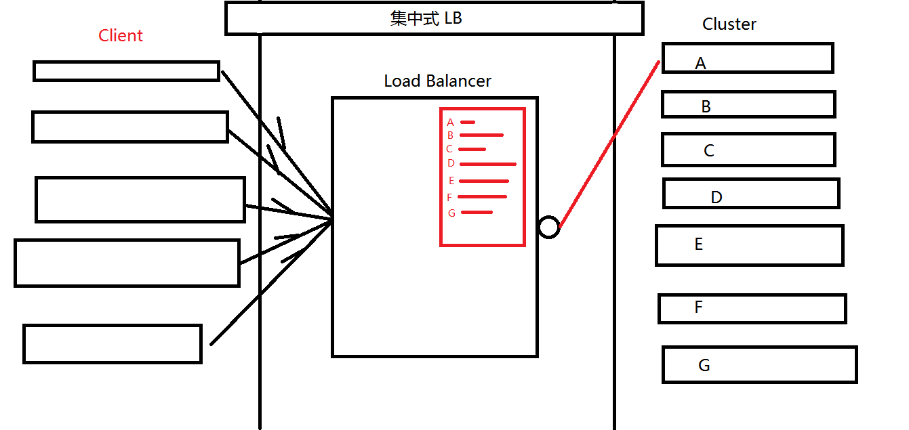
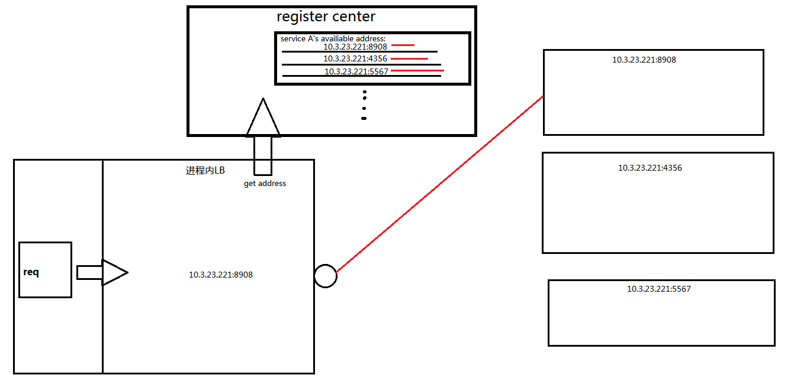

[TOC]

# Ribbon 客户端负载均衡器

将Load Balancer(LB) 后面所有可供连接的机器配置在 ribbon 的列表中，ribbon会自动的基于某种规则（简单轮询、随机连接等）去连接这些机器，以达到负载均衡的效果。也很容易使用ribbon实现自定义的负载均衡算法。

## LB 方案分类

主流方案分两种：

- 集中式LB，在服务的消费方和提供方之间使用独立的LB设施（可以是硬件，可以是软件（nginx）），有改设施负责将请求通过某种策略均衡的转发给服务提供者
- 进程内LB，将LB逻辑集成到消费方，消费方从服务注册中心获得服务的可访问地址列表，自己从中挑选合适的进行访问。

ribbon属于后者，也叫客户端负载均衡，做一个理性的消费者。ribbon只是一个类库，集成在消费方的进程里，消费方通过ribbon获得服务器可供访问的地址。

集中式LB：



进程内LB：




# Ribbon的核心组件

**均为接口类型,有以下几个**

**ServerList**

- 用于获取地址列表。它既可以是静态的(提供一组固定的地址)，也可以是动态的(从注册中心中定期查询地址列表)。

**ServerListFilter**

- 仅当使用动态ServerList时使用，用于在原始的服务列表中使用一定策略过虑掉一部分地址。

**IRule**

- 选择一个最终的服务地址作为LB结果。选择策略有轮询、根据响应时间加权、断路器(当Hystrix可用时)等。

Ribbon在工作时首选会通过ServerList来获取所有可用的服务列表，然后通过ServerListFilter过虑掉一部分地址，最后在剩下的地址中通过IRule选择出一台服务器作为最终结果。


## 故障处理

Ribbon会定期从 Eureka 更新并过滤服务实例列表，若 Eureka 不可用了，Ribbon 依然可以使服务可用。

Ribbon 会把从 Eureka 取来的ServerList 进行缓存，间隔一定的时间去刷新，所以当 Eureka 宕机，Ribbon 依然可以调用到 Server Provider。但是有缓存就会有延迟，所以常常部署了一个服务之后要好久才能被调用（就算显示Eureka已经注册了改服务，也需要等一会才能访问，不知是不是Ribbon的原因），Ribbon 默认的更新是 30 s ,所以一个服务从部署到能被调用最大会有一分钟的延迟，使用如下配置设置默认延迟：

```yaml
ribbon:
  ServerListRefreshInterval: 5000
```

